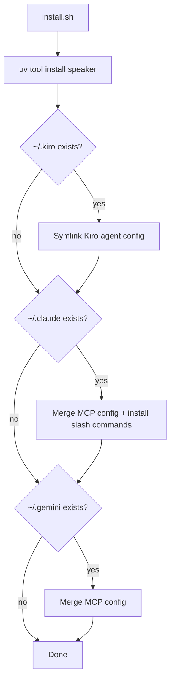
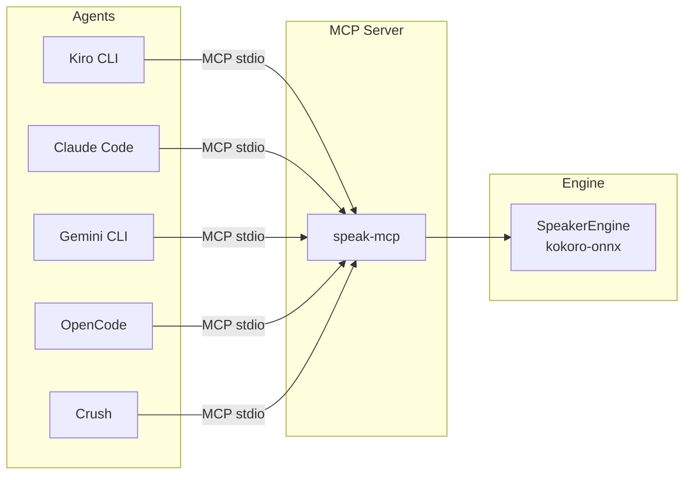

# Agent Installation Guide

## Prerequisites

Install the `speak-mcp` MCP server:
```bash
cd ~/code/personal/tools/speaker
uv tool install . --force
```

Verify:
```bash
which speak-mcp       # MCP server installed
```

## Install Script

The easiest path — auto-detects installed AI tools:
```bash
./scripts/install.sh
```



The installer merges the speaker MCP entry into existing config files — it won't overwrite your other MCP servers.

## How All Agents Connect

Every agent uses the same MCP server (`speak-mcp`). The only difference is where each agent stores its MCP config.



## Kiro CLI

**Files needed:**
- `~/.kiro/agents/speaker.json` — agent definition with MCP server config
- `~/.kiro/agents/speaker/persona.md` — system prompt

**speaker.json:**
```json
{
  "name": "speaker",
  "description": "Voice output for AI agents",
  "prompt": "file://speaker/persona.md",
  "resources": ["file://speaker/persona.md"],
  "tools": ["@builtin", "@speaker"],
  "mcpServers": {
    "speaker": {
      "command": "speak-mcp",
      "args": [],
      "env": {"FASTMCP_LOG_LEVEL": "ERROR"}
    }
  },
  "allowedTools": ["mcp_speaker_speak"]
}
```

**Usage:**
```bash
kiro-cli chat --agent speaker
```

## Claude Code

**Files needed:**
- `~/.claude/mcp.json` — MCP server config
- `~/.claude/commands/speak-start.md` — slash command to enable voice
- `~/.claude/commands/speak-stop.md` — slash command to disable voice

**mcp.json:**
```json
{
  "mcpServers": {
    "speaker": {
      "command": "speak-mcp",
      "args": []
    }
  }
}
```

**Usage:** `/speak-start` and `/speak-stop` in any session.

## Gemini CLI

**mcp.json** (`~/.gemini/mcp.json`):
```json
{
  "mcpServers": {
    "speaker": {
      "command": "speak-mcp",
      "args": []
    }
  }
}
```

**Usage:** `@speak-start` in any session.

## OpenCode

**mcp.json** (typically `~/.config/opencode/mcp.json`):
```json
{
  "mcpServers": {
    "speaker": {
      "command": "speak-mcp",
      "args": []
    }
  }
}
```

## Crush

**crush.json** in project root:
```json
{
  "$schema": "https://charm.land/crush.json",
  "mcp": {
    "speaker": {
      "type": "stdio",
      "command": "speak-mcp",
      "args": [],
      "timeout": 120
    }
  }
}
```

## Amp

Add to your Amp MCP config:
```json
{
  "mcpServers": {
    "speaker": {
      "command": "speak-mcp",
      "args": []
    }
  }
}
```

And add to `AGENTS.md`:
```markdown
## Voice Output

The user can toggle voice with @speak-start and @speak-stop.
When enabled, call the speak tool with your full response text.
Exclude code blocks from spoken text.
```
