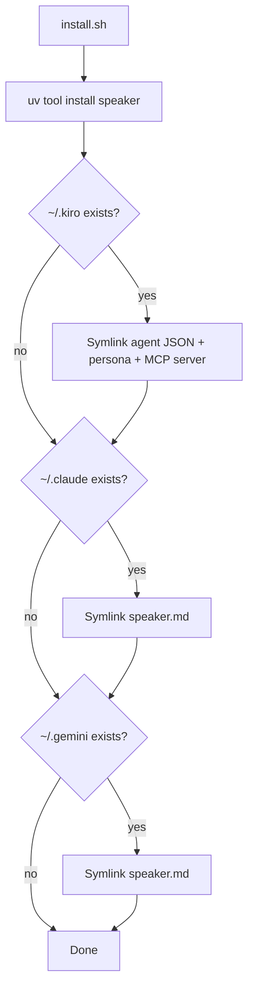
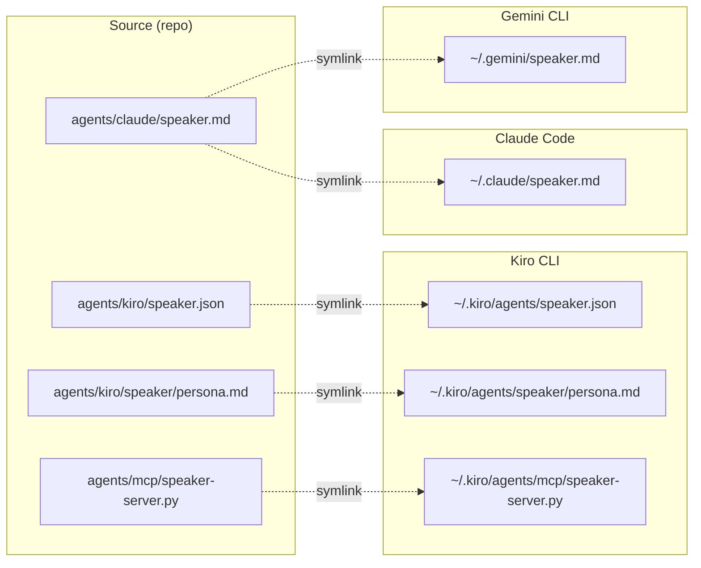

# Agent Installation Guide

## Prerequisites

Install the `speak` CLI first:
```bash
cd ~/code/personal/tools/speaker
uv tool install .[mcp] --force
```

Verify:
```bash
speak "test"
```

## Install Script

The easiest path — auto-detects installed AI tools:
```bash
./scripts/install.sh
```



## File Locations Per Platform



## Kiro CLI

The install script handles this, but here's the manual setup.

**Files needed:**
- `~/.kiro/agents/speaker.json` — agent definition
- `~/.kiro/agents/speaker/persona.md` — system prompt
- `~/.kiro/agents/mcp/speaker-server.py` — MCP server

**speaker.json:**
```json
{
  "name": "speaker",
  "description": "Voice output for AI agents — speak responses aloud using high-quality local TTS",
  "prompt": "file://speaker/persona.md",
  "resources": ["file://speaker/persona.md"],
  "tools": ["@builtin", "@speaker"],
  "mcpServers": {
    "speaker": {
      "command": "uvx",
      "args": ["--from", "mcp[cli]", "mcp", "run", "~/.kiro/agents/mcp/speaker-server.py"],
      "env": {"FASTMCP_LOG_LEVEL": "ERROR"}
    }
  },
  "allowedTools": ["mcp_speaker_speak"]
}
```

**Usage:**
```bash
kiro-cli chat --agent speaker
```

**Adding to an existing agent** — merge the `mcpServers` and `allowedTools` into your agent's JSON, and add voice toggle instructions to its persona.

## Claude Code

**File needed:**
- `~/.claude/speaker.md` — prompt with voice toggle instructions

**speaker.md:**
```markdown
You have a voice output tool. The user controls it with:
- `/speak-start` — enable voice
- `/speak-stop` — disable voice

Voice is off by default. When enabled, run this after each response:
~/.local/bin/speak "Your full response text here"

Exclude code blocks from spoken text. If the command fails, continue without voice.
```

**Usage:** Load the prompt in a session:
```
/read ~/.claude/speaker.md
```

Or add to your project's `.claude/commands/` for automatic loading.

## OpenCode

Add to your OpenCode agent config (typically `~/.config/opencode/agents.json`):

```json
{
  "study-mentor": {
    "system_prompt_append": "The user can toggle voice with @speak-start and @speak-stop. When enabled, run: ~/.local/bin/speak \"your response text\". Exclude code blocks."
  }
}
```

OpenCode agents use shell commands, so the CLI is called directly — no MCP server needed.

## Crush

Same pattern as Claude Code — Crush agents execute shell commands.

Add to your Crush agent prompt:
```markdown
The user can toggle voice with @speak-start and @speak-stop.
When enabled, run: ~/.local/bin/speak "your response text"
Exclude code blocks from spoken text.
```

## Gemini CLI

The install script symlinks `speaker.md` to `~/.gemini/speaker.md`. Gemini auto-loads subagent files from that directory.

**Usage:** In any Gemini session:
```
@speak-start
```

Gemini calls the CLI directly via shell. No MCP server needed.

## Amp

Amp reads `AGENTS.md` from the project root. Add a section:

```markdown
## Voice Output

The user can toggle voice with @speak-start and @speak-stop.
When enabled, run: ~/.local/bin/speak "your response text"
Exclude code blocks from spoken text.
```
