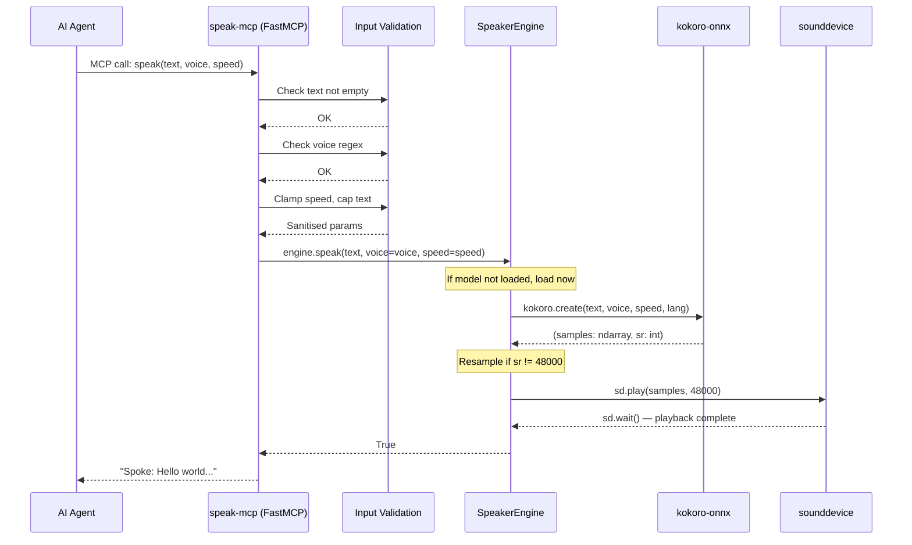
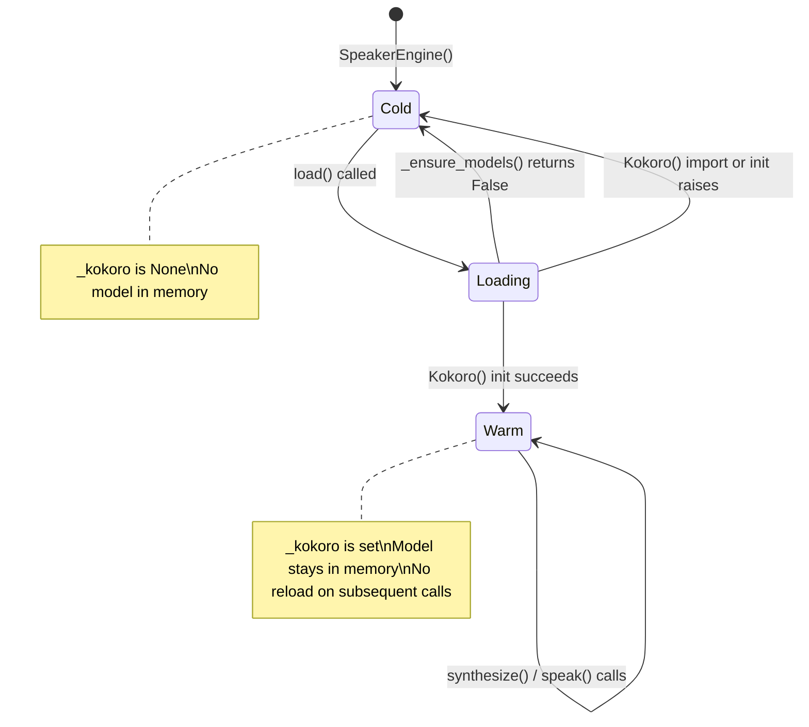
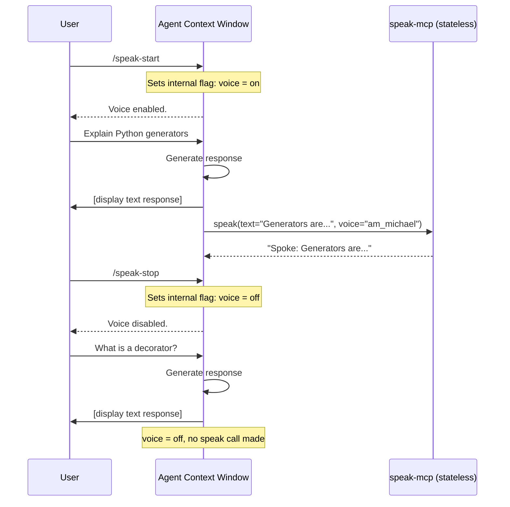
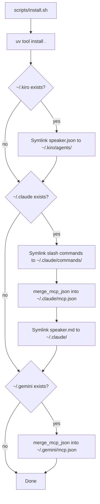
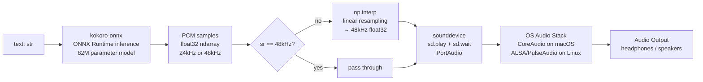

# Speaker Architecture

## Table of Contents

1. [Overview](#1-overview)
2. [System Layers](#2-system-layers)
3. [Deep Dive: MCP Server](#3-deep-dive-mcp-server)
4. [Deep Dive: TTS Engine](#4-deep-dive-tts-engine)
5. [Deep Dive: Model Management](#5-deep-dive-model-management)
6. [Deep Dive: Agent Integration](#6-deep-dive-agent-integration)
7. [Deep Dive: Audio Pipeline](#7-deep-dive-audio-pipeline)
8. [Security Model](#8-security-model)
9. [Testing Strategy](#9-testing-strategy)
10. [Cross-references](#10-cross-references)

---

## 1. Overview

Speaker is a local text-to-speech MCP server for AI coding agents. It wraps the [kokoro-onnx](https://github.com/thewh1teagle/kokoro-onnx) 82M-parameter ONNX neural TTS model in a [FastMCP](https://github.com/jlowin/fastmcp) server so any MCP-compatible agent (Claude Code, Kiro CLI, Gemini CLI, OpenCode, Crush, Amp) can speak responses aloud by calling a single `speak` tool.

### Why Speaker Exists

Dense text responses from AI agents create cognitive overhead. Reading long outputs requires sustained visual attention and working memory. For neurodivergent users in particular, hearing a response spoken aloud in parallel with reading it reduces the "wall of text" overwhelm — the auditory channel offloads the visual channel.

Speaker is a local-only, zero-cost, privacy-preserving solution. No audio leaves the machine. The kokoro-onnx model produces natural-sounding speech (not robotic TTS) at roughly 1.5 seconds latency for a typical paragraph. The model loads once and stays warm in memory, so repeated calls have approximately 200ms overhead.

### Design Philosophy

Speaker is intentionally minimal:

- **One tool, one responsibility.** The MCP server exposes a single `speak` tool. No configuration endpoints, no state queries, no management surface.
- **Stateless server, warm model.** The server holds no per-session state. Voice on/off and voice selection are soft-state in the agent's context window, not in the server. The only thing kept in process memory is the loaded model.
- **In-process engine.** The engine runs inside the MCP server process. No subprocess spawning, no IPC, no sockets. Text goes in, audio comes out of the speakers.
- **Fail gracefully.** Every error path returns a string result to the agent rather than crashing. The agent continues its session whether TTS works or not.

### High-Level Architecture

```mermaid
graph TB
    subgraph "Agent Layer — AI Coding Agents"
        CC[Claude Code<br/>mcp.json + speaker.md<br/>/speak-start /speak-stop]
        KC[Kiro CLI<br/>speaker.json + persona.md<br/>allowedTools]
        GC[Gemini CLI<br/>mcp.json]
        OC[OpenCode<br/>mcp.json]
        CR[Crush<br/>crush.json]
        AM[Amp<br/>mcp.json + AGENTS.md]
    end

    subgraph "MCP Protocol Layer"
        STDIO[stdio transport<br/>JSON-RPC 2.0]
    end

    subgraph "MCP Server — speak-mcp"
        VAL[Input Validation<br/>voice regex, speed clamp, text cap]
        TOOL[speak tool<br/>FastMCP @mcp.tool()]
    end

    subgraph "TTS Engine — SpeakerEngine"
        LOAD[Lazy Model Load<br/>_ensure_models + Kokoro()]
        SYNTH[Synthesis<br/>kokoro.create()]
        RESAMP[Resampling<br/>24kHz → 48kHz]
    end

    subgraph "Audio Output"
        SD[sounddevice<br/>sd.play + sd.wait]
        OS[OS Audio Stack<br/>CoreAudio / ALSA]
    end

    subgraph "Storage — ~/.cache/kokoro-onnx/"
        MODEL[kokoro-v1.0.onnx<br/>~337 MB]
        VOICES[voices-v1.0.bin<br/>~37 MB]
    end

    CC -->|MCP stdio| STDIO
    KC -->|MCP stdio| STDIO
    GC -->|MCP stdio| STDIO
    OC -->|MCP stdio| STDIO
    CR -->|MCP stdio| STDIO
    AM -->|MCP stdio| STDIO

    STDIO --> TOOL
    TOOL --> VAL
    VAL --> LOAD
    LOAD -.->|first call| MODEL
    LOAD -.->|first call| VOICES
    LOAD --> SYNTH
    SYNTH --> RESAMP
    RESAMP --> SD
    SD --> OS
```

---

## 2. System Layers

Speaker is built from five layers stacked vertically. Each layer has a single responsibility and communicates with adjacent layers through a narrow interface.

```mermaid
graph TB
    subgraph L1["Layer 1 — Agent Integration"]
        direction LR
        A1[Config files<br/>mcp.json / speaker.json]
        A2[Persona files<br/>speaker.md / persona.md]
        A3[Toggle mechanism<br/>slash commands / @ commands]
    end

    subgraph L2["Layer 2 — MCP Protocol"]
        direction LR
        B1[FastMCP server<br/>mcp = FastMCP('speaker')]
        B2[stdio transport<br/>JSON-RPC 2.0]
        B3[Tool registration<br/>@mcp.tool() decorator]
    end

    subgraph L3["Layer 3 — TTS Engine"]
        direction LR
        C1[SpeakerEngine class<br/>engine.py]
        C2[Model lifecycle<br/>cold → warm]
        C3[Synthesis pipeline<br/>text → PCM samples]
    end

    subgraph L4["Layer 4 — Audio Output"]
        direction LR
        D1[sounddevice<br/>PortAudio wrapper]
        D2[PCM playback<br/>sd.play + sd.wait]
    end

    subgraph L5["Layer 5 — Storage"]
        direction LR
        E1[~/.cache/kokoro-onnx/<br/>model cache directory]
        E2[Atomic download<br/>temp-file + rename]
    end

    L1 -->|MCP tool call| L2
    L2 -->|engine.speak()| L3
    L3 -->|samples, sr| L4
    L3 -->|loads on demand| L5
```

### Layer Responsibilities

| Layer | Module | Primary Responsibility |
|-------|--------|----------------------|
| Agent Integration | `agents/{name}/` | Teach agents how and when to call `speak` |
| MCP Protocol | `src/speaker/mcp_server.py` | Expose `speak` as an MCP tool; validate inputs |
| TTS Engine | `src/speaker/engine.py` | Manage model lifecycle; synthesize PCM audio |
| Audio Output | `sounddevice` (external) | Deliver PCM samples to the OS audio stack |
| Storage | `~/.cache/kokoro-onnx/` | Cache ONNX model and voice weights |

---

## 3. Deep Dive: MCP Server

The MCP server (`src/speaker/mcp_server.py`) is the entry point for all agent interactions. It is deliberately thin: validate inputs, delegate to the engine, return a result string.

### FastMCP Framework Usage

FastMCP is a Python-first MCP server framework. Registering a tool requires nothing more than decorating a function:

```python
from mcp.server.fastmcp import FastMCP

mcp = FastMCP("speaker")

@mcp.tool()
def speak(text: str, voice: str = DEFAULT_VOICE, speed: float = DEFAULT_SPEED) -> str:
    ...
```

FastMCP introspects the function signature to generate the JSON Schema that MCP clients receive when they query available tools. Python type annotations become JSON Schema types. Default values become optional parameters. No separate schema definition is needed.

The server runs on stdio transport. The `main()` function is the entry point registered in `pyproject.toml` as the `speak-mcp` console script:

```python
def main() -> None:
    mcp.run()
```

When an agent starts, it spawns `speak-mcp` as a subprocess and communicates over its stdin/stdout using JSON-RPC 2.0 messages.

### Input Validation Pipeline

Every call to `speak` passes through three validation steps before reaching the engine. The steps are sequential: the first failure short-circuits and returns an error string to the agent.

```mermaid
flowchart TD
    A[speak called] --> B{text.strip() empty?}
    B -->|yes| C[Return 'No text provided.']
    B -->|no| D{voice matches regex?}
    D -->|no| E[Return 'Invalid voice name: ...']
    D -->|yes| F[Clamp speed to 0.5–2.0]
    F --> G[Truncate text at 10,000 chars]
    G --> H[engine.speak]
    H -->|True| I[Return 'Spoke: preview...']
    H -->|False| J[Return 'TTS failed — check models']
```

The validation constants are defined at module level, making them easy to locate and adjust:

```python
_VOICE_PATTERN = re.compile(r"^[a-z]{2}_[a-z]{2,20}$")
_MAX_TEXT_LENGTH = 10_000
_MIN_SPEED = 0.5
_MAX_SPEED = 2.0
_RESPONSE_PREVIEW_LENGTH = 80
```

Speed clamping uses Python's `max`/`min` idiom rather than raising an error — an out-of-range speed is silently corrected, which is more useful than an error for the agent:

```python
speed = max(_MIN_SPEED, min(_MAX_SPEED, speed))
```

### Response Formatting

The tool returns a human-readable confirmation string rather than structured data. This is intentional: MCP tool results are shown in agent UIs, and a plain string is more readable than a JSON object for this use case.

Successful calls return a preview of the spoken text to allow the agent (and developer) to verify what was actually synthesized. Long texts are truncated in the response with an ellipsis, but the full text (up to the 10,000-character cap) is passed to the engine:

```python
preview = text[:_RESPONSE_PREVIEW_LENGTH]
suffix = "..." if len(text) > _RESPONSE_PREVIEW_LENGTH else ""
return f"Spoke: {preview}{suffix}"
```

### Request Lifecycle Sequence



---

## 4. Deep Dive: TTS Engine

`SpeakerEngine` in `src/speaker/engine.py` is the core of the system. It owns the model lifecycle, the synthesis pipeline, and the audio playback call.

### Model Lifecycle

The engine follows a three-state lifecycle. The model is never loaded at import time — only when the first `speak` call arrives.



The `is_loaded` property exposes the current state:

```python
@property
def is_loaded(self) -> bool:
    return self._kokoro is not None
```

### Lazy Loading with Deferred Imports

`SpeakerEngine` uses two levels of deferral to avoid heavy startup costs:

**Level 1 — Object instantiation is free.** `__init__` sets `_kokoro = None` and returns immediately. No file I/O, no imports.

**Level 2 — `kokoro_onnx` and `sounddevice` are imported inside methods, not at module level.** This is the deferred import pattern:

```python
def load(self) -> bool:
    if self._kokoro is not None:
        return True              # Already warm — no-op
    if not _ensure_models():
        return False             # Files not ready — abort
    try:
        from kokoro_onnx import Kokoro           # Import here, not at top
        self._kokoro = Kokoro(str(_KOKORO_MODEL), str(_KOKORO_VOICES))
        return True
    except Exception:
        logger.warning("Failed to load Kokoro model", exc_info=True)
        return False
```

The same pattern applies to `sounddevice` inside `speak()`:

```python
import sounddevice as sd
sd.play(samples, sr)
sd.wait()
```

Deferring these imports has two benefits: the MCP server starts instantly (agents see it as immediately ready), and the heavy libraries can be mocked via `sys.modules` in tests without requiring the actual packages to be installed.

`load()` is idempotent — calling it multiple times after the model is warm is a no-op because of the early return on `self._kokoro is not None`.

### Audio Synthesis Pipeline

`synthesize()` calls kokoro and returns raw PCM samples plus sample rate. It does not play audio — that is `speak()`'s responsibility. This separation makes `synthesize()` independently testable.

```python
def synthesize(self, text: str, *, voice: str = DEFAULT_VOICE, speed: float = DEFAULT_SPEED) -> tuple[np.ndarray, int] | None:
    if not self.load():
        return None
    samples, sr = self._kokoro.create(text, voice=voice, speed=speed, lang="en-us")
    if sr != _TARGET_SR:
        # Resample to 48kHz
        ...
    return samples, sr
```

The return type is `tuple[np.ndarray, int] | None`. `None` signals failure to the caller without raising — the MCP server treats `None` as a TTS failure and returns an error string.

### Resampling Algorithm

kokoro-onnx generates PCM audio at 24kHz. Many audio devices (and most modern OS audio stacks) prefer 48kHz. Playing 24kHz audio through a device configured for 48kHz produces crackling or pitch distortion. The engine resamples unconditionally when the output sample rate does not match the 48kHz target:

```python
_TARGET_SR = 48000

if sr != _TARGET_SR:
    samples = np.interp(
        np.linspace(0, len(samples), int(len(samples) * _TARGET_SR / sr), endpoint=False),
        np.arange(len(samples)),
        samples,
    ).astype(np.float32)
    sr = _TARGET_SR
```

This is linear interpolation resampling. `np.linspace` generates evenly spaced indices in the output time domain, and `np.interp` maps each output index back to the nearest input sample values. For a 2:1 upsampling (24kHz to 48kHz), the output array contains approximately twice as many samples as the input.

Linear interpolation is not the highest-quality resampling algorithm — polyphase FIR filtering would produce less aliasing — but for speech synthesis at these rates the audible difference is negligible, and it avoids adding a `scipy` or `resampy` dependency.

### Error Handling Strategy

The engine uses a consistent error-as-`None` pattern throughout. All exception-raising operations are wrapped in `try/except Exception`, with a `logger.warning` call that includes `exc_info=True` to preserve the stack trace, then return of the failure sentinel:

```python
except Exception:
    logger.warning("TTS synthesis failed", exc_info=True)
    return None
```

This means:
- Exceptions never propagate to the MCP server layer.
- The MCP server layer always gets a clean boolean or `None` value to act on.
- Stack traces are preserved in logs for debugging without crashing the server process.

---

## 5. Deep Dive: Model Management

### Download Mechanism

Model files are downloaded on first use by `_ensure_models()`. The download uses the atomic rename pattern: each file is downloaded to a temporary `.{name}.download` path, then atomically renamed to the final path. This prevents a partially-downloaded file from being mistaken for a complete one if the process is interrupted.

```mermaid
flowchart TD
    A[_ensure_models called] --> B{Both files exist?}
    B -->|yes| C[Return True — skip download]
    B -->|no| D[mkdir -p ~/.cache/kokoro-onnx]
    D --> E{For each missing file}
    E --> F[Set tmp = .{name}.download]
    F --> G[urllib.request.urlretrieve to tmp]
    G -->|success| H[tmp.rename to final path]
    G -->|exception| I[Log warning]
    I --> J[tmp.unlink missing_ok=True]
    J --> K[Return False]
    H --> L{More files to download?}
    L -->|yes| E
    L -->|no| M[Return True if both exist]
```

The download URL is constructed from a module-level constant:

```python
_MODEL_BASE_URL = "https://github.com/thewh1teagle/kokoro-onnx/releases/download/model-files-v1.0"
```

`urllib.request.urlretrieve` is used rather than `requests` to avoid adding a dependency. The standard library is sufficient for a one-time file download.

### Cache Directory Structure

```
~/.cache/kokoro-onnx/
├── kokoro-v1.0.onnx      # ONNX model weights (~337 MB)
└── voices-v1.0.bin       # Voice embeddings (~37 MB)
```

The cache directory follows the XDG convention of placing user-specific data under `~/.cache`. Both files must be present for the model to load. If either is missing, `_ensure_models()` attempts to download both.

### Failure Modes and Recovery

| Failure | Behaviour | Recovery |
|---------|-----------|----------|
| Network unavailable during download | Returns `False`, logs warning, cleans temp file | Retry by deleting `~/.cache/kokoro-onnx` and calling speak again |
| Partial download left from previous crash | File does not exist (temp was cleaned), re-downloads | Automatic on next call |
| Corrupted model file | kokoro raises on load, engine returns `False` | Delete `~/.cache/kokoro-onnx` and re-download |
| Disk full during download | Exception caught, temp cleaned, returns `False` | Free disk space, retry |

---

## 6. Deep Dive: Agent Integration

### Common MCP Config Pattern

Every agent uses the same minimal MCP server configuration. The `speak-mcp` executable is resolved from `PATH` at agent startup:

```json
{
  "mcpServers": {
    "speaker": {
      "command": "speak-mcp",
      "args": []
    }
  }
}
```

This configuration tells the agent framework to launch `speak-mcp` as a subprocess and connect to it via stdio when the agent session starts.

### Agent-Specific Differences

| Agent | Config File | Config Location | Voice Toggle | Extra Config |
|-------|------------|-----------------|--------------|--------------|
| Claude Code | `mcp.json` + `speaker.md` | `~/.claude/` | `/speak-start`, `/speak-stop` slash commands | Slash command files in `~/.claude/commands/` |
| Kiro CLI | `speaker.json` | `~/.kiro/agents/` | `@speak-start`, `@speak-stop` | `allowedTools`, `deniedCommands` security layer, `FASTMCP_LOG_LEVEL=ERROR` env |
| Gemini CLI | `mcp.json` | `~/.gemini/` | `@speak-start`, `@speak-stop` | Standard config only |
| OpenCode | `mcp.json` | `~/.config/opencode/` | `@speak-start`, `@speak-stop` | Standard config only |
| Crush | `crush.json` | Project root | `@speak-start`, `@speak-stop` | `"type": "stdio"`, `"timeout": 120` |
| Amp | `mcp.json` + `AGENTS.md` | Agent config dir | `@speak-start`, `@speak-stop` | `AGENTS.md` carries the persona prompt |

### Voice Toggle Mechanism

Voice on/off state is held in the agent's context window, not in the server. This is the soft-state pattern: the server is stateless, and the agent's system prompt or slash command teaches it to track the toggle itself.



The server has no `/status`, no `/enable`, no `/disable` endpoint. If the server process restarts mid-session, the agent's context-window state is preserved and the next `speak` call works immediately.

### Persona / Prompt Pattern

Each agent has a short persona file that establishes the voice toggle convention. Claude Code's `speaker.md` is the canonical example:

```
# Speaker — Voice Output for AI Agents

You have a voice output tool via MCP. The user controls it with:
- /speak-start — enable voice
- /speak-stop — disable voice

Voice is off by default.

When enabled, call the speak tool after each response with your full response text.
Exclude code blocks from spoken text. If the tool fails, continue without voice.
```

The persona files are deliberately minimal. They establish three things: the toggle commands, the off-by-default behaviour, and the exclusion of code blocks from spoken text (code spoken aloud is noise, not signal).

### Install Script Flow

`scripts/install.sh` performs all installation steps in a single run. It detects which agents are installed by checking for their config directories, then installs or merges configuration non-destructively.



The `merge_mcp_json` function is the key non-destructive step. It reads the existing config, adds the `speaker` entry to `mcpServers`, and writes the result back. Existing servers are not removed:

```bash
python3 -c "
import json
existing = json.loads(open('$target').read())
speaker = json.loads(open('$src').read())
servers = existing.setdefault('mcpServers', {})
servers.update(speaker.get('mcpServers', {}))
with open('$target', 'w') as f:
    json.dump(existing, f, indent=2)
    f.write('\n')
"
```

Kiro uses symlinks rather than merging because the Kiro agent JSON is a complete agent definition (not just an MCP config fragment), and it cannot be merged into an existing file.

---

## 7. Deep Dive: Audio Pipeline

### Full Signal Flow

The audio pipeline takes text as input and produces digital audio samples that the OS audio stack converts to sound.



### Sample Rate Considerations

kokoro-onnx v1.0 generates PCM at 24kHz. The target rate `_TARGET_SR = 48000` is hardcoded. 48kHz is the standard rate for modern consumer audio hardware and is natively supported by:

- CoreAudio on macOS (both built-in and external devices)
- ALSA/PulseAudio on Linux
- Most USB audio devices
- AirPlay (when the OS resamples before transmission)

Playing 24kHz audio without resampling on a 48kHz device causes the device driver to either re-sample (with variable quality) or play the audio at half speed. Resampling in the engine before the handoff to sounddevice gives consistent behaviour across devices.

### Known Audio Issues

| Issue | Root Cause | Workaround |
|-------|-----------|------------|
| Short clips cut off on AirPlay | AirPlay has ~2s transmit buffer; `sd.wait()` returns before buffer flushes | Use wired headphones or built-in speakers for short text |
| Crackling on Bluetooth devices | Bluetooth A2DP codec negotiation can mismatch sample rate | Resampling to 48kHz mitigates most cases; severe cases need wired audio |
| Long pause before first audio | Model cold-start (~2s on CPU); ONNX inference on long text is proportional to length | Keep spoken text concise; exclude code blocks |
| No audio output | sounddevice cannot find output device | Check `python3 -c "import sounddevice; print(sounddevice.query_devices())"` |

---

## 8. Security Model

Speaker runs locally with no network access after the initial model download. The attack surface is narrow, but input validation exists to prevent misuse of the `voice` parameter (which is ultimately passed to the kokoro model) and to prevent resource exhaustion.

### Input Validation

Three independent validation checks run in the MCP server before the engine is called:

**Voice parameter — regex allowlist.** The `voice` parameter is checked against a strict allowlist pattern before being passed to kokoro. This prevents directory traversal attempts, shell injection, or unexpected characters from reaching the model:

```python
_VOICE_PATTERN = re.compile(r"^[a-z]{2}_[a-z]{2,20}$")

if not _VOICE_PATTERN.match(voice):
    return f"Invalid voice name: {voice}. Expected format: am_michael, af_heart, etc."
```

The pattern requires exactly two lowercase ASCII letters, an underscore, then two to twenty lowercase ASCII letters. Anything not matching this form is rejected before reaching the engine. This rejects strings like `../../etc/passwd`, `Samantha -o /tmp/evil`, and `AM_MICHAEL`.

**Speed parameter — range clamping.** Speed is silently clamped to `[0.5, 2.0]` rather than rejected. An out-of-range speed is not a security issue — it is corrected to the nearest valid value.

**Text parameter — length cap.** Text is truncated at 10,000 characters. This prevents memory exhaustion from extremely long inputs causing the ONNX model to allocate large buffers.

### No Network Access After Download

After the initial model download, `speak-mcp` makes no network connections. All inference is local. `sounddevice` writes to the OS audio subsystem. There is no telemetry, no model update check, no remote API call.

### Kiro `deniedCommands` Security Layer

The Kiro agent definition (`agents/kiro/speaker.json`) includes a comprehensive `deniedCommands` block under `toolsSettings`. This is a Kiro-specific security feature that prevents the agent from executing shell commands matching specified patterns, even if instructed to do so.

The denied patterns cover credential exfiltration attempts (AWS keys, SSH keys, kubeconfig), destructive operations (database drops, `rm -rf`, `terraform destroy`, `cdk destroy`), and piped remote execution (`curl ... | bash`). This is independent of Speaker's own input validation — it is a defence-in-depth layer specific to the Kiro platform.

The same `deniedCommands` block applies to both `execute_bash` and `shell` tool types in Kiro.

### detect-secrets Baseline

The repository includes a `detect-secrets` baseline (referenced in `.gitignore` for the `.secrets.baseline` file) to prevent accidental credential commits. This is a pre-commit guard, not a runtime control.

---

## 9. Testing Strategy

### Test Architecture

The test suite is organised into two files mirroring the two source modules:

| File | Tests | Coverage Target |
|------|-------|-----------------|
| `tests/test_engine.py` | 19 tests across 3 classes | `src/speaker/engine.py` |
| `tests/test_mcp.py` | 16 tests across 2 classes | `src/speaker/mcp_server.py` |

Test classes group related behaviours:

```
tests/test_engine.py
├── TestDefaults           — constants have expected values
├── TestEnsureModels       — download and cache logic
└── TestSpeakerEngine      — model lifecycle, synthesis, playback

tests/test_mcp.py
├── TestMCPSpeak           — speak tool success and failure paths
└── TestInputValidation    — voice regex, speed clamping, text truncation
```

### Mocking Strategy

Neither `kokoro_onnx` nor `sounddevice` is installed in the test environment (they have large binary dependencies). The tests use `sys.modules` patching via `monkeypatch.setitem` to inject mock objects before the deferred imports execute.

This is defined in `tests/conftest.py` as shared fixtures:

```python
@pytest.fixture()
def mock_kokoro(monkeypatch):
    fake_samples = np.zeros(4800, dtype=np.float32)
    mock_cls = MagicMock()
    mock_instance = MagicMock()
    mock_instance.create.return_value = (fake_samples, 24000)
    mock_cls.return_value = mock_instance

    mod = MagicMock()
    mod.Kokoro = mock_cls
    monkeypatch.setitem(sys.modules, "kokoro_onnx", mod)
    return mock_instance

@pytest.fixture()
def mock_sounddevice(monkeypatch):
    mod = MagicMock()
    monkeypatch.setitem(sys.modules, "sounddevice", mod)
    return mod
```

The `mock_kokoro` fixture returns the mock instance (not the class), so tests can assert on `mock_kokoro.create.call_args` to verify the correct parameters were passed through the validation and engine layers.

The `sys.modules` approach works because the deferred `from kokoro_onnx import Kokoro` statement checks `sys.modules` first. If the key is present, Python uses the cached module object rather than importing from disk. `monkeypatch.setitem` restores the original state after each test.

### Resampling Test Pattern

The resampling logic is tested with a known input/output relationship. A 2400-sample array at 24kHz should produce a 4800-sample array at 48kHz:

```python
def test_synthesize_resamples_24k_to_48k(self, monkeypatch, mock_kokoro, mock_sounddevice):
    fake_samples = np.zeros(2400, dtype=np.float32)
    mock_kokoro.create.return_value = (fake_samples, 24000)

    engine = SpeakerEngine()
    result = engine.synthesize("test")

    samples, sr = result
    assert sr == 48000
    assert len(samples) == pytest.approx(4800, abs=1)
```

The `abs=1` tolerance accounts for integer rounding in the `linspace` length calculation.

### Coverage Approach

Tests run with `pytest-cov` configured in `pyproject.toml`:

```toml
[tool.pytest.ini_options]
addopts = "--cov=speaker --cov-report=term-missing"
```

Coverage is measured on the `speaker` package. The `term-missing` report format shows which lines are not covered, making it straightforward to identify gaps. The goal is full coverage of the engine's conditional branches (model already loaded, model load failure, synthesis failure, resampling path, no-resample path).

---

## 10. Cross-references

| Document | Content |
|----------|---------|
| [codemap.md](codemap.md) | Component diagram and module-level breakdown with data flow sequence diagram |
| [mcp.md](mcp.md) | MCP server reference: tool schema, voice list, speed reference, adding to any agent |
| [use-cases.md](use-cases.md) | How-to guides: enabling voice in Claude Code and Kiro, changing voice and speed |
| [agent-install.md](agent-install.md) | Platform-specific installation instructions for all six agents |
| [troubleshooting.md](troubleshooting.md) | Diagnostic decision tree, common failure modes, AirPlay latency, model download failures |
