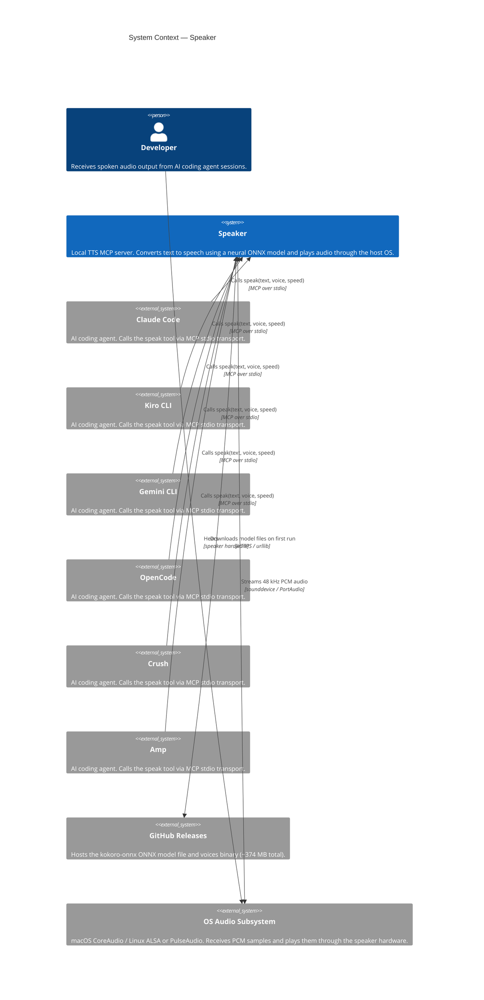
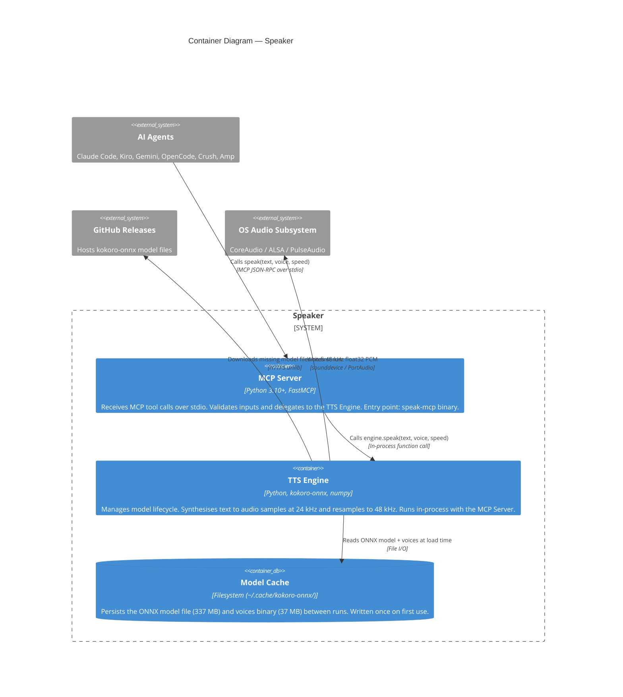
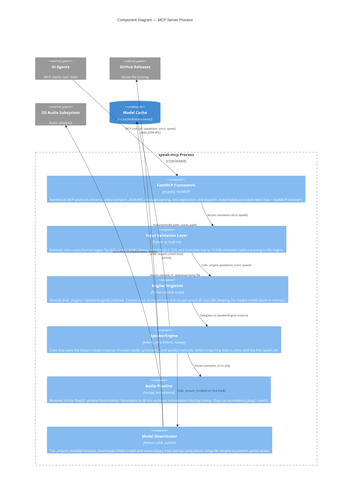
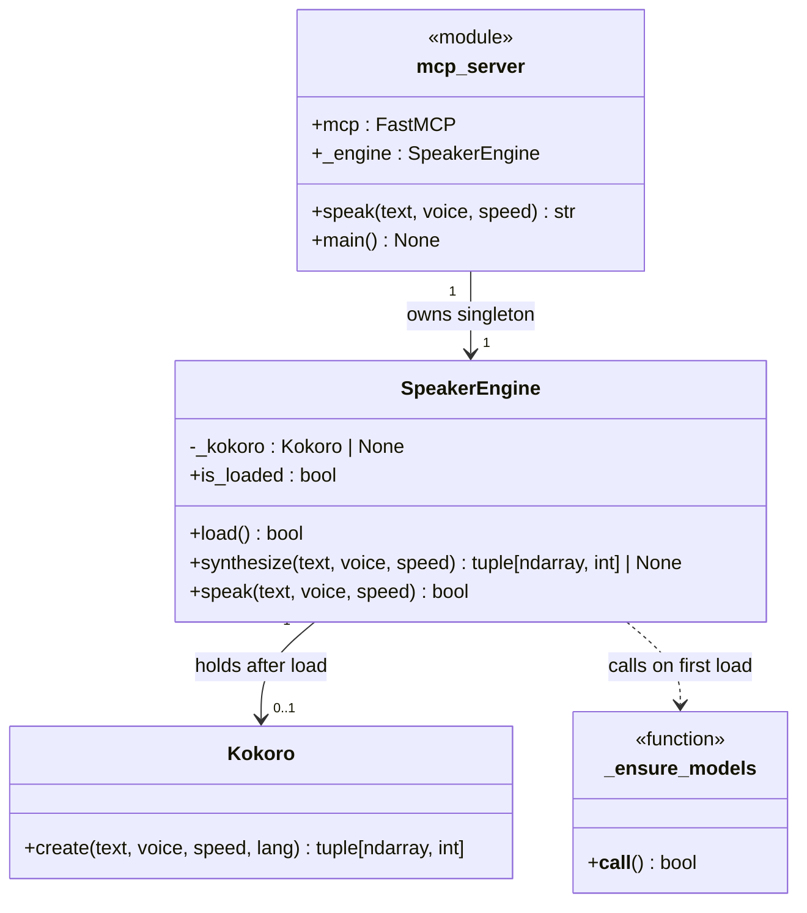
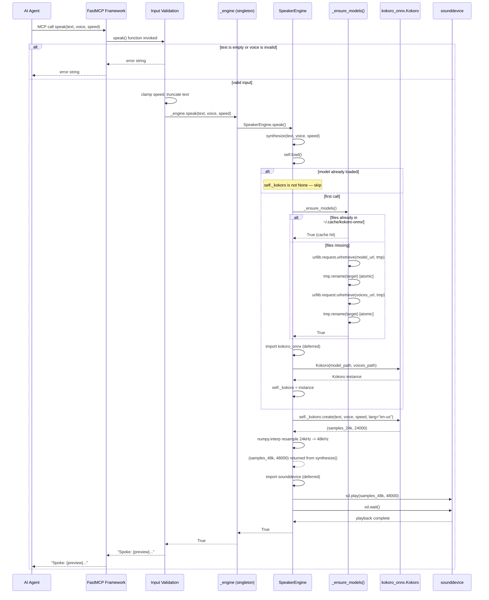

# C4 Architecture — Speaker

Speaker is a local text-to-speech MCP server that wraps the kokoro-onnx neural TTS model and exposes it as a single `speak` tool. Any MCP-compatible AI coding agent can call the tool to speak responses aloud over the host machine's audio output.

This document describes the architecture at four levels of magnification, following the [C4 model](https://c4model.com/) notation.

---

## Table of Contents

1. [Level 1 — System Context](#level-1--system-context)
2. [Level 2 — Container](#level-2--container)
3. [Level 3 — Component](#level-3--component)
4. [Level 4 — Code](#level-4--code)
5. [Key Decisions](#key-decisions)

---

## Level 1 — System Context

The system context diagram shows Speaker in relation to the people and external systems that interact with it. At this level, the internal structure of Speaker is not visible — only its boundaries and external relationships matter.

### Element Catalogue

| Element | Type | Description |
|---|---|---|
| Developer | Person | The human who hears audio through their machine's speakers during AI agent sessions. |
| Speaker | System | The subject of this document. Runs as a persistent background process, receives MCP tool calls, and plays audio. |
| Claude Code | External system | Anthropic's terminal AI agent. Integrates via `~/.claude/mcp.json`. |
| Kiro CLI | External system | AWS Kiro terminal agent. Integrates via `agents/kiro/speaker.json`. |
| Gemini CLI | External system | Google Gemini terminal agent. Integrates via `agents/gemini/mcp.json`. |
| OpenCode | External system | Open-source AI coding agent. Integrates via `agents/opencode/mcp.json`. |
| Crush | External system | AI coding agent. Integrates via `agents/crush/crush.json`. |
| Amp | External system | Sourcegraph AI coding agent. Integrates via `agents/amp/`. |
| GitHub Releases | External system | Hosts the `kokoro-v1.0.onnx` (337 MB) and `voices-v1.0.bin` (37 MB) artefacts at `thewh1teagle/kokoro-onnx`. |
| OS Audio Subsystem | External system | Platform audio layer (CoreAudio on macOS, ALSA/PulseAudio on Linux) that converts PCM data into physical sound. |

### Narrative

Every AI agent integrates with Speaker using the same MCP stdio transport: the agent spawns `speak-mcp` as a subprocess and exchanges JSON-RPC messages on stdin/stdout. Speaker downloads its ONNX model files from GitHub on first run, then operates entirely offline. Audio output flows out of the process into the operating system's audio stack and ultimately reaches the developer's ears.

---

## Level 2 — Container

The container diagram zooms inside Speaker to reveal the four distinct runtime and storage units that make up the system. A "container" in C4 terms is any separately deployable unit — a process, a database, a file store.

### Element Catalogue

| Container | Technology | Description |
|---|---|---|
| MCP Server | Python 3.10+, FastMCP, `mcp[cli]` | The process entry point. Registered as `speak-mcp` via `pyproject.toml` scripts. Handles all MCP protocol concerns: tool registration, JSON-RPC dispatch, stdio transport, input validation. |
| TTS Engine | Python, kokoro-onnx, numpy, sounddevice | Runs in the same process as the MCP Server — not a separate process. Owns the model lifecycle (download, load, keep warm). Performs synthesis and audio playback. |
| Model Cache | Filesystem | `~/.cache/kokoro-onnx/kokoro-v1.0.onnx` and `voices-v1.0.bin`. Populated by the TTS Engine on first run; read-only thereafter. Survives process restarts. |

### Narrative

The MCP Server and TTS Engine share a single Python process — there is no IPC boundary between them. This is an intentional design choice (see [Key Decisions](#key-decisions)). The model cache is the only persistent state in the system; everything else is reconstructed from process startup. Model files are downloaded once from GitHub and never re-fetched unless manually deleted.

---

## Level 3 — Component

The component diagram zooms inside the single Python process to show the logical groupings of code and their responsibilities.

### Element Catalogue

| Component | Technology | Description |
|---|---|---|
| FastMCP Framework | `mcp[cli]`, FastMCP | Module-level `mcp = FastMCP("speaker")` instance. Decorates `speak()` with `@mcp.tool()`, handles stdio transport, and dispatches JSON-RPC calls. Calling `mcp.run()` in `main()` starts the event loop. |
| Input Validation Layer | Python `re`, built-ins | Inline guards in the `speak()` tool function. Rejects empty text, validates voice name against `_VOICE_PATTERN`, clamps speed with `max`/`min`, and slices text at `_MAX_TEXT_LENGTH`. Returns error strings rather than raising exceptions, preserving MCP call success. |
| Engine Singleton | Python module scope | `_engine = SpeakerEngine()` at module level in `mcp_server.py`. Module import creates the instance once; the first `speak` call triggers model loading. Subsequent calls reuse the already-warm model. |
| SpeakerEngine | `kokoro_onnx.Kokoro`, numpy | The central class in `engine.py`. Holds `self._kokoro: Kokoro | None`. Exposes `is_loaded` property, `load()`, `synthesize()`, and `speak()`. `kokoro_onnx` is imported inside `load()` to defer the slow import until needed. |
| Audio Pipeline | numpy, sounddevice | Lives inside `synthesize()` and `speak()`. Performs sample-rate conversion when kokoro returns at non-48 kHz (currently always 24 kHz). `sounddevice` is imported inside `speak()` for the same deferred-import reason as kokoro_onnx. |
| Model Downloader | Python `urllib`, `pathlib` | The `_ensure_models()` module-level function. Downloads to a `.{name}.download` temp path, then uses `Path.rename()` — an atomic operation on POSIX filesystems — to place the final file. On failure the temp file is cleaned up and the function returns `False`. |

### Narrative

The validation layer sits entirely within the `speak()` tool function and returns user-visible error strings on bad input. This keeps the MCP contract clean: the tool always returns a string, never raises. The engine singleton is the linchpin of the warm-model design — because Python modules are singletons by nature, `_engine` is created exactly once per process lifetime regardless of how many tool calls arrive. The audio pipeline deliberately performs the 24 kHz to 48 kHz resample unconditionally on every call rather than caching the resampled output, because audio samples are ephemeral and not worth caching.

---

## Level 4 — Code

Level 4 shows the class structure and runtime call chain for the core `SpeakerEngine` class.

### Class Diagram

### Sequence Diagram — Full speak() Call Chain

### Element Catalogue

| Element | Type | Description |
|---|---|---|
| `SpeakerEngine` | Class | Central TTS class. Single instance lives at module scope in `mcp_server.py`. |
| `SpeakerEngine._kokoro` | Private attribute | `Kokoro \| None`. `None` until `load()` succeeds. Acts as the loaded-state guard. |
| `SpeakerEngine.is_loaded` | Property | Read-only boolean. Returns `self._kokoro is not None`. Used by callers to check state without side effects. |
| `SpeakerEngine.load()` | Method | Checks guard, calls `_ensure_models()`, imports `kokoro_onnx`, constructs `Kokoro` instance. Returns `bool`. Idempotent — safe to call multiple times. |
| `SpeakerEngine.synthesize()` | Method | Calls `load()`, calls `Kokoro.create()`, resamples if `sr != 48000`. Returns `(ndarray, int) \| None`. |
| `SpeakerEngine.speak()` | Method | Calls `synthesize()`, imports `sounddevice`, calls `sd.play()` + `sd.wait()`. Returns `bool`. |
| `_ensure_models()` | Module function | Downloads ONNX model and voices binary. Uses atomic rename. Returns `bool`. |
| `Kokoro` | External class | From `kokoro_onnx`. Holds the loaded ONNX session. `create()` runs inference and returns raw float32 PCM at 24 kHz. |

### Narrative

`SpeakerEngine` is a minimal state machine with a single state variable: `_kokoro`. When it is `None`, the model is not loaded; when it holds a `Kokoro` instance, the model is warm. Every public method calls `load()` first, making each method safe to call in isolation. The deferred imports of `kokoro_onnx` and `sounddevice` inside the methods that first need them mean the MCP server process starts in under a second — the multi-second model load is pushed to the first actual `speak` call.

---

## Key Decisions

### In-process engine rather than subprocess

The TTS engine runs in the same process as the MCP server. The alternative — spawning a separate inference process and communicating via a socket or pipe — would add serialisation overhead and process management complexity for no benefit. Because `speak-mcp` is already a dedicated single-tool process, there is nothing to gain from further isolation.

### Deferred imports of `kokoro_onnx` and `sounddevice`

Both libraries are expensive to import: `kokoro_onnx` triggers ONNX Runtime initialisation, and `sounddevice` probes available audio hardware through PortAudio. Importing them at module level would add several seconds to every process start, including MCP server initialisation. By deferring the imports to the methods that first need them (`load()` and `speak()` respectively), the server is ready to accept MCP calls in under one second. The cost is paid exactly once, at the first actual `speak` call.

### Module-level singleton for `_engine`

Python modules are singletons — they are imported once and cached in `sys.modules`. Placing `_engine = SpeakerEngine()` at module level in `mcp_server.py` exploits this: however many MCP tool calls arrive, they all share the same engine instance and the same loaded model. No lock, no registry, no dependency injection container is needed. The pattern works because the MCP server is a single-process, single-user tool with no concurrency requirement.

### Atomic download with temp file rename

`urllib.request.urlretrieve` writes bytes progressively. If the process is killed mid-download, a partial file at the target path would cause the exists-check to return `True` on the next run, and `Kokoro` would fail to open a truncated ONNX file. Downloading to a `.{name}.download` temp path and then calling `Path.rename()` avoids this: `rename` is atomic on POSIX filesystems, so the target path is either absent or complete. The `missing_ok=True` cleanup on exception ensures temp files do not accumulate.

### Unconditional resample from 24 kHz to 48 kHz

Kokoro v1.0 generates audio at 24 kHz. Most modern audio hardware and OS audio stacks default to 44.1 kHz or 48 kHz and apply their own software resampling if given a different rate. That OS-level resampling is uncontrolled and varies in quality across platforms. By resampling to 48 kHz inside the engine using `numpy.interp`, Speaker delivers a consistent sample rate that every platform accepts natively, avoids double-resampling artifacts, and removes a class of platform-specific audio bugs. The resample guard (`if sr != _TARGET_SR`) means this step is skipped automatically if a future Kokoro version changes its output rate.
