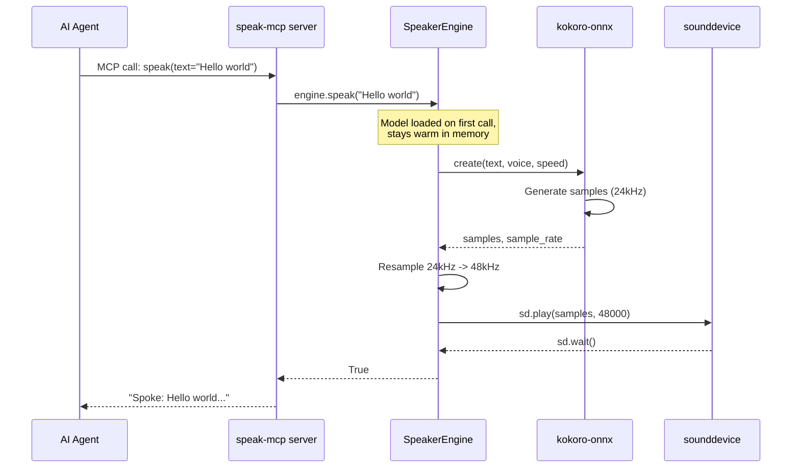
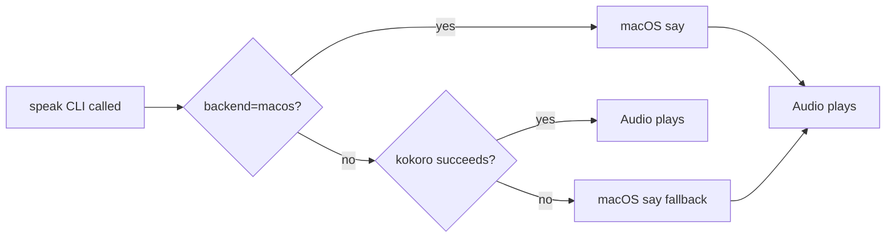
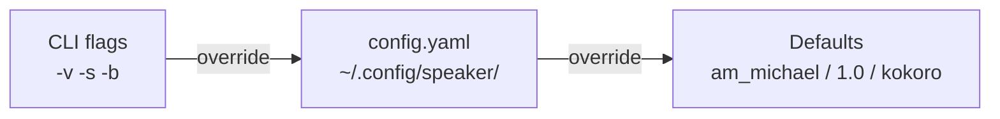

# Architecture & Code Map

Speaker is a local TTS tool with three layers: a shared engine, an MCP server that exposes it as a tool, and agent configs that teach AI assistants how to use it. There is also a standalone CLI for direct use.

## Component Diagram

```mermaid
graph TB
    subgraph "Agent Layer"
        KA[Kiro CLI Agent<br/>speaker.json + persona.md]
        CA[Claude Code Agent<br/>mcp.json + speaker.md]
        GA[Gemini CLI<br/>mcp.json]
        OA[OpenCode / Crush / Amp<br/>mcp.json or config]
    end

    subgraph "MCP Server"
        MCP[speak-mcp<br/>FastMCP server<br/>src/speaker/mcp_server.py]
    end

    subgraph "CLI"
        CLI[speak<br/>typer app<br/>src/speaker/cli.py]
    end

    subgraph "Engine"
        ENG[SpeakerEngine<br/>src/speaker/engine.py]
    end

    subgraph "Backend"
        KO[kokoro-onnx<br/>82M ONNX TTS model]
        SD[sounddevice<br/>audio playback]
        SAY[macOS say<br/>fallback]
    end

    subgraph "Storage"
        MODEL[~/.cache/kokoro-onnx/<br/>model + voices]
        CFG[~/.config/speaker/<br/>config.yaml]
    end

    KA -->|MCP protocol| MCP
    CA -->|MCP protocol| MCP
    GA -->|MCP protocol| MCP
    OA -->|MCP protocol| MCP
    MCP --> ENG
    CLI --> ENG
    ENG --> KO
    ENG --> SD
    CLI --> SAY
    KO -.->|loads| MODEL
    CLI -.->|reads| CFG
```

## Data Flow (MCP)



## Fallback Chain



Note: The macOS fallback only applies to the CLI. The MCP server uses the engine directly and reports failure to the agent if kokoro is unavailable.

## Module Breakdown

### `src/speaker/engine.py` — TTS Engine

The core module. A `SpeakerEngine` class that:

- Downloads kokoro-onnx model files on first use (~337MB to `~/.cache/kokoro-onnx/`)
- Loads the model once and keeps it warm in memory
- Synthesizes text to audio, resamples 24kHz->48kHz
- Plays audio via sounddevice

Key components:

| Component | Purpose |
|-----------|---------|
| `_ensure_models()` | Download ONNX model + voices on first run via wget |
| `SpeakerEngine.load()` | Lazy-load Kokoro model into memory |
| `SpeakerEngine.synthesize()` | Generate audio samples from text |
| `SpeakerEngine.speak()` | Synthesize + play audio |

### `src/speaker/mcp_server.py` — MCP Server

A FastMCP server exposing one tool:

- `speak(text, voice, speed)` — calls `SpeakerEngine.speak()` directly (in-process)
- Returns confirmation string or error message
- Entry point: `speak-mcp` (installed via `uv tool install`)

All agent integrations use this server via MCP protocol over stdio.

### `src/speaker/cli.py` — Standalone CLI

A typer app with one command (`speak`) that:

- Reads text from argument or stdin (`speak -`)
- Loads config from `~/.config/speaker/config.yaml`
- Merges CLI flags over config file over defaults
- Uses `SpeakerEngine` for kokoro backend
- Falls back to macOS `say` if kokoro fails

### Agent Configs

| File | Purpose |
|------|---------|
| `agents/kiro/speaker.json` | Kiro agent definition with MCP server config |
| `agents/kiro/speaker/persona.md` | Kiro system prompt with voice toggle |
| `agents/claude/mcp.json` | Claude Code MCP server config |
| `agents/claude/speaker.md` | Claude Code system prompt with voice toggle |
| `agents/claude/commands/speak-start.md` | Claude Code slash command to enable voice |
| `agents/claude/commands/speak-stop.md` | Claude Code slash command to disable voice |
| `agents/gemini/mcp.json` | Gemini CLI MCP server config |
| `agents/opencode/mcp.json` | OpenCode MCP server config |
| `agents/crush/crush.json` | Crush MCP server config |

### `scripts/install.sh` — Installer

- Installs `speak` CLI and `speak-mcp` server via `uv tool install`
- Detects Kiro CLI, Claude Code, Gemini CLI by checking for `~/.kiro`, `~/.claude`, `~/.gemini`
- Symlinks/copies agent configs into the right locations

## Config Loading Priority (CLI only)



Resolved in the CLI `speak()` command: CLI flag -> config file -> hardcoded default.

The MCP server uses its own defaults (am_michael, 1.0) and accepts voice/speed as tool parameters from the agent.

## Dependencies

| Package | Role |
|---------|------|
| `typer` | CLI framework |
| `kokoro-onnx` | ONNX TTS model wrapper |
| `sounddevice` | Cross-platform audio playback |
| `numpy` | Audio resampling (linear interpolation) |
| `pyyaml` | Config file parsing |
| `mcp[cli]` | MCP server framework (optional dependency) |
