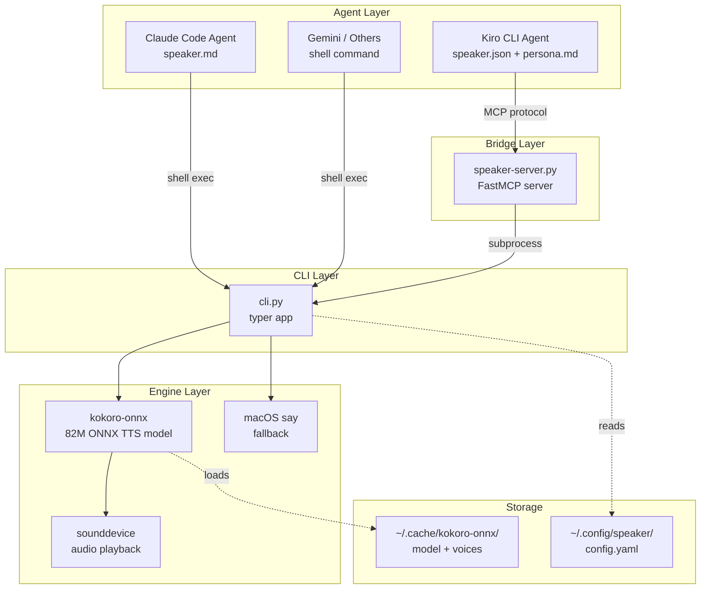
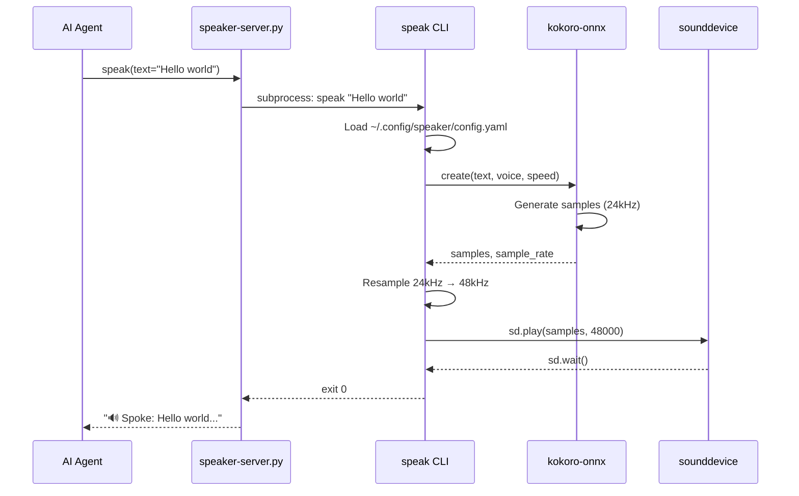
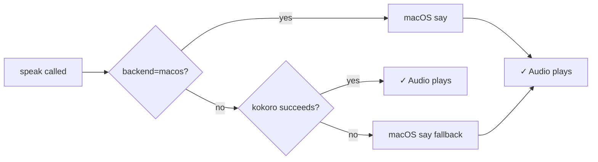
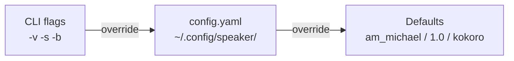

# Architecture & Code Map

Speaker is a local TTS tool with three layers: a CLI that wraps kokoro-onnx, an MCP server that exposes the CLI as a tool, and agent configs that teach AI assistants how to use it.

## Component Diagram

## Data Flow

## Fallback Chain

## Module Breakdown

### `src/speaker/cli.py` — TTS Engine + CLI

The core module. A typer app with one command (`speak`) that:

- Reads text from argument or stdin (`speak -`)
- Loads config from `~/.config/speaker/config.yaml`
- Merges CLI flags over config file over defaults
- Generates audio via kokoro-onnx, resamples to 48kHz, plays via sounddevice
- Falls back to macOS `say` if kokoro fails or is unavailable

Key functions:

| Function | Purpose |
|----------|---------|
| `_load_config()` | Parse YAML config, return `tts` section |
| `_ensure_models()` | Download ONNX model + voices on first run via wget |
| `_speak_kokoro()` | Generate + play audio via kokoro-onnx + sounddevice |
| `_speak_macos()` | Fallback: shell out to macOS `say` |
| `speak()` | CLI entrypoint — resolve config, route to backend |

### `agents/mcp/speaker-server.py` — MCP Bridge

A FastMCP server exposing one tool:

- `speak(text: str) → str` — calls `~/.local/bin/speak` via subprocess
- Returns confirmation string or error message
- Timeout: 120s

Kiro CLI launches this server via the `mcpServers` config in the agent JSON. It communicates over stdio using the MCP protocol.

### `agents/kiro/speaker.json` — Kiro Agent Config

Defines the speaker agent for `kiro-cli chat --agent speaker`:

- Points to `persona.md` for the system prompt
- Declares the `speaker` MCP server (uvx + mcp run)
- Whitelists `mcp_speaker_speak` in `allowedTools`

### `agents/kiro/speaker/persona.md` — Kiro Persona

System prompt teaching the agent about `@speak-start` / `@speak-stop` toggle and how to call the speak tool.

### `agents/claude/speaker.md` — Claude Code Prompt

System prompt for Claude Code. Uses `/speak-start` / `/speak-stop` and calls the CLI directly via shell (`~/.local/bin/speak "text"`).

### `scripts/install.sh` — Installer

- Installs the `speak` CLI via `uv tool install`
- Detects Kiro CLI, Claude Code, Gemini CLI by checking for `~/.kiro`, `~/.claude`, `~/.gemini`
- Symlinks agent configs into the right locations

## Config Loading Priority

Resolved in `speak()`: CLI flag → config file → hardcoded default.

## Dependencies

| Package | Role |
|---------|------|
| `typer` | CLI framework |
| `kokoro-onnx` | ONNX TTS model wrapper |
| `sounddevice` | Cross-platform audio playback |
| `numpy` | Audio resampling (linear interpolation) |
| `pyyaml` | Config file parsing |
| `mcp[cli]` | MCP server framework (optional, for MCP bridge) |
