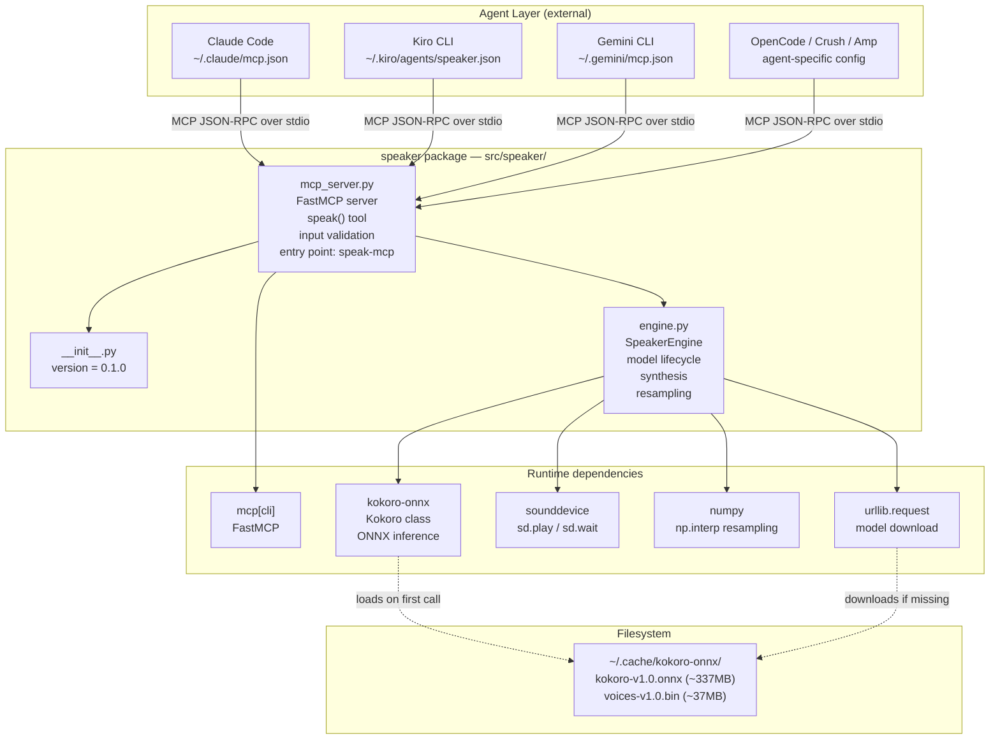
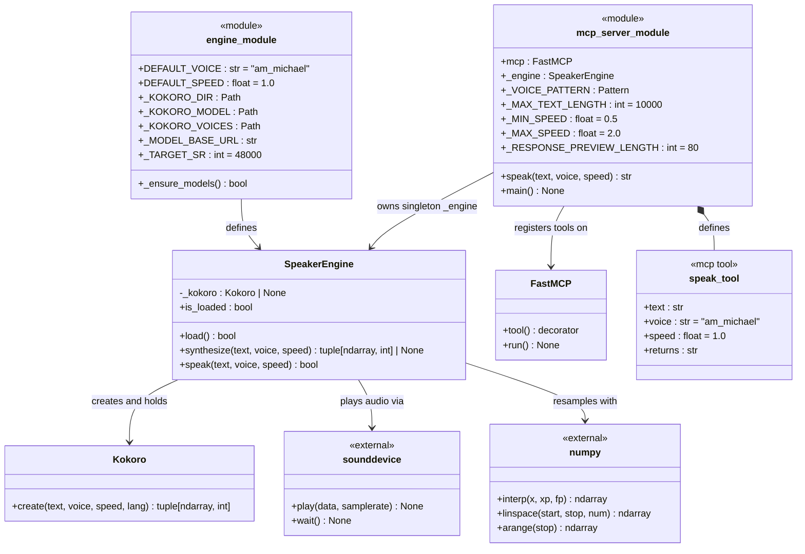
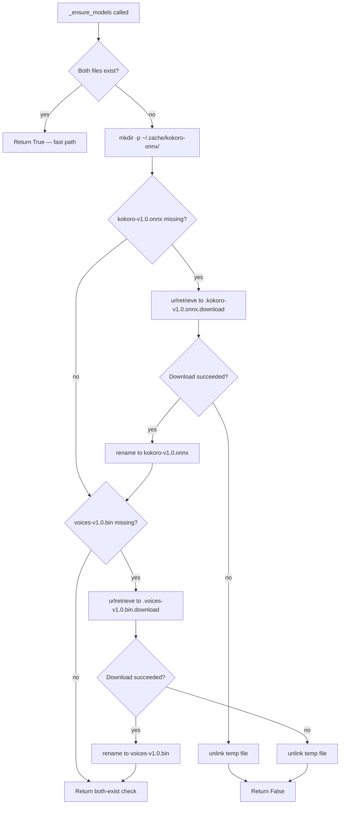
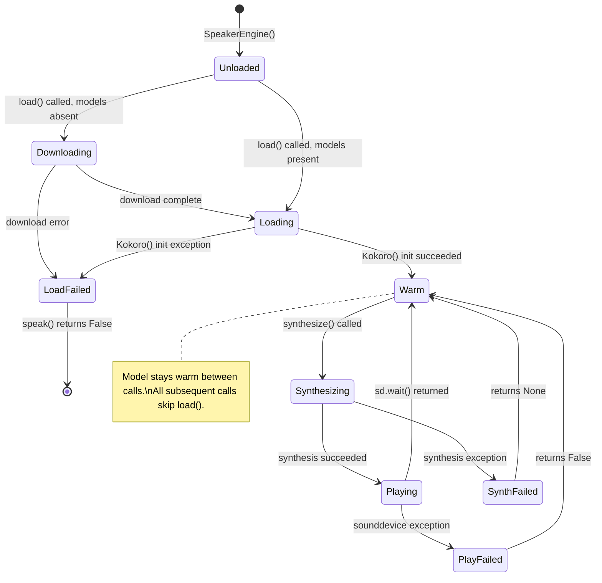
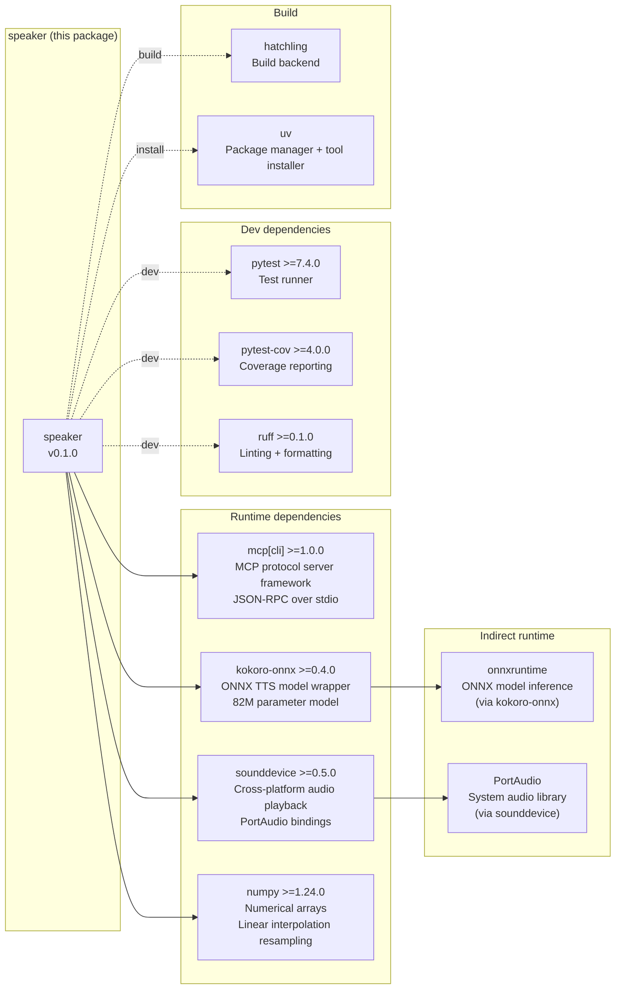
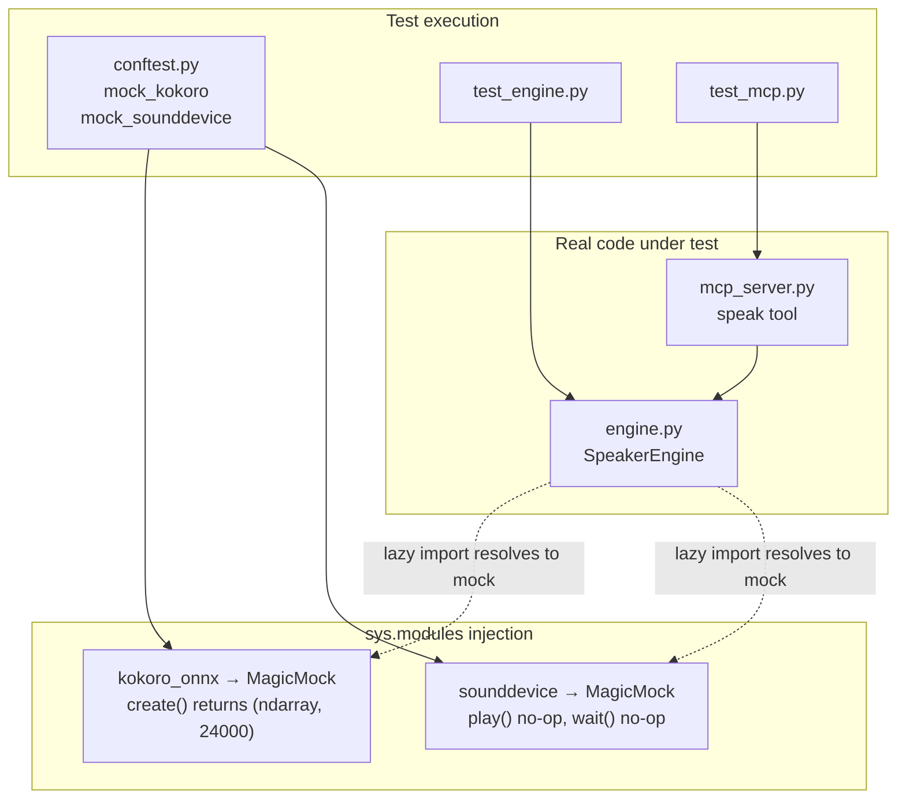

# Code Map

Speaker is a local TTS MCP server for AI coding agents. Two Python modules (`engine.py` and `mcp_server.py`) back a single installable entry point (`speak-mcp`) that any MCP-compatible agent can call to synthesize and play speech locally via kokoro-onnx.

## Table of Contents

1. [Project Overview](#1-project-overview)
2. [Module Relationship Diagram](#2-module-relationship-diagram)
3. [Class Diagram](#3-class-diagram)
4. [Module: `speaker.__init__`](#4-module-speaker__init__)
5. [Module: `speaker.engine`](#5-module-speakerengine)
6. [Module: `speaker.mcp_server`](#6-module-speakermcp_server)
7. [Interface Descriptions](#7-interface-descriptions)
8. [Data Flow Diagrams](#8-data-flow-diagrams)
9. [Core Workflows](#9-core-workflows)
10. [Dependency Graph](#10-dependency-graph)
11. [Test Coverage Map](#11-test-coverage-map)
12. [Cross-references](#12-cross-references)

---

## 1. Project Overview

Speaker solves a specific problem: AI coding agents produce text-only output by default. This project wraps the kokoro-onnx ONNX TTS model in a FastMCP server so any MCP-compatible agent (Claude Code, Kiro CLI, Gemini CLI, OpenCode, Crush, Amp) can call `speak()` as a native tool and hear responses aloud.

Design priorities in order:

- **Low latency on repeat calls** — the Kokoro model loads once and stays warm in memory across tool invocations.
- **Minimal surface area** — one MCP tool, two source modules, no config files.
- **Safe defaults** — input validation at the MCP boundary prevents bad data from reaching the engine.

### Directory Tree

```
speaker/
├── src/
│   └── speaker/
│       ├── __init__.py          # Package metadata, version
│       ├── engine.py            # TTS engine — model lifecycle + synthesis
│       └── mcp_server.py        # FastMCP server — MCP tool + entry point
├── tests/
│   ├── conftest.py              # Shared fixtures (mock_kokoro, mock_sounddevice)
│   ├── test_engine.py           # 19 tests — engine unit tests
│   └── test_mcp.py              # 16 tests — MCP tool unit tests
├── agents/
│   ├── claude/                  # Claude Code MCP config + slash commands
│   ├── kiro/                    # Kiro CLI agent definition + persona
│   ├── gemini/                  # Gemini CLI MCP config
│   ├── opencode/                # OpenCode MCP config
│   ├── crush/                   # Crush MCP config
│   └── amp/                     # Amp MCP config
├── docs/
│   ├── codemap.md               # This file
│   ├── mcp.md                   # MCP server reference
│   ├── use-cases.md             # How-to guides per agent
│   ├── agent-install.md         # Installation guide
│   └── troubleshooting.md       # Diagnostic decision trees
├── scripts/
│   └── install.sh               # Auto-detect and install agent configs
├── pyproject.toml               # Package metadata, dependencies, entry points
└── README.md
```

---

## 2. Module Relationship Diagram



---

## 3. Class Diagram



---

## 4. Module: `speaker.__init__`

**File:** `src/speaker/__init__.py`

Package-level metadata only. Declares `__version__ = "0.1.0"`. No imports, no logic. The package name `speaker` is the importable root — both `speaker.engine` and `speaker.mcp_server` are siblings under this namespace.

---

## 5. Module: `speaker.engine`

**File:** `src/speaker/engine.py`

**Purpose:** Owns the full TTS lifecycle — model file management, Kokoro model loading and warm-keeping, audio synthesis, sample-rate resampling, and playback. All heavy dependencies (kokoro-onnx, sounddevice) are imported lazily inside method bodies so the module itself loads cheaply.

### Constants

| Name | Type | Value | Purpose |
|------|------|-------|---------|
| `DEFAULT_VOICE` | `str` | `"am_michael"` | Shared default exported to `mcp_server.py` |
| `DEFAULT_SPEED` | `float` | `1.0` | Shared default exported to `mcp_server.py` |
| `_KOKORO_DIR` | `Path` | `~/.cache/kokoro-onnx/` | Cache directory for model files |
| `_KOKORO_MODEL` | `Path` | `_KOKORO_DIR / "kokoro-v1.0.onnx"` | ONNX model path (~337MB) |
| `_KOKORO_VOICES` | `Path` | `_KOKORO_DIR / "voices-v1.0.bin"` | Voice embeddings path (~37MB) |
| `_MODEL_BASE_URL` | `str` | GitHub releases URL | Base URL for model file downloads |
| `_TARGET_SR` | `int` | `48000` | Target sample rate after resampling |

### Function: `_ensure_models()`

**Signature:** `_ensure_models() -> bool`

**Behaviour:** Checks whether both model files exist. If either is missing, creates the cache directory and downloads missing files one at a time. Each download writes to a temporary `.{name}.download` sibling file first, then atomically renames it to the target path. This prevents a partially-written ONNX file from being treated as valid on a subsequent call after an interrupted download. Returns `True` only when both files exist and are fully written.

**Error handling:** Any exception during download is caught, logged at WARNING with the traceback, and the temp file is removed. Returns `False` so the caller can surface a clean error rather than attempting to load a corrupt model.

```python
# Atomic write pattern used in _ensure_models()
tmp = _KOKORO_DIR / f".{name}.download"
try:
    urllib.request.urlretrieve(url, str(tmp))
    tmp.rename(target)          # atomic on POSIX; replaces target if it exists
except Exception:
    tmp.unlink(missing_ok=True) # clean up partial download
    return False
```

### Class: `SpeakerEngine`

**Purpose:** Holds a single `Kokoro` instance in `_kokoro` and provides three public methods. The class is instantiated once at module load time in `mcp_server.py` and reused across all tool calls.

#### `__init__(self) -> None`

Initialises `_kokoro` to `None`. Does not download models or import kokoro-onnx — deferred entirely to `load()`.

#### Property: `is_loaded`

**Type:** `bool`

Returns `True` if `_kokoro` is not `None`. Used in tests and can be used by callers to check warm state without triggering a load.

#### `load(self) -> bool`

**Behaviour:** Guard-returns `True` immediately if `_kokoro` is already set (warm path). Otherwise calls `_ensure_models()`, then imports and instantiates `Kokoro` from `kokoro_onnx`. The `from kokoro_onnx import Kokoro` import is inside the method body — this is intentional lazy loading that keeps startup cost near zero and allows the module to be imported without kokoro-onnx being installed (relevant for testing with mocks injected into `sys.modules`).

**Return:** `True` on success, `False` if models cannot be downloaded or Kokoro fails to initialise.

```python
# Lazy import pattern — kokoro_onnx only imported when first needed
def load(self) -> bool:
    if self._kokoro is not None:
        return True                         # warm path — no work done
    if not _ensure_models():
        return False
    try:
        from kokoro_onnx import Kokoro      # deferred import
        self._kokoro = Kokoro(str(_KOKORO_MODEL), str(_KOKORO_VOICES))
        return True
    except Exception:
        logger.warning("Failed to load Kokoro model", exc_info=True)
        return False
```

#### `synthesize(self, text, *, voice, speed) -> tuple[np.ndarray, int] | None`

**Signature:** `synthesize(text: str, *, voice: str = DEFAULT_VOICE, speed: float = DEFAULT_SPEED) -> tuple[np.ndarray, int] | None`

**Behaviour:** Calls `self.load()` to ensure the model is warm. Calls `self._kokoro.create(text, voice, speed, lang="en-us")` to produce a numpy array of float32 PCM samples and the model's native sample rate. If the sample rate differs from `_TARGET_SR` (48 000 Hz), resamples using linear interpolation via `numpy.interp`. Returns the resampled samples and `_TARGET_SR`, or `None` on any failure.

The resampling uses linear interpolation rather than a proper resampling library because it avoids the dependency and is sufficient for speech at typical TTS rates. The kokoro-onnx model outputs 24 kHz; the resampling doubles the sample count to 48 kHz.

```python
# Linear resampling: 24kHz -> 48kHz
if sr != _TARGET_SR:
    samples = np.interp(
        np.linspace(0, len(samples), int(len(samples) * _TARGET_SR / sr), endpoint=False),
        np.arange(len(samples)),
        samples,
    ).astype(np.float32)
    sr = _TARGET_SR
```

**Return:** `(samples: np.ndarray, sample_rate: int)` on success, `None` on any failure.

#### `speak(self, text, *, voice, speed) -> bool`

**Signature:** `speak(text: str, *, voice: str = DEFAULT_VOICE, speed: float = DEFAULT_SPEED) -> bool`

**Behaviour:** Calls `synthesize()`. If synthesis succeeds, imports `sounddevice` and calls `sd.play(samples, sr)` followed by `sd.wait()` to block until playback completes. Returns `True` on success, `False` if synthesis failed or playback threw an exception.

The `sd.wait()` call is what makes `speak()` synchronous — the MCP tool call does not return until audio playback is complete. This is the intended behaviour: the agent waits for the user to hear the response before continuing.

### Interface Contracts

- `synthesize()` is public and can be called independently when a caller needs raw audio samples without playback (e.g., future streaming or file-write use cases).
- `speak()` is the primary interface for the MCP server — one call, blocking until audio completes.
- `is_loaded` is safe to call at any time without side effects.
- All methods are safe to call on an engine that has not been loaded; they trigger lazy loading internally.

### Error Handling

All exceptions from kokoro-onnx and sounddevice are caught and logged at WARNING level with the full traceback (`exc_info=True`). The methods return `False` or `None` rather than raising. This keeps the MCP server alive on transient failures — a bad TTS call returns an error string to the agent rather than crashing the server process.

---

## 6. Module: `speaker.mcp_server`

**File:** `src/speaker/mcp_server.py`

**Purpose:** Thin MCP adapter. Creates a FastMCP server instance, instantiates a single `SpeakerEngine`, defines one tool (`speak`), and provides the `main()` entry point. All business logic lives in `engine.py`; this module handles MCP protocol concerns: input validation, response formatting, and server lifecycle.

### Module-Level Objects

| Name | Type | Value | Purpose |
|------|------|-------|---------|
| `mcp` | `FastMCP` | `FastMCP("speaker")` | Server instance, holds tool registry |
| `_engine` | `SpeakerEngine` | `SpeakerEngine()` | Singleton engine, created at import time |
| `_VOICE_PATTERN` | `re.Pattern` | `r"^[a-z]{2}_[a-z]{2,20}$"` | Voice name validation regex |
| `_MAX_TEXT_LENGTH` | `int` | `10_000` | Text input cap (characters) |
| `_MIN_SPEED` | `float` | `0.5` | Speed lower bound |
| `_MAX_SPEED` | `float` | `2.0` | Speed upper bound |
| `_RESPONSE_PREVIEW_LENGTH` | `int` | `80` | Characters of text echoed in success response |

### Tool: `speak()`

**Registered as:** `@mcp.tool()` — FastMCP registers this as an MCP tool named `speak` with schema derived from the function signature.

**Full signature:**
```python
def speak(text: str, voice: str = DEFAULT_VOICE, speed: float = DEFAULT_SPEED) -> str:
```

#### Parameter Breakdown

| Parameter | Type | Default | Validation | Notes |
|-----------|------|---------|-----------|-------|
| `text` | `str` | required | Must not be blank after `.strip()`; truncated to 10 000 chars | Whitespace-only text returns early with an error string |
| `voice` | `str` | `"am_michael"` | Must match `^[a-z]{2}_[a-z]{2,20}$` | Invalid voice returns an error string describing the expected format |
| `speed` | `float` | `1.0` | Clamped to 0.5–2.0 | Out-of-range values are silently clamped, not rejected |

#### Validation Rules

1. Empty/blank text: returns `"No text provided."` immediately, no engine call.
2. Invalid voice: returns `f"Invalid voice name: {voice}. Expected format: am_michael, af_heart, etc."` immediately.
3. Speed out of range: `speed = max(_MIN_SPEED, min(_MAX_SPEED, speed))` — clamped silently. The distinction between voice (hard reject) and speed (silent clamp) is intentional: a wrong voice name produces silence with no error, whereas speed out of range still produces useful output.
4. Text length: `text = text[:_MAX_TEXT_LENGTH]` — silently truncated. No error returned; agents should pre-trim but this is a safety backstop.

#### Return Values

| Condition | Return Value |
|-----------|-------------|
| Success | `f"Spoke: {text[:80]}..."` or `f"Spoke: {text}"` if text is 80 chars or fewer |
| Engine failure | `"TTS failed — check that kokoro-onnx models are downloaded."` |
| Empty text | `"No text provided."` |
| Invalid voice | `"Invalid voice name: {voice}. Expected format: am_michael, af_heart, etc."` |

### Function: `main()`

**Signature:** `main() -> None`

Called by the `speak-mcp` entry point (defined in `pyproject.toml`). Calls `mcp.run()` which starts the FastMCP server on stdio, listening for MCP JSON-RPC messages. Blocks until the process is terminated.

### MCP Tool Schema

As seen by agents via the MCP `tools/list` response:

```json
{
  "name": "speak",
  "description": "Speak text aloud using high-quality local TTS.",
  "inputSchema": {
    "type": "object",
    "properties": {
      "text": {
        "type": "string",
        "description": "Text to speak aloud."
      },
      "voice": {
        "type": "string",
        "default": "am_michael",
        "description": "Kokoro voice name (e.g. am_michael, af_heart)."
      },
      "speed": {
        "type": "number",
        "default": 1.0,
        "description": "Speech speed from 0.5 to 2.0."
      }
    },
    "required": ["text"]
  }
}
```

### Interface Contracts

- The module is safe to import without kokoro-onnx installed; the engine is created but not loaded at import time.
- `_engine` is a module-level singleton. All calls to `speak()` share the same engine instance and therefore the same warm Kokoro model.
- `speak()` is always synchronous from the agent's perspective — the MCP call blocks until playback is complete.

---

## 7. Interface Descriptions

### 7.1 Agent ↔ MCP Server

| Attribute | Detail |
|-----------|--------|
| Direction | Bidirectional — agent sends requests, server sends responses |
| Protocol | MCP (Model Context Protocol) JSON-RPC 2.0 over stdio |
| Transport | `speak-mcp` process spawned as subprocess by agent; stdin/stdout as the message pipe |
| Request format | `{"method": "tools/call", "params": {"name": "speak", "arguments": {"text": "...", "voice": "...", "speed": 1.0}}}` |
| Response format | `{"result": {"content": [{"type": "text", "text": "Spoke: ..."}]}}` |
| Error handling | MCP error response returned for unhandled exceptions; tool-level errors returned as text content with error strings |

### 7.2 MCP Server ↔ Engine

| Attribute | Detail |
|-----------|--------|
| Direction | Unidirectional — server calls engine |
| Mechanism | Direct Python function call on `_engine` singleton |
| Call site | `_engine.speak(text, voice=voice, speed=speed)` |
| Input | Validated and sanitised `text`, `voice`, `speed` |
| Output | `bool` — `True` on success, `False` on any failure |
| Error handling | `False` return triggers error string response; no exceptions propagate to the MCP layer |

### 7.3 Engine ↔ kokoro-onnx

| Attribute | Detail |
|-----------|--------|
| Direction | Unidirectional — engine calls Kokoro |
| Mechanism | `Kokoro.create(text, voice, speed, lang)` |
| Input | Raw text string, voice name string, speed float, language tag `"en-us"` |
| Output | `(samples: np.ndarray, sample_rate: int)` — float32 PCM samples at model-native sample rate (24 kHz) |
| Error handling | Any exception caught in `synthesize()`, logged at WARNING, returns `None` |
| Lifecycle | `Kokoro` object instantiated once in `load()`, held in `_kokoro`, reused for all subsequent calls |

### 7.4 Engine ↔ sounddevice

| Attribute | Detail |
|-----------|--------|
| Direction | Unidirectional — engine calls sounddevice |
| Mechanism | `sd.play(samples, samplerate)` followed by `sd.wait()` |
| Input | `samples: np.ndarray` (float32, 48 kHz), `samplerate: int` (48 000) |
| Output | None — `sd.wait()` blocks until playback complete |
| Error handling | Any exception caught in `speak()`, logged at WARNING, returns `False` |
| Side effects | Writes to system audio device; blocks the calling thread until audio finishes |

### 7.5 Engine ↔ Filesystem

| Attribute | Detail |
|-----------|--------|
| Direction | Read/write — engine reads model files, writes during download |
| Mechanism | `urllib.request.urlretrieve()` for download; `Path.rename()` for atomic placement; `Kokoro(model_path, voices_path)` for read |
| Cache location | `~/.cache/kokoro-onnx/` |
| Files | `kokoro-v1.0.onnx` (~337MB), `voices-v1.0.bin` (~37MB) |
| Atomicity | Downloads to `.{name}.download` temp file, renamed to final path only on success |
| Error handling | Failed downloads clean up the temp file and return `False`; partially written model files are never left at the target path |

---

## 8. Data Flow Diagrams

### 8.1 Complete Request Flow

```mermaid
sequenceDiagram
    participant Agent as AI Agent
    participant MCP as speak-mcp (mcp_server.py)
    participant ENG as SpeakerEngine (engine.py)
    participant KO as kokoro-onnx (Kokoro)
    participant FS as ~/.cache/kokoro-onnx/
    participant SD as sounddevice

    Agent->>MCP: tools/call: speak(text, voice, speed)

    Note over MCP: Input validation
    MCP->>MCP: text.strip() == "" → return error
    MCP->>MCP: _VOICE_PATTERN.match(voice) → return error if invalid
    MCP->>MCP: speed = clamp(speed, 0.5, 2.0)
    MCP->>MCP: text = text[:10_000]

    MCP->>ENG: _engine.speak(text, voice, speed)
    ENG->>ENG: synthesize() → load()

    alt First call — model not loaded
        ENG->>FS: _ensure_models() — check file existence
        FS-->>ENG: files present or downloaded
        ENG->>KO: import kokoro_onnx; Kokoro(model, voices)
        KO-->>ENG: _kokoro instance (warm)
    else Subsequent calls — model warm
        Note over ENG: _kokoro already set, skip load
    end

    ENG->>KO: _kokoro.create(text, voice, speed, "en-us")
    KO-->>ENG: samples (float32, 24kHz), sr=24000

    alt Sample rate != 48000
        ENG->>ENG: np.interp resample 24kHz → 48kHz
    end

    ENG->>SD: sd.play(samples, 48000)
    ENG->>SD: sd.wait()
    SD-->>ENG: playback complete

    ENG-->>MCP: True
    MCP-->>Agent: "Spoke: {text[:80]}..."
```

### 8.2 Model Download Flow



### 8.3 Model Lifecycle State Diagram



---

## 9. Core Workflows

### 9.1 First-Time Usage (Cold Start)

```
1. Agent calls speak(text="Hello world")
2. mcp_server.py validates inputs — all pass
3. _engine.speak() calls synthesize() calls load()
4. load() calls _ensure_models():
   - ~/.cache/kokoro-onnx/ does not exist → mkdir
   - Downloads kokoro-v1.0.onnx (~337MB, ~60s on typical broadband)
   - Downloads voices-v1.0.bin (~37MB, ~10s)
   - Both files atomically renamed into place
5. Kokoro(model_path, voices_path) loads ONNX model into memory (~2s)
6. _kokoro is now set — engine is warm
7. _kokoro.create("Hello world", ...) generates samples at 24kHz (~200ms)
8. np.interp resamples to 48kHz
9. sd.play(samples, 48000) + sd.wait() — audio plays (~1s for short text)
10. Returns True → "Spoke: Hello world"
```

Total first-call time: download + model load + synthesis + playback. Downloads only happen once; model load happens once per process lifetime.

### 9.2 Subsequent Usage (Warm Path)

```
1. Agent calls speak(text="Next response")
2. mcp_server.py validates inputs
3. _engine.speak() → synthesize() → load()
4. load() sees _kokoro is not None → returns True immediately
5. _kokoro.create() — model already in memory (~200ms)
6. Resample if needed, play audio
7. Returns True → "Spoke: Next response"
```

Total subsequent call time: synthesis (~200ms for short text) + playback duration.

### 9.3 Error Recovery

**Download failure:**
```
_ensure_models() catches exception → logs WARNING with traceback
→ unlinks temp file → returns False
→ load() returns False
→ synthesize() returns None
→ speak() returns False
→ MCP tool returns "TTS failed — check that kokoro-onnx models are downloaded."
```
The server process remains alive. The next tool call retries the download.

**Synthesis failure (kokoro-onnx exception):**
```
_kokoro.create() raises → caught in synthesize()
→ logs WARNING → returns None
→ speak() returns False
→ MCP tool returns "TTS failed — check that kokoro-onnx models are downloaded."
```
`_kokoro` remains set (warm). The next call may succeed if the failure was transient.

**Playback failure (sounddevice exception):**
```
sd.play() or sd.wait() raises → caught in speak()
→ logs WARNING → returns False
→ MCP tool returns "TTS failed — check that kokoro-onnx models are downloaded."
```
The engine stays warm; only the playback layer failed. See [troubleshooting.md](troubleshooting.md) for common audio device issues.

---

## 10. Dependency Graph



---

## 11. Test Coverage Map

### Coverage Targets

| Module | Target | Test File |
|--------|--------|-----------|
| `speaker.engine` | >= 90% | `tests/test_engine.py` (19 tests) |
| `speaker.mcp_server` | >= 90% | `tests/test_mcp.py` (16 tests) |

### `tests/conftest.py` — Shared Fixtures

Two fixtures injected into `sys.modules` at the start of each test, preventing any real model downloads or audio device access:

- **`mock_kokoro`** — Replaces `kokoro_onnx` and `kokoro_onnx.Kokoro` in `sys.modules` with a mock. The mock's `create()` returns a synthetic numpy array and sample rate. This allows `SpeakerEngine.synthesize()` and `SpeakerEngine.load()` to be tested without the real 374MB model files being present.
- **`mock_sounddevice`** — Replaces `sounddevice` in `sys.modules` with a mock that no-ops `play()` and `wait()`. This allows `SpeakerEngine.speak()` to be tested without a real audio device.

The injection into `sys.modules` is required because both `kokoro_onnx` and `sounddevice` are imported lazily inside method bodies (not at module top level). Patching at the `sys.modules` level ensures the lazy import resolves to the mock regardless of when it is called.

### `tests/test_engine.py` — Engine Tests (19 tests)

| Test Group | What is Covered |
|------------|----------------|
| Defaults | `DEFAULT_VOICE`, `DEFAULT_SPEED` values; `_TARGET_SR` value |
| Model path constants | `_KOKORO_DIR`, `_KOKORO_MODEL`, `_KOKORO_VOICES` point to expected paths |
| `_ensure_models()` | Returns `True` when files exist; downloads when missing; handles download failure; handles partial download; atomic rename leaves no temp files on failure |
| `SpeakerEngine` init | `_kokoro` starts as `None`; `is_loaded` is `False` initially |
| `load()` | Returns `True` on success; sets `is_loaded`; idempotent on second call; returns `False` when models unavailable; returns `False` when Kokoro init raises |
| `synthesize()` | Returns samples and rate on success; returns `None` when engine not loadable; resamples when `sr != _TARGET_SR`; passes through when `sr == _TARGET_SR`; returns `None` on Kokoro exception |
| `speak()` | Returns `True` and calls `sd.play` + `sd.wait`; returns `False` when synthesis fails; returns `False` when sounddevice raises |

### `tests/test_mcp.py` — MCP Tool Tests (16 tests)

| Test Group | What is Covered |
|------------|----------------|
| Success path | Returns `"Spoke: ..."` prefix; short text included in full; long text truncated to 80 chars with ellipsis |
| Empty text | Returns `"No text provided."` for empty string; whitespace-only string |
| Voice validation | Valid voices accepted (`am_michael`, `af_heart`); invalid formats rejected with error string (`AM_MICHAEL`, `michael`, `am`, `am-michael`, `am_a`) |
| Speed clamping | Values below 0.5 clamped to 0.5; values above 2.0 clamped to 2.0; in-range values passed through |
| Text truncation | Text longer than 10 000 chars truncated before engine call |
| Engine failure | Returns `"TTS failed..."` when `_engine.speak()` returns `False` |

### Mocking Strategy Summary



---

## 12. Cross-references

| Document | What it Covers |
|----------|---------------|
| [mcp.md](mcp.md) | MCP server reference — tool schema, voice table, speed table, per-agent config snippets |
| [use-cases.md](use-cases.md) | How-to guides — enabling voice in Claude Code, Kiro CLI, and other agents; changing voice and speed |
| [agent-install.md](agent-install.md) | Installation guide — per-agent config file locations, install script walkthrough, manual config snippets |
| [troubleshooting.md](troubleshooting.md) | Diagnostic decision trees — model download failures, audio device issues, AirPlay latency, crackling audio |
