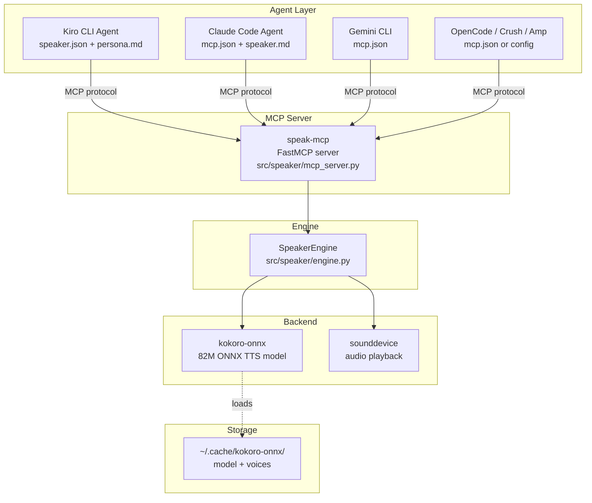
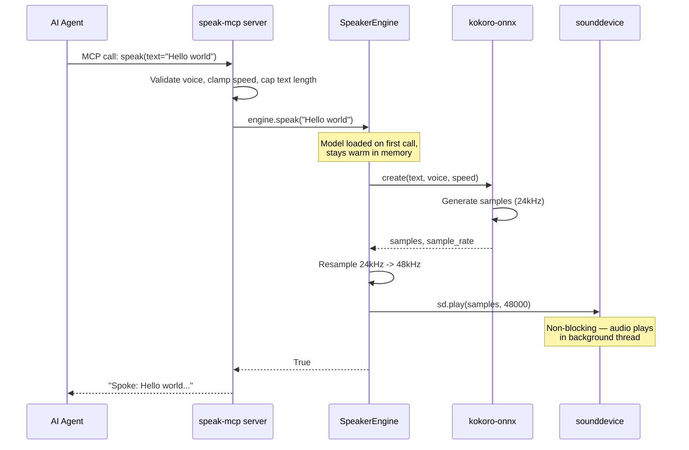

# Architecture & Code Map

Speaker is a local TTS tool with two layers: an engine that wraps kokoro-onnx, and an MCP server that exposes it as a tool. Agent configs teach AI assistants how to use it.

## Component Diagram

## Data Flow

## Module Breakdown

### `src/speaker/engine.py` — TTS Engine

The core module. A `SpeakerEngine` class that:

- Downloads kokoro-onnx model files on first use (~337MB to `~/.cache/kokoro-onnx/`) via urllib with atomic rename and SHA-256 verification
- Loads the model once and keeps it warm in memory
- Synthesizes text to audio, resamples 24kHz->48kHz
- Plays audio via sounddevice

Key components:

| Component | Purpose |
|-----------|---------|
| `DEFAULT_VOICE`, `DEFAULT_SPEED` | Shared constants for defaults |
| `_EXPECTED_SHA256` | Hardcoded SHA-256 hashes for model integrity verification |
| `_sha256()` | Compute SHA-256 digest of a downloaded file |
| `_ensure_models()` | Download ONNX model + voices via urllib, atomic temp-file rename, SHA-256 check |
| `SpeakerEngine.load()` | Lazy-load Kokoro model into memory |
| `SpeakerEngine.synthesize()` | Generate audio samples from text |
| `SpeakerEngine.speak()` | Synthesize + play audio |

### `src/speaker/mcp_server.py` — MCP Server

A FastMCP server exposing one tool:

- `speak(text, voice, speed)` — validates inputs, calls `SpeakerEngine.speak()` directly (in-process)
- Input validation: voice regex, speed clamped 0.5-2.0, text capped at 10k chars
- Returns confirmation string or error message
- Entry point: `speak-mcp` (installed via `uv tool install`)

All agent integrations use this server via MCP protocol over stdio.

### Agent Configs

| File | Purpose |
|------|---------|
| `agents/kiro/speaker.json` | Kiro agent definition with MCP server config |
| `agents/kiro/speaker/persona.md` | Kiro system prompt with voice toggle |
| `agents/claude/mcp.json` | Claude Code MCP server config |
| `agents/claude/speaker.md` | Claude Code system prompt with voice toggle |
| `agents/claude/commands/speak-start.md` | Claude Code slash command to enable voice |
| `agents/claude/commands/speak-stop.md` | Claude Code slash command to disable voice |
| `agents/gemini/mcp.json` | Gemini CLI MCP server config |
| `agents/gemini/speaker.md` | Gemini CLI system prompt with voice toggle |
| `agents/opencode/mcp.json` | OpenCode MCP server config |
| `agents/opencode/speaker.md` | OpenCode system prompt with voice toggle |
| `agents/crush/crush.json` | Crush MCP server config |
| `agents/crush/speaker.md` | Crush system prompt with voice toggle |
| `agents/amp/mcp.json` | Amp MCP server config |
| `agents/amp/speaker.md` | Amp system prompt with voice toggle |

### `scripts/install.sh` — Installer

- Installs `speak-mcp` server via `uv tool install`
- Detects Kiro CLI, Claude Code, Gemini CLI, OpenCode
- Merges MCP config and installs system prompts (non-destructive)
- Crush and Amp use project-level configs — shipped in `agents/` but not auto-installed

## Dependencies

| Package | Role |
|---------|------|
| `kokoro-onnx` | ONNX TTS model wrapper |
| `sounddevice` | Cross-platform audio playback |
| `numpy` | Audio resampling (`np.repeat` for integer ratios, `np.interp` fallback) |
| `mcp[cli]` | MCP server framework |
