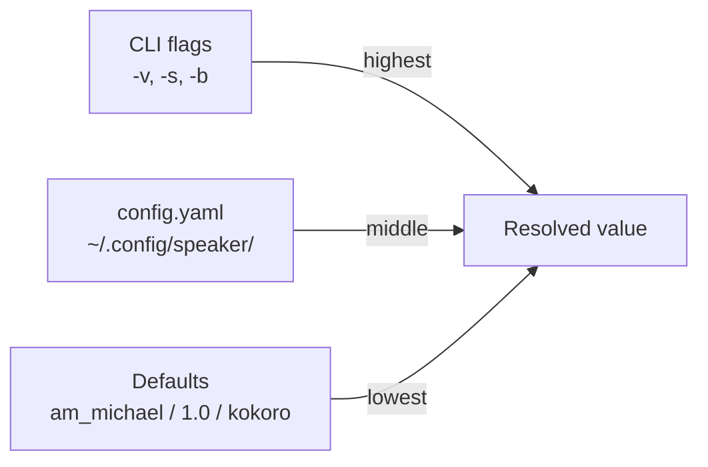

# Configuration Reference

## Config File

Location: `~/.config/speaker/config.yaml`

```yaml
tts:
  voice: am_michael      # Voice name (see table below)
  speed: 1.0             # Playback speed (0.5–2.0)
  backend: kokoro         # TTS backend: kokoro | macos
  macos_voice: Samantha   # Voice for macOS say fallback
```

Create it if it doesn't exist — all fields are optional, defaults apply.

## Config Loading Priority



CLI flags override config file, which overrides defaults. Each option is resolved independently.

## Options

| Option | CLI Flag | Config Key | Default | Description |
|--------|----------|------------|---------|-------------|
| Voice | `-v`, `--voice` | `tts.voice` | `am_michael` | kokoro-onnx voice name |
| Speed | `-s`, `--speed` | `tts.speed` | `1.0` | Playback speed multiplier |
| Backend | `-b`, `--backend` | `tts.backend` | `kokoro` | TTS engine to use |
| macOS voice | — | `tts.macos_voice` | `Samantha` | Voice for macOS `say` fallback |

## Voices

kokoro-onnx voices follow the pattern `{accent}{gender}_{name}`:
- `a` = American, `b` = British
- `m` = male, `f` = female

| Voice | Description |
|-------|-------------|
| `am_michael` | American male (default) — clear, natural |
| `af_heart` | American female — warm tone |
| `af_bella` | American female — bright |
| `am_adam` | American male — deeper |
| `bf_emma` | British female |

Speed examples:

| Speed | Effect |
|-------|--------|
| `0.5` | Half speed — very slow, useful for dense content |
| `0.8` | Slightly slow — good for learning |
| `1.0` | Normal (default) |
| `1.2` | Slightly fast — good for familiar content |
| `1.5` | Fast — skimming |
| `2.0` | Maximum — double speed |

## Backend Options

| Backend | Pros | Cons |
|---------|------|------|
| `kokoro` | High quality, natural voice, multiple voices | Requires model download (~337MB), CPU-bound |
| `macos` | No download, instant start, system voices | macOS only, less natural, limited voice control |

kokoro is the default. macOS `say` is used as automatic fallback if kokoro fails (missing model, import error, etc.).

## Model Cache

Location: `~/.cache/kokoro-onnx/`

| File | Size | Purpose |
|------|------|---------|
| `kokoro-v1.0.onnx` | ~337MB | ONNX TTS model |
| `voices-v1.0.bin` | ~37MB | Voice embeddings |

Models auto-download on first `speak` call via wget. To force re-download:
```bash
rm -rf ~/.cache/kokoro-onnx
speak "test"
```
