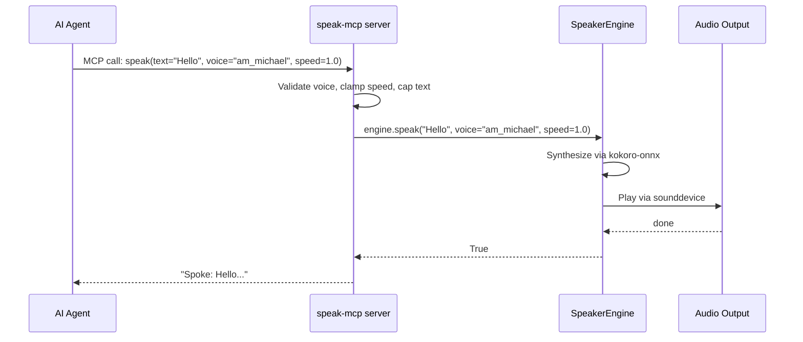

# MCP Server Reference

## What is MCP?

Model Context Protocol (MCP) is an open protocol that lets AI agents call external tools over stdio. Speaker uses it to expose `speak()` as a native tool that any MCP-compatible agent can call.

## Architecture

All agent integrations (Claude Code, Kiro CLI, Gemini CLI, OpenCode, Crush, Amp) use the same MCP server. The server keeps the Kokoro model warm in memory for low-latency speech.



## Tool Schema

| Field | Value |
|-------|-------|
| Name | `speak` |
| Parameters | `text: str` — text to speak aloud |
| | `voice: str = "am_michael"` — kokoro voice name |
| | `speed: float = 1.0` — speed from 0.5 to 2.0 |
| Returns | `str` — confirmation (`Spoke: ...`) or error message |

### Input Validation

- **voice**: Must match pattern `{2 lowercase letters}_{2-20 lowercase letters}` (e.g. `am_michael`, `af_heart`)
- **speed**: Clamped to 0.5-2.0 range
- **text**: Truncated at 10,000 characters

## Entry Point

The MCP server is installed as `speak-mcp` via `uv tool install .`. It runs `speaker.mcp_server:main` which starts a FastMCP server on stdio.

```bash
# Verify it's installed
which speak-mcp

# Test the server (starts on stdio, expects MCP JSON-RPC)
speak-mcp
```

## Adding to Any Agent

All agents use the same MCP config pattern:

```json
{
  "mcpServers": {
    "speaker": {
      "command": "speak-mcp",
      "args": []
    }
  }
}
```

See [agent-install.md](agent-install.md) for platform-specific config locations.

## Voices

| Voice | Description |
|-------|-------------|
| `am_michael` | American male (default) — clear, natural |
| `af_heart` | American female — warm tone |
| `af_bella` | American female — bright |
| `am_adam` | American male — deeper |
| `bf_emma` | British female |

## Speed

| Speed | Effect |
|-------|--------|
| `0.5` | Half speed — very slow, useful for dense content |
| `0.8` | Slightly slow — good for learning |
| `1.0` | Normal (default) |
| `1.2` | Slightly fast — good for familiar content |
| `1.5` | Fast — skimming |
| `2.0` | Maximum — double speed |

## Testing

**Test the MCP server starts:**
```bash
speak-mcp
# Should start on stdio waiting for MCP JSON-RPC messages
# Ctrl+C to exit
```

If the server starts but the tool doesn't work in your agent, check the agent's MCP config — see [troubleshooting.md](troubleshooting.md#mcp-server-not-working).

## Server Source

The server is minimal — one file, one tool, in-process engine:

```python
from mcp.server.fastmcp import FastMCP
from speaker.engine import SpeakerEngine

mcp = FastMCP("speaker")
_engine = SpeakerEngine()

@mcp.tool()
def speak(text: str, voice: str = "am_michael", speed: float = 1.0) -> str:
    """Speak text aloud using high-quality local TTS."""
    if _engine.speak(text, voice=voice, speed=speed):
        return f"Spoke: {text[:80]}..."
    return "TTS failed."
```
