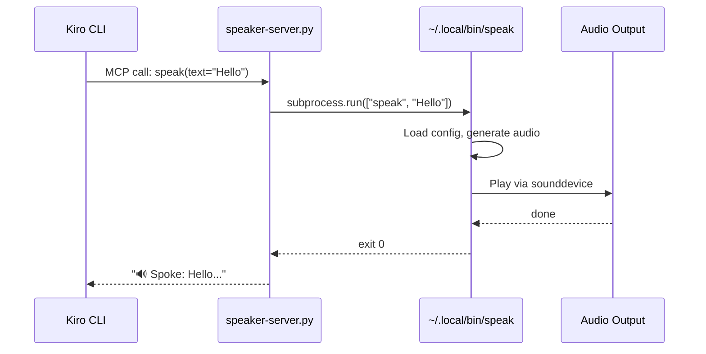

# MCP Server Reference

## What is MCP?

Model Context Protocol (MCP) is an open protocol that lets AI agents call external tools over stdio — speaker-server.py uses it to expose `speak()` as a native tool.

## How It Works

`speaker-server.py` is a FastMCP server with one tool. Kiro CLI launches it as a subprocess, communicates over stdio using MCP protocol, and the server calls the `speak` CLI binary via subprocess.



## Tool Schema

| Field | Value |
|-------|-------|
| Name | `speak` |
| Parameter | `text: str` — the text to speak aloud |
| Returns | `str` — confirmation (`🔊 Spoke: ...`) or error message |
| Timeout | 120 seconds |

The tool calls `~/.local/bin/speak` (installed by `uv tool install`). It uses whatever voice/speed/backend is configured in `~/.config/speaker/config.yaml`.

## Adding to Any Kiro Agent

Merge this into your agent's JSON config:

```json
{
  "mcpServers": {
    "speaker": {
      "command": "uvx",
      "args": ["--from", "mcp[cli]", "mcp", "run", "~/.kiro/agents/mcp/speaker-server.py"],
      "env": {"FASTMCP_LOG_LEVEL": "ERROR"}
    }
  },
  "allowedTools": ["mcp_speaker_speak"]
}
```

The tool name in `allowedTools` follows the pattern `mcp_{server}_{tool}` → `mcp_speaker_speak`.

## Testing Standalone

**Run the server directly:**
```bash
uvx --from "mcp[cli]" mcp run ~/.kiro/agents/mcp/speaker-server.py
```

This starts the server on stdio. It expects MCP JSON-RPC messages — useful for verifying the server starts without errors.

**Test the underlying CLI:**
```bash
~/.local/bin/speak "MCP test"
```

If the CLI works but the MCP tool doesn't, the issue is in the server config or MCP transport — see [troubleshooting.md](troubleshooting.md#mcp-server-not-showing-in-tools).

## Server Source

The full server is minimal — one file, one tool:

```python
from mcp.server.fastmcp import FastMCP
import subprocess
from pathlib import Path

mcp = FastMCP("speaker")
_SPEAK_BIN = Path.home() / ".local" / "bin" / "speak"

@mcp.tool()
def speak(text: str) -> str:
    """Speak text aloud using TTS."""
    subprocess.run([str(_SPEAK_BIN), text], check=True, timeout=120, capture_output=True)
    return f"🔊 Spoke: {text[:80]}..."
```
