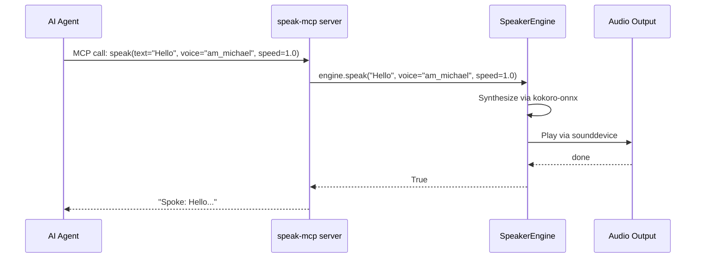

# MCP Server Reference

## What is MCP?

Model Context Protocol (MCP) is an open protocol that lets AI agents call external tools over stdio. Speaker uses it to expose `speak()` as a native tool that any MCP-compatible agent can call.

## Architecture

All agent integrations (Claude Code, Kiro CLI, Gemini CLI, OpenCode, Crush, Amp) use the same MCP server. The server keeps the Kokoro model warm in memory for low-latency speech.



## Tool Schema

| Field | Value |
|-------|-------|
| Name | `speak` |
| Parameters | `text: str` — text to speak aloud |
| | `voice: str = "am_michael"` — kokoro voice name |
| | `speed: float = 1.0` — speed from 0.5 to 2.0 |
| Returns | `str` — confirmation (`Spoke: ...`) or error message |

## Entry Point

The MCP server is installed as `speak-mcp` via `uv tool install .[mcp]`. It runs `speaker.mcp_server:main` which starts a FastMCP server on stdio.

```bash
# Verify it's installed
which speak-mcp

# Test the server (starts on stdio, expects MCP JSON-RPC)
speak-mcp
```

## Adding to Any Agent

All agents use the same MCP config pattern. Add to your agent's MCP server configuration:

```json
{
  "mcpServers": {
    "speaker": {
      "command": "speak-mcp",
      "args": []
    }
  }
}
```

### Platform-Specific Configs

**Claude Code** (`~/.claude/mcp.json`):
```json
{
  "mcpServers": {
    "speaker": {
      "command": "speak-mcp",
      "args": []
    }
  }
}
```

**Kiro CLI** (in agent JSON):
```json
{
  "mcpServers": {
    "speaker": {
      "command": "speak-mcp",
      "args": [],
      "env": {"FASTMCP_LOG_LEVEL": "ERROR"}
    }
  },
  "allowedTools": ["mcp_speaker_speak"]
}
```

Kiro uses the `mcp_{server}_{tool}` naming convention, so the tool is `mcp_speaker_speak`.

**Gemini CLI** (`~/.gemini/mcp.json`):
```json
{
  "mcpServers": {
    "speaker": {
      "command": "speak-mcp",
      "args": []
    }
  }
}
```

**OpenCode** (`~/.config/opencode/mcp.json`):
```json
{
  "mcpServers": {
    "speaker": {
      "command": "speak-mcp",
      "args": []
    }
  }
}
```

**Crush** (`crush.json`):
```json
{
  "$schema": "https://charm.land/crush.json",
  "mcp": {
    "speaker": {
      "type": "stdio",
      "command": "speak-mcp",
      "args": [],
      "timeout": 120
    }
  }
}
```

## Testing

**Test the MCP server starts:**
```bash
speak-mcp
# Should start on stdio waiting for MCP JSON-RPC messages
# Ctrl+C to exit
```

**Test the underlying engine:**
```bash
speak "MCP test"
```

If the CLI works but the MCP tool doesn't in your agent, the issue is in the agent's MCP config — see [troubleshooting.md](troubleshooting.md#mcp-server-not-showing-in-tools).

## Server Source

The server is minimal — one file, one tool, in-process engine:

```python
from mcp.server.fastmcp import FastMCP
from speaker.engine import SpeakerEngine

mcp = FastMCP("speaker")
_engine = SpeakerEngine()

@mcp.tool()
def speak(text: str, voice: str = "am_michael", speed: float = 1.0) -> str:
    """Speak text aloud using high-quality local TTS."""
    if not text.strip():
        return "No text provided."
    if _engine.speak(text, voice=voice, speed=speed):
        return f"Spoke: {text[:80]}..."
    return "TTS failed — check that kokoro-onnx models are downloaded."
```
