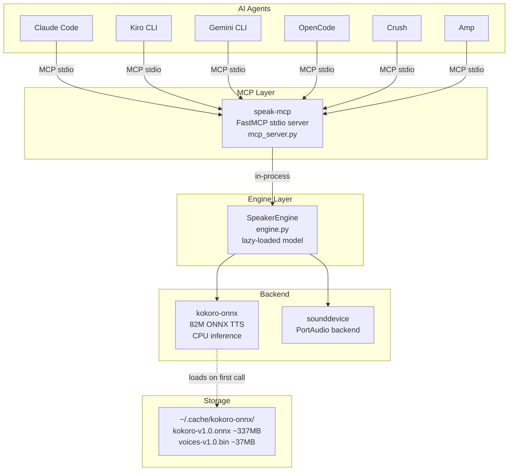
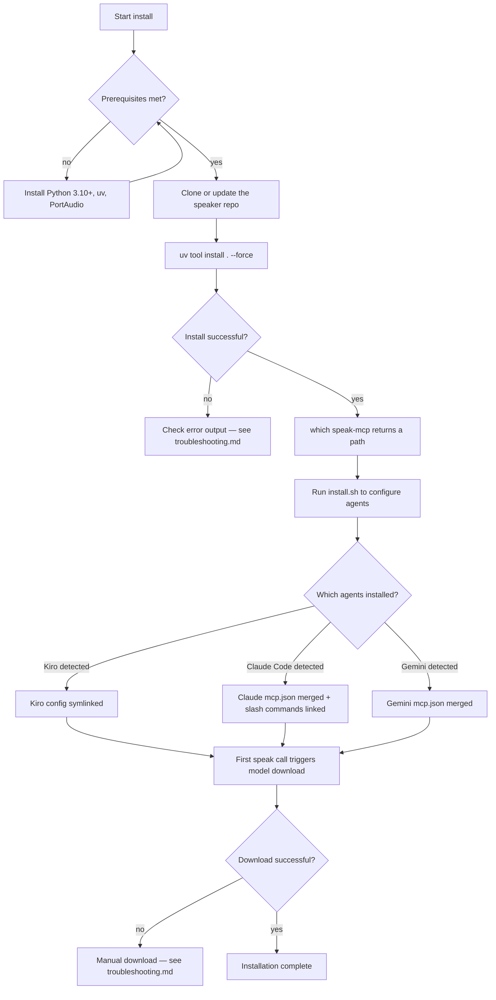
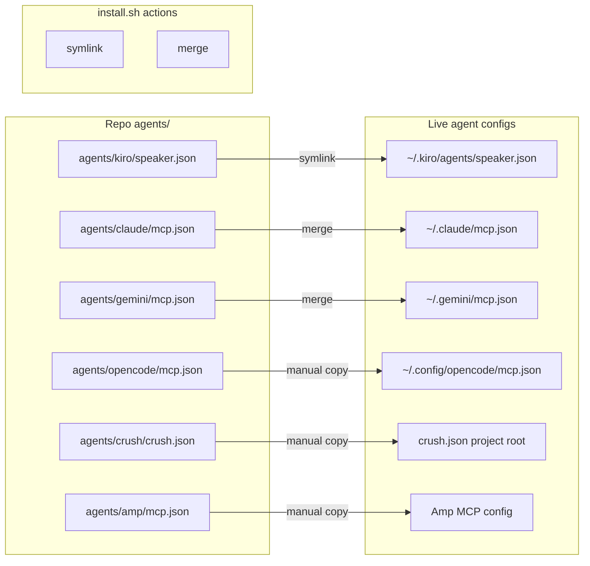
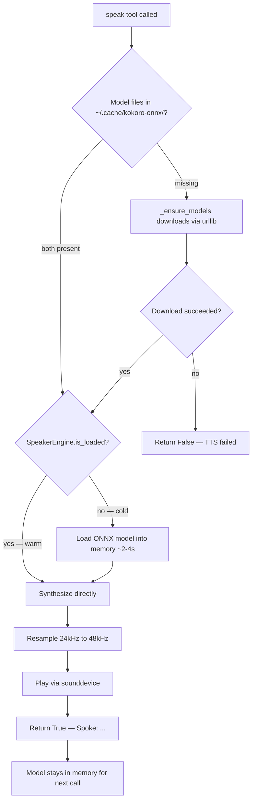
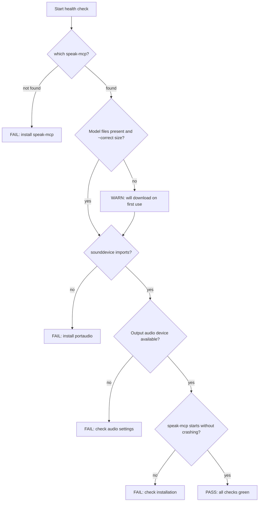
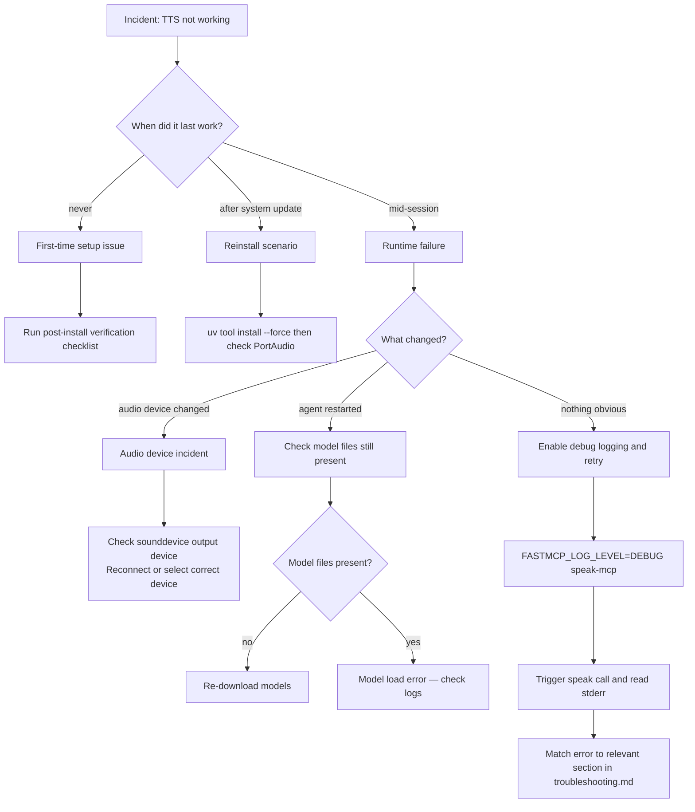
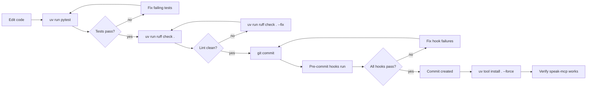

# Operational Runbook

## Table of Contents

1. [Service Overview](#service-overview)
2. [Installation Procedure](#installation-procedure)
3. [Configuration](#configuration)
4. [Updating and Upgrading](#updating-and-upgrading)
5. [Model Management](#model-management)
6. [Health Checks](#health-checks)
7. [Common Operations](#common-operations)
8. [Incident Response](#incident-response)
9. [Maintenance](#maintenance)
10. [Environment Variables](#environment-variables)
11. [Quick Reference Card](#quick-reference-card)
12. [Cross-references](#cross-references)

---

## Service Overview

Speaker is a local text-to-speech (TTS) MCP server for AI coding agents. It wraps the [kokoro-onnx](https://github.com/thewh1teagle/kokoro-onnx) ONNX model in a [FastMCP](https://github.com/jlowin/fastmcp) server, exposing a single `speak` tool. Any MCP-compatible agent can call this tool to speak a response aloud through the local audio system.

**Key characteristics:**
- Runs entirely locally — no network calls after model download
- Single process, single tool, single model loaded in memory
- Model stays warm between calls for low latency (~200ms overhead after first load)
- Installed as `speak-mcp` via `uv tool install`
- Agents connect over stdio using the Model Context Protocol

### Architecture



### Dependencies

| Component | Package | Version | Role |
|-----------|---------|---------|------|
| TTS model | `kokoro-onnx` | >=0.4.0 | ONNX inference for speech synthesis |
| Audio output | `sounddevice` | >=0.5.0 | PortAudio wrapper for cross-platform playback |
| Numerical processing | `numpy` | >=1.24.0 | Audio resampling (24kHz to 48kHz) |
| MCP framework | `mcp[cli]` | >=1.0.0 | FastMCP server, stdio transport |
| Build backend | `hatchling` | any | Python packaging |
| Package manager | `uv` | any | Tool installation and virtual environments |
| System library | PortAudio | system | Required by sounddevice — install via Homebrew or apt |

**Runtime requirements:**
- Python 3.10 or higher
- macOS or Linux (ONNX Runtime CPU inference)
- ~500MB RAM while model is loaded
- ~380MB disk space for model files (`~/.cache/kokoro-onnx/`)

---

## Installation Procedure

### Prerequisites

Before installing Speaker, ensure the following are present:

```bash
# 1. Python 3.10+
python3 --version

# 2. uv package manager
uv --version
# Install if missing: curl -LsSf https://astral.sh/uv/install.sh | sh

# 3. PortAudio (required by sounddevice)
# macOS:
brew install portaudio
# Ubuntu/Debian:
sudo apt-get install libportaudio2 portaudio19-dev
# Fedora/RHEL:
sudo dnf install portaudio-devel
```

### Installation flowchart



### Step-by-step installation

**Step 1: Install the MCP server binary**

```bash
cd ~/code/personal/tools/speaker
uv tool install . --force
```

**Step 2: Verify the binary is on PATH**

```bash
which speak-mcp
# Expected: /Users/<you>/.local/bin/speak-mcp

# If not found, add ~/.local/bin to PATH
echo 'export PATH="$HOME/.local/bin:$PATH"' >> ~/.zshrc
source ~/.zshrc
```

**Step 3: Configure agents**

```bash
# Automated — detects and configures Kiro CLI, Claude Code, Gemini CLI
./scripts/install.sh
```

For OpenCode, Crush, and Amp — see the [Configuration](#configuration) section for manual steps.

**Step 4: Trigger model download**

The 374MB model files download on first use. Pre-download now to avoid a long pause during a session:

```bash
python3 -c "
import sys
sys.path.insert(0, 'src')
from speaker.engine import SpeakerEngine
engine = SpeakerEngine()
print('Loading model...')
ok = engine.load()
print('Model loaded successfully' if ok else 'Model load FAILED')
"
```

Alternatively, call the speak tool from any agent session — the download starts automatically.

### Post-install verification checklist

```bash
# 1. Binary installed
which speak-mcp && echo "PASS: binary found" || echo "FAIL: binary not found"

# 2. Server starts
timeout 2 speak-mcp && echo "PASS: server starts" || echo "PASS: server starts (timeout is expected)"

# 3. Model files present
test -f ~/.cache/kokoro-onnx/kokoro-v1.0.onnx && \
test -f ~/.cache/kokoro-onnx/voices-v1.0.bin && \
echo "PASS: model files present" || echo "FAIL: model files missing"

# 4. sounddevice works
python3 -c "import sounddevice; sounddevice.query_devices(); print('PASS: sounddevice OK')" || echo "FAIL: sounddevice failed"

# 5. Claude Code config (if applicable)
test -f ~/.claude/mcp.json && echo "PASS: Claude mcp.json exists" || echo "SKIP: Claude not installed"

# 6. Kiro config (if applicable)
test -f ~/.kiro/agents/speaker.json && echo "PASS: Kiro agent config exists" || echo "SKIP: Kiro not installed"
```

---

## Configuration

### Config file locations

| Agent | Config file | Key | Notes |
|-------|------------|-----|-------|
| Claude Code | `~/.claude/mcp.json` | `mcpServers` | Merged by install.sh; slash commands in `~/.claude/commands/` |
| Kiro CLI | `~/.kiro/agents/speaker.json` | `mcpServers` + `allowedTools` | Symlinked from repo by install.sh |
| Gemini CLI | `~/.gemini/mcp.json` | `mcpServers` | Merged by install.sh |
| OpenCode | `~/.config/opencode/mcp.json` | `mcpServers` | Manual install |
| Crush | `crush.json` (project root) | `mcp` | Different key from others; manual install |
| Amp | Amp MCP config | `mcpServers` | Manual install |

### Config relationship diagram



### Per-agent config examples

**Claude Code** (`~/.claude/mcp.json`):
```json
{
  "mcpServers": {
    "speaker": {
      "command": "speak-mcp",
      "args": []
    }
  }
}
```

**Kiro CLI** (`~/.kiro/agents/speaker.json`) — abbreviated:
```json
{
  "name": "speaker",
  "mcpServers": {
    "speaker": {
      "command": "speak-mcp",
      "args": [],
      "env": { "FASTMCP_LOG_LEVEL": "ERROR" }
    }
  },
  "allowedTools": ["mcp_speaker_speak"]
}
```

**Gemini CLI / OpenCode / Amp** (`mcp.json`):
```json
{
  "mcpServers": {
    "speaker": {
      "command": "speak-mcp",
      "args": []
    }
  }
}
```

**Crush** (`crush.json` in project root):
```json
{
  "$schema": "https://charm.land/crush.json",
  "mcp": {
    "speaker": {
      "type": "stdio",
      "command": "speak-mcp",
      "args": [],
      "timeout": 120
    }
  }
}
```

---

## Updating and Upgrading

### Check current version

```bash
# Check installed package version
uv tool list | grep speaker

# Check source version
cat ~/code/personal/tools/speaker/pyproject.toml | grep '^version'
```

### Update to latest source

```bash
cd ~/code/personal/tools/speaker

# Pull latest changes
git pull

# Reinstall the tool from updated source
uv tool install . --force
```

### Verify after update

```bash
which speak-mcp
speak-mcp &
SPEAK_PID=$!
sleep 1
kill $SPEAK_PID 2>/dev/null
echo "Post-update check complete"
```

### Rollback procedure

Speaker is installed from source. To roll back to a previous state:

```bash
cd ~/code/personal/tools/speaker

# Find the commit you want to roll back to
git log --oneline -10

# Check out that commit
git checkout <commit-hash>

# Reinstall from that state
uv tool install . --force

# Verify
which speak-mcp
```

To return to the latest version:
```bash
git checkout main
uv tool install . --force
```

---

## Model Management

### Model file locations and sizes

| File | Path | Expected size |
|------|------|--------------|
| ONNX model | `~/.cache/kokoro-onnx/kokoro-v1.0.onnx` | ~337MB |
| Voice embeddings | `~/.cache/kokoro-onnx/voices-v1.0.bin` | ~37MB |

Total disk space required: ~380MB

### Model lifecycle



### Checking model integrity

```bash
ls -lh ~/.cache/kokoro-onnx/
# Verify sizes match expectations:
# kokoro-v1.0.onnx should be approximately 337MB (353,000,000 bytes)
# voices-v1.0.bin  should be approximately 37MB  (37,000,000 bytes)
```

For a more thorough check, verify the file can be read without error:
```bash
python3 -c "
from pathlib import Path
import struct

onnx = Path.home() / '.cache/kokoro-onnx/kokoro-v1.0.onnx'
voices = Path.home() / '.cache/kokoro-onnx/voices-v1.0.bin'

for f in (onnx, voices):
    if not f.exists():
        print(f'MISSING: {f.name}')
    elif f.stat().st_size < 1_000_000:
        print(f'TOO SMALL (possible corruption): {f.name} ({f.stat().st_size} bytes)')
    else:
        print(f'OK: {f.name} ({f.stat().st_size / 1_000_000:.0f} MB)')
"
```

### Forcing model re-download

```bash
# Delete model files — engine re-downloads on next speak call
rm -rf ~/.cache/kokoro-onnx/

# Optionally pre-download immediately rather than waiting for next call
python3 -c "
import sys
sys.path.insert(0, '$HOME/code/personal/tools/speaker/src')
from speaker.engine import SpeakerEngine
ok = SpeakerEngine().load()
print('Re-download', 'successful' if ok else 'FAILED')
"
```

### Disk space requirements

| State | Disk usage |
|-------|-----------|
| No models downloaded | ~0MB |
| Models present | ~380MB |
| During download (peak) | ~760MB (new + temp file) |

The atomic download pattern uses a `.download` temp file alongside the target. At peak, both the temp file and the final file exist simultaneously. Ensure at least 760MB free in `~/.cache/` before first use.

---

## Health Checks

### Quick health check sequence

Run all checks with a single command block:

```bash
echo "=== Speaker Health Check ==="

echo ""
echo "1. Binary"
which speak-mcp && echo "   PASS" || echo "   FAIL: speak-mcp not on PATH"

echo ""
echo "2. Model files"
ONNX=~/.cache/kokoro-onnx/kokoro-v1.0.onnx
VOICES=~/.cache/kokoro-onnx/voices-v1.0.bin
[ -f "$ONNX" ] && echo "   PASS: kokoro-v1.0.onnx ($(du -sh $ONNX | cut -f1))" || echo "   FAIL: kokoro-v1.0.onnx missing"
[ -f "$VOICES" ] && echo "   PASS: voices-v1.0.bin ($(du -sh $VOICES | cut -f1))" || echo "   FAIL: voices-v1.0.bin missing"

echo ""
echo "3. Python imports"
python3 -c "import sounddevice; print('   PASS: sounddevice')" 2>/dev/null || echo "   FAIL: sounddevice import failed"
python3 -c "import kokoro_onnx; print('   PASS: kokoro_onnx')" 2>/dev/null || echo "   FAIL: kokoro_onnx import failed"
python3 -c "import numpy; print('   PASS: numpy')" 2>/dev/null || echo "   FAIL: numpy import failed"

echo ""
echo "4. Audio device"
python3 -c "
import sounddevice as sd
dev = sd.query_devices(kind='output')
print(f'   PASS: {dev[\"name\"]} @ {int(dev[\"default_samplerate\"])}Hz')
" 2>/dev/null || echo "   FAIL: no output audio device"

echo ""
echo "5. MCP server starts"
timeout 2 speak-mcp > /dev/null 2>&1
[ $? -eq 124 ] && echo "   PASS: server starts (timeout as expected)" || echo "   CHECK: server exited early — run speak-mcp manually to investigate"

echo ""
echo "=== Done ==="
```

### Health check flowchart



### Expected healthy state

| Check | Expected |
|-------|---------|
| `which speak-mcp` | `/Users/<you>/.local/bin/speak-mcp` |
| `ls -lh ~/.cache/kokoro-onnx/` | Two files, ~337MB and ~37MB |
| `python3 -c "import sounddevice"` | No output (no error) |
| `speak-mcp` | Blocks on stdin (does not exit immediately) |
| First `speak` call | ~2-4s pause, then audio plays |
| Subsequent `speak` calls | ~200ms pause, then audio plays |

---

## Common Operations

### Enable voice in an agent session

| Agent | Command |
|-------|---------|
| Claude Code | `/speak-start` |
| Kiro CLI | `@speak-start` |
| Gemini CLI | `@speak-start` |
| OpenCode | `@speak-start` |
| Amp | `@speak-start` |

### Disable voice in an agent session

| Agent | Command |
|-------|---------|
| Claude Code | `/speak-stop` |
| Kiro CLI | `@speak-stop` |
| Gemini CLI | `@speak-stop` |
| OpenCode | `@speak-stop` |
| Amp | `@speak-stop` |

### Change voice

The voice is set per `speak` tool call. To change the default, update the agent's system prompt to specify a different voice when calling the tool.

Available voices: `am_michael` (default), `af_heart`, `af_bella`, `am_adam`, `bf_emma`

Example — instruct the agent to use a different voice:
```
When voice is enabled, call speak(text=<response>, voice="af_heart", speed=1.0)
```

### Change speech speed

Speed is also a per-call parameter. Update the agent's system prompt:
```
When voice is enabled, call speak(text=<response>, voice="am_michael", speed=1.2)
```

Valid range: `0.5` (half speed) to `2.0` (double speed). Default: `1.0`.

### Clear model cache

```bash
# Remove all model files — next speak call re-downloads
rm -rf ~/.cache/kokoro-onnx/
```

### Reinstall after system update

After a macOS or Python update, the tool environment may need to be rebuilt:

```bash
# Reinstall uv tool environment
cd ~/code/personal/tools/speaker
uv tool install . --force

# Verify
which speak-mcp
speak-mcp   # should start cleanly — Ctrl-C to exit
```

PortAudio may also need reinstalling after a macOS major version update:
```bash
brew reinstall portaudio
uv tool install . --force
```

### Remove Speaker entirely

```bash
# Uninstall the uv tool
uv tool uninstall speaker

# Remove model cache
rm -rf ~/.cache/kokoro-onnx/

# Remove agent configs (if desired — install.sh created symlinks for Kiro and Claude)
rm ~/.kiro/agents/speaker.json
rm -rf ~/.kiro/agents/speaker/
# Edit ~/.claude/mcp.json to remove the speaker entry
# Edit ~/.gemini/mcp.json to remove the speaker entry
```

---

## Incident Response

### Incident response flowchart



### Incident: TTS fails mid-session

**Symptom:** Voice was working earlier in the session but now returns `"TTS failed"`.

**Immediate diagnosis:**
```bash
# Check model files still present
ls -lh ~/.cache/kokoro-onnx/

# Check audio device still available
python3 -c "import sounddevice; print(sounddevice.query_devices(kind='output'))"
```

**Recovery:**
1. If model files missing: `rm -rf ~/.cache/kokoro-onnx/` and let the engine re-download.
2. If audio device missing: reconnect the device (plug in headphones, reconnect Bluetooth), then retry.
3. If both present and healthy: restart the agent — this reloads the `speak-mcp` process and the model.

---

### Incident: Model files corrupted

**Symptom:** Model files are present but `speak` returns `"TTS failed"`. Logs show `Failed to load Kokoro model`.

**Recovery:**
```bash
# Delete and force re-download
rm -rf ~/.cache/kokoro-onnx/

# Pre-download immediately
python3 -c "
import sys
sys.path.insert(0, '$HOME/code/personal/tools/speaker/src')
from speaker.engine import SpeakerEngine
ok = SpeakerEngine().load()
print('Recovery', 'successful' if ok else 'FAILED — check network and disk space')
"
```

---

### Incident: Audio device changes

**Symptom:** After connecting or disconnecting headphones / Bluetooth, sound stops or plays through the wrong device.

**Cause:** sounddevice uses the system default output device at the time `sd.play()` is called. Changing the system default while a session is active takes effect on the next call.

**Recovery:**
1. Change the system output device in macOS Sound settings to your preferred device.
2. Call `speak` again — the next call picks up the new system default.
3. No restart required.

If sound routes to the wrong device consistently, override the device in the MCP config environment:
```json
"env": { "SD_DEFAULT_DEVICE": "2" }
```
where `2` is the device index from `sounddevice.query_devices()`.

---

### Incident: Agent cannot find speak tool

**Symptom:** After updating the repo, agent, or system, the speak tool is no longer visible.

**Recovery:**
```bash
# Re-run full install
cd ~/code/personal/tools/speaker
uv tool install . --force
./scripts/install.sh

# Verify binary
which speak-mcp

# Restart the agent (MCP configs are read at session start)
```

If the agent config was overwritten by an agent update (Kiro agent JSON, Claude mcp.json), re-run the install script — it merges non-destructively.

---

## Maintenance

### Running tests

```bash
cd ~/code/personal/tools/speaker
uv run pytest
```

The test suite requires >=90% code coverage (configured in `pyproject.toml`). A failing coverage threshold fails the test run.

**Run with verbose output:**
```bash
uv run pytest -v
```

**Run a specific test file:**
```bash
uv run pytest tests/test_engine.py -v
```

### Running the linter

```bash
cd ~/code/personal/tools/speaker

# Check for linting issues
uv run ruff check .

# Auto-fix fixable issues
uv run ruff check . --fix

# Check formatting
uv run ruff format --check .

# Apply formatting
uv run ruff format .
```

### Pre-commit hooks

Pre-commit hooks run automatically on `git commit`. They run:
- `ruff` — linting and formatting check
- `detect-secrets` — check for accidentally committed credentials
- `pyright` — static type checking
- `pytest` — full test suite with coverage

To run hooks manually without committing:
```bash
pre-commit run --all-files
```

To install hooks after cloning:
```bash
pre-commit install
```

### Coverage report

```bash
uv run pytest --cov=speaker --cov-report=html
open htmlcov/index.html
```

### Development workflow



---

## Environment Variables

| Variable | Where set | Values | Effect |
|----------|----------|--------|--------|
| `FASTMCP_LOG_LEVEL` | MCP config `env` block | `DEBUG`, `INFO`, `WARNING`, `ERROR` | Controls verbosity of FastMCP log output to stderr. Default is `WARNING`. Kiro sets this to `ERROR` to suppress noise. Set to `DEBUG` for troubleshooting. |
| `PATH` | `~/.zshrc` or `~/.bashrc` | Must include `~/.local/bin` | Required for `speak-mcp` to be found. Added by uv installer, but may need manual addition. |
| `https_proxy` / `http_proxy` | MCP config `env` block or shell | Proxy URL | If set, urllib uses this proxy for model downloads. Set in agent MCP config if behind a corporate proxy. |

### Setting environment variables in agent configs

All MCP agents support an `env` block in their MCP config. Example for Claude Code:

```json
{
  "mcpServers": {
    "speaker": {
      "command": "speak-mcp",
      "args": [],
      "env": {
        "FASTMCP_LOG_LEVEL": "DEBUG",
        "https_proxy": "http://proxy.example.com:8080"
      }
    }
  }
}
```

The `env` block merges with the process environment — it does not replace it. Existing environment variables remain available unless explicitly overridden.

---

## Quick Reference Card

| Operation | Command | Expected result |
|-----------|---------|----------------|
| Install | `uv tool install . --force` | `speak-mcp` binary in `~/.local/bin/` |
| Verify install | `which speak-mcp` | Path to binary |
| Start server manually | `speak-mcp` | Blocks on stdin (Ctrl-C to exit) |
| Configure all agents | `./scripts/install.sh` | Configs merged / linked |
| Check model files | `ls -lh ~/.cache/kokoro-onnx/` | Two files ~337MB and ~37MB |
| Force model re-download | `rm -rf ~/.cache/kokoro-onnx/` | Files deleted; engine re-downloads on next call |
| Pre-download models | `python3 -c "import sys; sys.path.insert(0,'src'); from speaker.engine import SpeakerEngine; SpeakerEngine().load()"` | `True` printed |
| Check audio devices | `python3 -c "import sounddevice; print(sounddevice.query_devices())"` | List of audio devices |
| Enable debug logs | `FASTMCP_LOG_LEVEL=DEBUG speak-mcp` | Verbose log output to stderr |
| Run tests | `uv run pytest` | All tests pass, coverage >=90% |
| Run linter | `uv run ruff check .` | No issues reported |
| Update to latest | `git pull && uv tool install . --force` | Updated binary |
| Uninstall | `uv tool uninstall speaker` | Binary removed |
| Enable voice (Claude) | `/speak-start` in session | Agent calls speak tool on each response |
| Disable voice (Claude) | `/speak-stop` in session | Agent stops calling speak tool |
| Enable voice (others) | `@speak-start` in session | Agent calls speak tool on each response |
| Disable voice (others) | `@speak-stop` in session | Agent stops calling speak tool |

---

## Cross-references

- [troubleshooting.md](troubleshooting.md) — Detailed fault diagnosis by symptom, with decision trees and fix steps
- [agent-install.md](agent-install.md) — Agent-specific installation instructions and config file formats
- [mcp.md](mcp.md) — MCP tool schema, voice list, speed reference, and protocol details
- [codemap.md](codemap.md) — Source code architecture, module breakdown, and data flow diagrams
