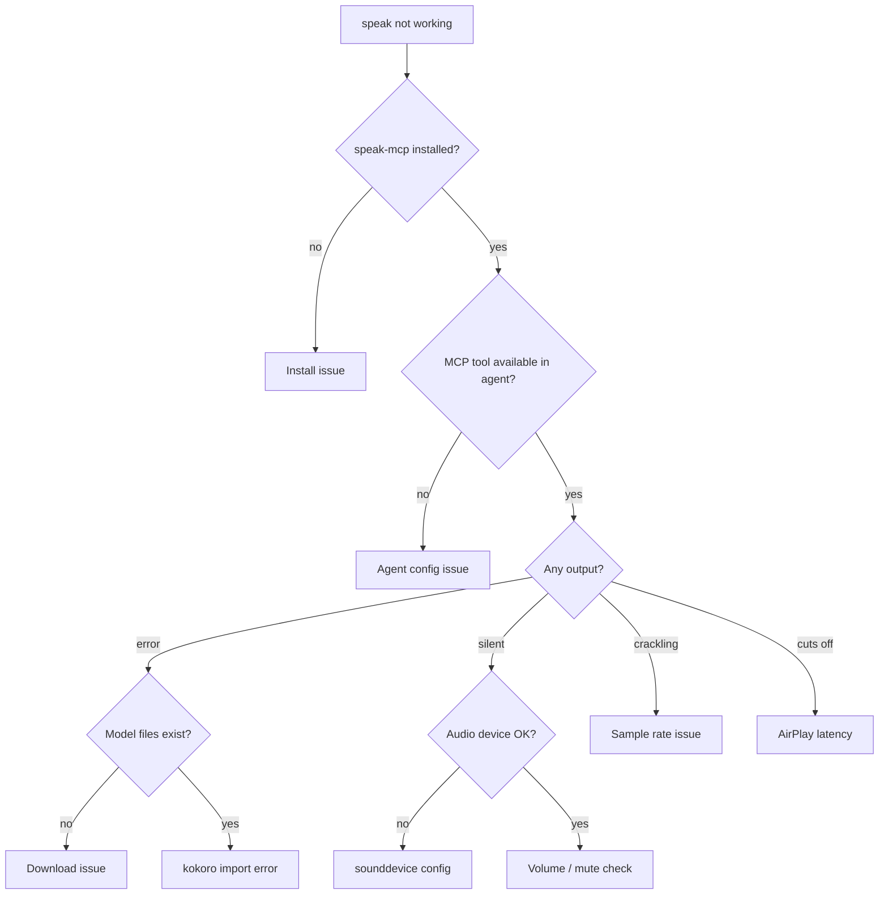

# Troubleshooting

## Diagnostic Decision Tree



## `speak-mcp` Not Installed

**Symptom:** `zsh: command not found: speak-mcp`

**Fix:**
```bash
# Check if it's installed
which speak-mcp

# Add ~/.local/bin to PATH (add to ~/.zshrc)
export PATH="$HOME/.local/bin:$PATH"

# Or reinstall
cd ~/code/personal/tools/speaker
uv tool install . --force
```

## MCP Server Not Working

**Symptom:** Agent doesn't have the speak tool available.

**Check 1 — speak-mcp is installed:**
```bash
which speak-mcp
# Should show ~/.local/bin/speak-mcp
```

**Check 2 — MCP config exists:**

For Claude Code:
```bash
cat ~/.claude/mcp.json
# Should contain: "speaker": { "command": "speak-mcp" }
```

For Kiro CLI:
```bash
cat ~/.kiro/agents/speaker.json
# Should contain mcpServers.speaker
```

**Check 3 — Test the server manually:**
```bash
speak-mcp
# Should start on stdio waiting for MCP messages
# Ctrl+C to exit
```

**Check 4 — Kiro allowedTools:**

Kiro agents need `"mcp_speaker_speak"` in `allowedTools`. Without it, the tool exists but the agent can't call it.

## No Sound Output

**Symptom:** Tool returns success but no audio plays.

**Check 1 — Model files:**
```bash
ls -la ~/.cache/kokoro-onnx/
# Should contain: kokoro-v1.0.onnx (~337MB), voices-v1.0.bin
```

If missing, re-trigger download:
```bash
rm -rf ~/.cache/kokoro-onnx
# Next speak tool call will re-download
```

**Check 2 — Audio device:**
```bash
python3 -c "import sounddevice; print(sounddevice.query_devices())"
```

**Check 3 — Volume:**
Check system volume isn't muted.

## Crackling Audio

**Symptom:** Audio plays but sounds distorted or crackly.

**Cause:** kokoro-onnx outputs 24kHz audio. Some audio devices (especially Bluetooth/AirPlay) expect 48kHz. The engine resamples to 48kHz to fix this.

If you still hear crackling:
```bash
python3 -c "import sounddevice; print(sounddevice.query_devices(kind='output'))"
```

## AirPlay Latency

**Symptom:** Short clips get cut off. First ~2 seconds of audio are silent or missing.

**Cause:** AirPlay has a ~2 second buffer. Audio playback is non-blocking, so the MCP tool returns immediately while audio is still playing. If the MCP server exits before AirPlay flushes its buffer, short clips get cut off.

**Workarounds:**
- Use wired headphones or built-in speakers for short clips
- For longer text, this isn't noticeable

## Slow Generation

**Symptom:** Long pause before audio plays.

**Cause:** kokoro-onnx runs on CPU. Long text takes proportionally longer to generate.

**Mitigations:**
- Keep spoken text short — agents should exclude code blocks
- First call loads the model (~2s), subsequent calls are faster (~200ms overhead)
- The MCP server keeps the model warm in memory between calls

## Model Download Fails

**Symptom:** Tool returns "TTS failed" and no model files exist.

**Check logs:** The engine logs download failures at WARNING level. If running with debug logging enabled, you'll see the specific error.

**Manual download:**
```bash
mkdir -p ~/.cache/kokoro-onnx
cd ~/.cache/kokoro-onnx
curl -fsSL -o kokoro-v1.0.onnx https://github.com/thewh1teagle/kokoro-onnx/releases/download/model-files-v1.0/kokoro-v1.0.onnx
curl -fsSL -o voices-v1.0.bin https://github.com/thewh1teagle/kokoro-onnx/releases/download/model-files-v1.0/voices-v1.0.bin
```

**Verify:**
```bash
ls -lh ~/.cache/kokoro-onnx/
# kokoro-v1.0.onnx should be ~337MB
# voices-v1.0.bin should be ~37MB
```

## Checksum Mismatch

**Symptom:** Log message `Checksum mismatch for <file>: expected ..., got ...`

**Cause:** The downloaded model file does not match the expected SHA-256 hash. This could indicate a corrupted download or a changed upstream release.

**Fix:**
```bash
rm -rf ~/.cache/kokoro-onnx
# Next speak tool call will re-download and verify
```

If the error persists, the upstream model files may have changed. Check for a newer version of speaker.
