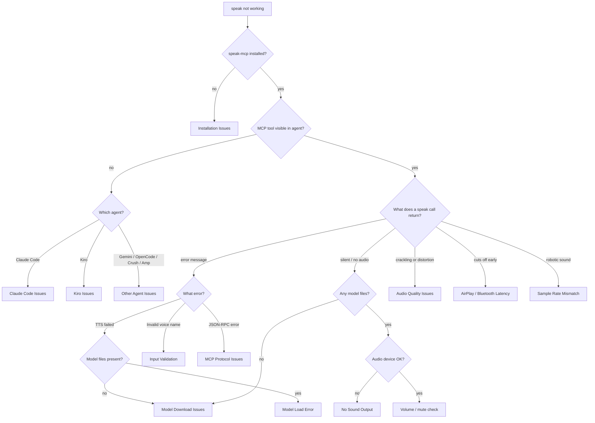
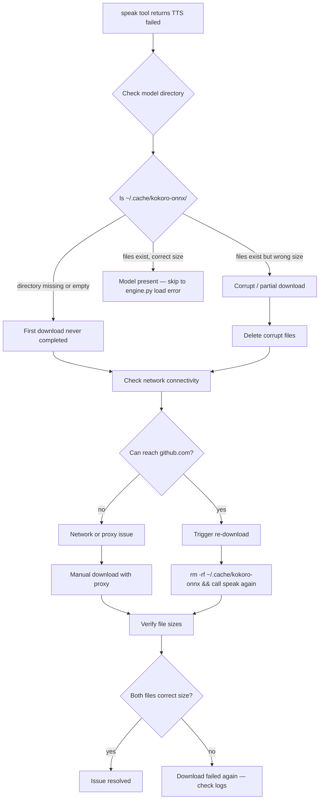

# Troubleshooting Guide

## Table of Contents

1. [Diagnostic Decision Tree](#diagnostic-decision-tree)
2. [Quick Diagnostic Commands](#quick-diagnostic-commands)
3. [Installation Issues](#installation-issues)
4. [Model Download Issues](#model-download-issues)
5. [No Sound Output](#no-sound-output)
6. [Audio Quality Issues](#audio-quality-issues)
7. [Performance Issues](#performance-issues)
8. [Agent-Specific Issues](#agent-specific-issues)
9. [MCP Protocol Issues](#mcp-protocol-issues)
10. [Input Validation Errors](#input-validation-errors)
11. [Log Analysis](#log-analysis)

---

## Diagnostic Decision Tree

Start here. Follow the branch that matches your situation to reach the relevant section.



---

## Quick Diagnostic Commands

Run these in sequence to quickly locate the problem. Each command tells you something specific.

| Command | What it checks | Healthy output |
|---------|---------------|----------------|
| `which speak-mcp` | MCP server installed and on PATH | `/Users/<you>/.local/bin/speak-mcp` |
| `speak-mcp` | Server starts without error | Waits silently (stdio) — Ctrl-C to exit |
| `ls -lh ~/.cache/kokoro-onnx/` | Model files present and correct size | `kokoro-v1.0.onnx` ~337MB, `voices-v1.0.bin` ~37MB |
| `python3 -c "import sounddevice; print(sounddevice.query_devices())"` | PortAudio and sounddevice functional | List of audio devices |
| `python3 -c "import sounddevice; print(sounddevice.query_devices(kind='output'))"` | Active output device | Device name and sample rate |
| `python3 -c "import kokoro_onnx; print('ok')"` | kokoro-onnx importable | `ok` |
| `python3 --version` | Python version meets requirement | `Python 3.10.x` or higher |
| `uv tool list` | Speaker installed as uv tool | Line containing `speaker` |
| `cat ~/.claude/mcp.json` | Claude Code MCP config | JSON with `mcpServers.speaker` |
| `cat ~/.kiro/agents/speaker.json` | Kiro agent config | JSON with `mcpServers.speaker` and `allowedTools` |

---

## Installation Issues

### `speak-mcp` not found

**Symptom:** `zsh: command not found: speak-mcp` or `which speak-mcp` returns nothing.

**Cause:** Either the tool is not installed, or `~/.local/bin` is not on your PATH.

**Diagnosis:**
```bash
# Check if uv installed it
uv tool list | grep speaker

# Check if the binary exists but PATH is wrong
ls ~/.local/bin/speak-mcp
```

**Fix — binary exists but PATH is wrong:**
```bash
# Add to ~/.zshrc (or ~/.bashrc on Linux)
export PATH="$HOME/.local/bin:$PATH"

# Apply immediately
source ~/.zshrc
```

**Fix — not installed at all:**
```bash
cd ~/code/personal/tools/speaker
uv tool install . --force
```

**Verify:**
```bash
which speak-mcp
# Expected: /Users/<you>/.local/bin/speak-mcp
```

---

### `uv tool install` fails

**Symptom:** The install command errors out or does not produce a `speak-mcp` binary.

**Diagnosis:**
```bash
# Run with verbose output to see what failed
cd ~/code/personal/tools/speaker
uv tool install . --force --verbose
```

**Common causes:**

1. **Python version too old** — Speaker requires Python 3.10+.
   ```bash
   python3 --version
   uv python list   # see available versions
   uv python install 3.12   # install if needed
   ```

2. **Missing build dependencies** — hatchling (the build backend) may fail.
   ```bash
   # Check pyproject.toml is present and valid
   cat pyproject.toml | python3 -m json.tool   # not JSON, but confirms it's readable
   uv pip install hatchling   # install build backend if missing
   ```

3. **Network error downloading dependencies** — See [Model Download Issues](#model-download-issues) for proxy/network guidance; the same applies to pip dependencies.

---

### Python version issues

**Symptom:** `uv tool install` completes but `speak-mcp` fails with `SyntaxError` or import errors referencing Python 3.10+ features.

**Cause:** uv may have used an older Python for the tool environment.

**Fix:**
```bash
# Force a specific Python version
uv tool install . --force --python 3.12

# Verify what Python the tool uses
uv tool run speak-mcp -- --version 2>&1 || true
```

---

### Permission issues

**Symptom:** `uv tool install` fails with `Permission denied` writing to `~/.local/bin`.

**Fix:**
```bash
# Create the directory if it doesn't exist
mkdir -p ~/.local/bin
chmod 755 ~/.local/bin

# Retry install
uv tool install . --force
```

Do not run `uv tool install` with `sudo`. uv tools install to user space by design.

---

## Model Download Issues

The engine downloads two files from GitHub Releases on first use:
- `kokoro-v1.0.onnx` (~337MB) — the ONNX model
- `voices-v1.0.bin` (~37MB) — voice embeddings

Downloads use an atomic rename pattern: files land as `.kokoro-v1.0.onnx.download` during transfer and are renamed on completion. Interrupted downloads leave no partial files behind.

### Download recovery flowchart



### First download hangs or never completes

**Symptom:** First `speak` call never returns. The `.download` temp file grows slowly or not at all.

**Diagnosis:**
```bash
# Watch the download directory while a speak call is in progress
watch -n 2 "ls -lh ~/.cache/kokoro-onnx/"
```

**Causes and fixes:**
- Slow connection — the model is 374MB total. On a slow connection this can take several minutes. Let it complete.
- Firewall blocking GitHub — see the manual download steps below.
- Proxy required — set `https_proxy` before calling the tool (see Proxy section below).

---

### Corrupt or partial model files

**Symptom:** `speak-mcp` logs `Failed to load Kokoro model`, or audio is garbled and model load errors appear.

**Diagnosis:**
```bash
ls -lh ~/.cache/kokoro-onnx/
# Expected:
# kokoro-v1.0.onnx   ~337MB  (353,000,000 bytes approx)
# voices-v1.0.bin    ~37MB   (37,000,000 bytes approx)
```

If sizes are wrong, files are corrupt (likely from an interrupted download).

**Fix — delete and re-download automatically:**
```bash
rm -rf ~/.cache/kokoro-onnx/
# Call the speak tool again — engine re-downloads automatically
```

---

### Network or proxy issues

**Symptom:** Download fails with `URLError` or `Connection refused` in logs.

**Fix — set proxy for the MCP server process:**

For Claude Code, add to `~/.claude/mcp.json`:
```json
{
  "mcpServers": {
    "speaker": {
      "command": "speak-mcp",
      "args": [],
      "env": {
        "https_proxy": "http://your-proxy:port",
        "http_proxy": "http://your-proxy:port"
      }
    }
  }
}
```

Apply the same `env` block to any other agent's MCP config.

---

### Manual download

If automatic download is blocked, download the files manually and place them in the expected location.

```bash
mkdir -p ~/.cache/kokoro-onnx
cd ~/.cache/kokoro-onnx

# Download with curl (preferred — shows progress)
curl -fL --progress-bar \
  -o kokoro-v1.0.onnx \
  "https://github.com/thewh1teagle/kokoro-onnx/releases/download/model-files-v1.0/kokoro-v1.0.onnx"

curl -fL --progress-bar \
  -o voices-v1.0.bin \
  "https://github.com/thewh1teagle/kokoro-onnx/releases/download/model-files-v1.0/voices-v1.0.bin"
```

**Verify sizes after download:**
```bash
ls -lh ~/.cache/kokoro-onnx/
# kokoro-v1.0.onnx should be ~337MB
# voices-v1.0.bin  should be ~37MB
```

After manual download, the engine will detect the files on the next `speak` call and skip the download step.

---

## No Sound Output

The `speak` tool returns `"Spoke: ..."` (success) but you hear nothing.

### Model files missing

**Symptom:** Tool returns `"TTS failed — check that kokoro-onnx models are downloaded."` — not `"Spoke: ..."`.

This means the engine could not load. Check [Model Download Issues](#model-download-issues).

---

### sounddevice import fails / PortAudio not installed

**Symptom:** `speak-mcp` crashes on startup or the speak call errors immediately. Logs show `OSError: PortAudio library not found`.

**Diagnosis:**
```bash
python3 -c "import sounddevice; print(sounddevice.query_devices())"
```

If this fails with `OSError`, PortAudio is not installed.

**Fix on macOS:**
```bash
brew install portaudio
# Then reinstall sounddevice to force relinking
uv tool install . --force
```

**Fix on Linux (Debian/Ubuntu):**
```bash
sudo apt-get install libportaudio2 portaudio19-dev
uv tool install . --force
```

**Fix on Linux (Fedora/RHEL):**
```bash
sudo dnf install portaudio-devel
uv tool install . --force
```

---

### No audio device available

**Symptom:** sounddevice imports fine but nothing plays. No error in logs.

**Diagnosis:**
```bash
python3 -c "
import sounddevice as sd
print('Output device:', sd.query_devices(kind='output'))
print()
print('All devices:')
print(sd.query_devices())
"
```

**Common causes:**
- No output device selected (common in headless or remote environments)
- Audio device in use by another application exclusively

**Fix:**
```bash
# Set a specific output device by index
python3 -c "
import sounddevice as sd
devices = sd.query_devices()
for i, d in enumerate(devices):
    if d['max_output_channels'] > 0:
        print(i, d['name'])
"
# Note the index of your preferred device, then test it
python3 -c "
import sounddevice as sd, numpy as np
sd.default.device = 2  # replace 2 with your device index
sd.play(np.zeros(1000, dtype=np.float32), 48000)
sd.wait()
print('playback complete')
"
```

To persist the device selection, set `SD_DEFAULT_DEVICE` as an environment variable in the MCP config for your agent.

---

### Volume muted

**Symptom:** System audio works for other apps but speak produces silence.

Check that:
- System volume is not at zero or muted (macOS: menu bar speaker icon; Linux: check `amixer` or your DE mixer)
- The application is not individually muted (macOS: open Sound settings, check App Volume pane if visible)

---

### Wrong output device selected

**Symptom:** Audio plays but through the wrong device (e.g., internal speakers when headphones are plugged in, or vice versa).

**Diagnosis:**
```bash
python3 -c "import sounddevice; print(sounddevice.query_devices(kind='output'))"
```

sounddevice uses the system default output device unless overridden. Change the system default output in macOS Sound settings, or set `sd.default.device` as described above.

---

## Audio Quality Issues

### Crackling or distortion

**Symptom:** Audio plays but sounds crackling, popping, or distorted throughout.

**Cause:** Sample rate mismatch between the output stream and the audio device's native rate. The engine resamples kokoro's 24kHz output to 48kHz before playback. If the device's native rate is neither 24kHz nor 48kHz, the OS resampler may introduce artifacts.

**Diagnosis:**
```bash
python3 -c "
import sounddevice as sd
dev = sd.query_devices(kind='output')
print('Device:', dev['name'])
print('Default sample rate:', dev['default_samplerate'])
"
```

**Fix:** If the device native rate is, for example, 44100Hz, the OS resamples from 48kHz which can introduce artifacts on some drivers. Switch the system output device to one that natively supports 48kHz, or change macOS audio MIDI Setup (Applications > Utilities > Audio MIDI Setup) to set the device to 48000Hz.

---

### AirPlay and Bluetooth latency

**Symptom:** Short clips are cut off at the start, or the first 1-2 seconds of audio are missing. Longer clips play correctly but are delayed.

**Cause:** AirPlay has a ~2 second buffering delay. `sd.play()` + `sd.wait()` returns as soon as the samples are queued — not when the last sample exits the speaker. AirPlay's buffer has not yet flushed. Bluetooth has a similar but usually shorter delay (~100-300ms).

**Workarounds:**
- Use wired headphones or the built-in speakers for short notifications
- For long agent responses (the typical use case), AirPlay latency is not noticeable relative to the content length
- There is no fix that doesn't involve buffering extra silence — this is an AirPlay/Bluetooth protocol constraint, not a bug in Speaker

---

### Robotic or unnatural-sounding output

**Symptom:** Speech sounds mechanical, monotone, or clipped — not like the sample voices.

**Causes and fixes:**

1. **Wrong voice name** — An unrecognised voice name passes the regex but maps to an unexpected voice in kokoro. Check the [voice list in mcp.md](mcp.md#voices). Use `am_michael`, `af_heart`, `bf_emma`, `af_bella`, or `am_adam`.

2. **Speed too high or too low** — Speed values at or near 0.5 or 2.0 can sound unnatural. Try speed 1.0 first.

3. **Model files corrupt** — Garbled synthesis that consistently sounds wrong on clean text may indicate a corrupt model. Delete and re-download:
   ```bash
   rm -rf ~/.cache/kokoro-onnx/
   ```

---

## Performance Issues

### Slow first call (expected behaviour)

**Symptom:** The first `speak` call after starting an agent session takes 2-4 seconds before audio plays.

**Cause:** This is expected. The Kokoro ONNX model (~337MB) loads into memory on first call. `SpeakerEngine` uses lazy loading — `engine.load()` is called inside `engine.speak()` when `self._kokoro is None`.

**What to expect:**
- First call: 2-4s load time + synthesis time
- Subsequent calls: ~200ms overhead (model is already warm in memory)
- The model stays loaded for the lifetime of the `speak-mcp` process

If the agent restarts between calls, the model reloads on the next call.

---

### Slow synthesis on long text

**Symptom:** Synthesis takes noticeably longer for long paragraphs.

**Cause:** kokoro-onnx runs on CPU via ONNX Runtime. Synthesis time scales roughly linearly with text length. There is no GPU acceleration in this setup.

**Mitigations:**
- Instruct agents to summarise rather than read verbatim responses — see the persona.md prompts for reference wording
- Keep spoken text under 200-300 words for responsive feedback
- The text truncation limit (10,000 characters) is a safety cap, not a recommended length

---

### High memory usage

**Symptom:** The `speak-mcp` process uses ~400-600MB of RAM while running.

**Cause:** The ONNX model (337MB) is loaded into memory and held there for the lifetime of the process. This is by design — it eliminates the 2-4s cold-start cost on every call.

**If memory is a concern:**
- There is no "unload model" operation exposed via the MCP tool
- Kill and restart the agent to release the memory (the model reloads on next call)
- Consider this a fixed cost: ~500MB for warm TTS, versus 2-4s reload penalty on every call

---

## Agent-Specific Issues

### Claude Code

**Problem: `speak` tool not visible in session**

The tool only appears after Claude Code loads its MCP config. Check:

```bash
cat ~/.claude/mcp.json
```

Expected content:
```json
{
  "mcpServers": {
    "speaker": {
      "command": "speak-mcp",
      "args": []
    }
  }
}
```

If the file is missing or malformed:
```bash
# Re-run the install script
cd ~/code/personal/tools/speaker
./scripts/install.sh
```

If the file is correct but the tool is still absent, restart Claude Code — MCP configs are read at session start.

**Problem: `/speak-start` and `/speak-stop` slash commands not working**

The commands are stored as markdown files in `~/.claude/commands/`. Check they exist:

```bash
ls ~/.claude/commands/speak-start.md ~/.claude/commands/speak-stop.md
```

If missing, the install script creates symlinks to the repo. Re-run it:
```bash
./scripts/install.sh
```

If the files exist but the commands are not recognised, confirm that Claude Code supports custom slash commands — some versions require commands to be in a specific format. Check that the files are non-empty and contain valid slash command markdown.

---

### Kiro CLI

**Problem: `speak` tool not visible or not callable**

Kiro requires two things:
1. The MCP server config in `speaker.json` — declares the server
2. `allowedTools` in `speaker.json` — gates which tools the agent can actually call

```bash
cat ~/.kiro/agents/speaker.json | python3 -m json.tool
```

Confirm the JSON contains both:
```json
{
  "mcpServers": {
    "speaker": { "command": "speak-mcp" }
  },
  "allowedTools": ["mcp_speaker_speak"]
}
```

If `allowedTools` is missing or does not contain `"mcp_speaker_speak"`, Kiro will list the tool as available but block calls to it silently.

**Problem: Kiro persona not loading**

The persona file must exist at `~/.kiro/agents/speaker/persona.md`. The install script creates a symlink from the repo. Check:

```bash
ls -la ~/.kiro/agents/speaker/persona.md
# Should show a symlink pointing to the repo
```

If the symlink is broken (repo moved):
```bash
cd ~/code/personal/tools/speaker
./scripts/install.sh
```

**Problem: `FASTMCP_LOG_LEVEL` spam in Kiro output**

The `speaker.json` sets `"FASTMCP_LOG_LEVEL": "ERROR"` to suppress info-level MCP logs. If you see verbose FastMCP output, check the env block is present in the Kiro agent config.

---

### Gemini CLI

**Problem: MCP config not picked up**

Gemini CLI reads its MCP config from `~/.gemini/mcp.json`. The config format is the same as Claude Code.

```bash
cat ~/.gemini/mcp.json
```

If missing, merge it manually:
```bash
python3 -c "
import json, pathlib
src = json.loads(open('agents/gemini/mcp.json').read())
target = pathlib.Path.home() / '.gemini' / 'mcp.json'
existing = json.loads(target.read_text()) if target.exists() else {}
existing.setdefault('mcpServers', {}).update(src.get('mcpServers', {}))
target.write_text(json.dumps(existing, indent=2) + '\n')
print('Done')
"
```

Restart Gemini CLI after changing the config.

---

### Gemini / OpenCode / Crush / Amp

**Problem: Config format differences**

Each agent uses a slightly different config key:

| Agent | Config file | Key |
|-------|------------|-----|
| Gemini CLI | `~/.gemini/mcp.json` | `mcpServers` |
| OpenCode | `~/.config/opencode/mcp.json` | `mcpServers` |
| Crush | `crush.json` (project root) | `mcp` (not `mcpServers`) |
| Amp | Amp MCP config | `mcpServers` |

Crush uses a different top-level key and requires a `"type": "stdio"` field:
```json
{
  "$schema": "https://charm.land/crush.json",
  "mcp": {
    "speaker": {
      "type": "stdio",
      "command": "speak-mcp",
      "args": [],
      "timeout": 120
    }
  }
}
```

All other agents use the standard `mcpServers` format without the `type` field.

---

## MCP Protocol Issues

### Server starts but tool not visible

**Symptom:** `speak-mcp` runs without error but the agent reports no `speak` tool.

**Diagnosis sequence:**

1. Confirm `speak-mcp` is on PATH:
   ```bash
   which speak-mcp
   ```

2. Confirm the server starts without immediately crashing:
   ```bash
   speak-mcp
   # Should block silently on stdin — Ctrl-C to exit
   # Any immediate output is an error
   ```

3. Confirm the MCP config uses the correct command name (`speak-mcp`, not `speaker` or `speaker-mcp`):
   ```bash
   cat ~/.claude/mcp.json   # or whichever agent config
   ```

4. Restart the agent after any config change — MCP servers are launched at session start.

---

### JSON-RPC errors

**Symptom:** The agent reports an MCP error like `{"jsonrpc":"2.0","error":{"code":-32601,"message":"Method not found"}}`.

**Cause:** The client is calling a method the server does not support, or the server crashed before registering its tools.

**Diagnosis:**
```bash
# Send a minimal MCP initialize request to test the server directly
echo '{"jsonrpc":"2.0","id":1,"method":"initialize","params":{"protocolVersion":"2024-11-05","capabilities":{},"clientInfo":{"name":"test","version":"0.0.1"}}}' | speak-mcp
```

A working server responds with a JSON capabilities object. If it crashes or returns nothing, the server has a startup error — check [Installation Issues](#installation-issues).

---

### stdio transport issues

**Symptom:** Agent connects but messages are lost or corrupted. Logs show framing errors.

**Cause:** Something is writing to stdout alongside the MCP JSON-RPC stream. This corrupts the binary framing.

**Common culprits:**
- Print statements in `~/.zshrc` or `~/.zprofile` that run during shell init (e.g., `echo` or `neofetch` calls)
- Python warnings printed to stdout

**Diagnosis:**
```bash
# Run speak-mcp and watch for any output before it blocks
speak-mcp 2>/dev/null
# Any visible output before the process blocks is contaminating the stdio stream
```

**Fix:** Move any shell startup output to stderr, or guard with `[[ -t 1 ]]` to only print to interactive terminals:
```bash
# In ~/.zshrc — only run interactive commands when terminal is attached
[[ -t 1 ]] && echo "welcome message"
```

---

### Timeout issues

**Symptom:** Agent reports the `speak` tool timed out.

**Cause:** The default MCP tool timeout may be shorter than the time needed to download models on first use (~337MB download on a slow connection).

**Fix for Crush** — increase the timeout in `crush.json`:
```json
{
  "mcp": {
    "speaker": {
      "type": "stdio",
      "command": "speak-mcp",
      "args": [],
      "timeout": 300
    }
  }
}
```

**Fix for other agents** — pre-download the models before the first call so the first `speak` invocation only needs to load (2-4s), not download (potentially minutes):
```bash
cd ~/code/personal/tools/speaker
python3 -c "from speaker.engine import SpeakerEngine; SpeakerEngine().load(); print('Models loaded')"
```

---

## Input Validation Errors

### Invalid voice name rejected

**Symptom:** Tool returns `"Invalid voice name: <name>. Expected format: am_michael, af_heart, etc."`

**Cause:** The voice name does not match the regex `^[a-z]{2}_[a-z]{2,20}$`.

**Valid voice name structure:** `<2 lowercase letters>_<2-20 lowercase letters>`

Examples that pass: `am_michael`, `af_heart`, `bf_emma`, `af_bella`, `am_adam`

Examples that fail:
- `AM_Michael` — uppercase letters
- `american_michael` — prefix more than 2 letters
- `am_` — suffix missing
- `am michael` — space instead of underscore

**Fix:** Use one of the documented voices from [mcp.md](mcp.md#voices), or check your agent's prompt is not modifying the voice parameter before the tool call.

---

### Speed clamped unexpectedly

**Symptom:** Speech plays at an unexpected rate despite specifying a speed value.

**Cause:** Speed is silently clamped to the range 0.5-2.0. Specifying `0.1` gives you `0.5`; specifying `3.0` gives you `2.0`.

This is not an error — the tool returns `"Spoke: ..."` regardless and logs no warning about clamping. If the speech rate is wrong, check what speed value the agent is sending.

**Expected behaviour by value:**

| Requested speed | Actual speed |
|----------------|-------------|
| `0.1` | `0.5` (clamped to minimum) |
| `0.5` | `0.5` |
| `1.0` | `1.0` (default) |
| `2.0` | `2.0` |
| `5.0` | `2.0` (clamped to maximum) |

---

### Text truncated

**Symptom:** Agent speaks only part of a long response.

**Cause:** Text is truncated to 10,000 characters before synthesis. This is a safety limit.

**Expected behaviour:** The engine synthesises the first 10,000 characters of the input. No error is returned; the tool returns `"Spoke: ..."` as normal.

If you need to speak long content, instruct the agent to summarise before calling the tool. The purpose of Speaker is to voice conversational responses, not read documents.

---

### Empty text

**Symptom:** Tool returns `"No text provided."` and no audio plays.

**Cause:** The text parameter was empty or contained only whitespace. The MCP server checks `text.strip()` and short-circuits before synthesis.

**Fix:** Check that the agent's prompt instructs it to call `speak` with the actual response text, not a placeholder or empty string.

---

## Log Analysis

### Enabling debug logging

The MCP server uses Python's `logging` module. The log level is controlled by the `FASTMCP_LOG_LEVEL` environment variable.

**For ad-hoc debugging** — run the server with debug logging directly:
```bash
FASTMCP_LOG_LEVEL=DEBUG speak-mcp
```

Then trigger a `speak` call from your agent in another terminal while watching the server output.

**For persistent debug logging in a specific agent**, add the env var to that agent's MCP config:

Claude Code (`~/.claude/mcp.json`):
```json
{
  "mcpServers": {
    "speaker": {
      "command": "speak-mcp",
      "args": [],
      "env": { "FASTMCP_LOG_LEVEL": "DEBUG" }
    }
  }
}
```

Kiro (`~/.kiro/agents/speaker.json` — change from ERROR to DEBUG):
```json
"env": { "FASTMCP_LOG_LEVEL": "DEBUG" }
```

**Revert to suppress noise after debugging:**
```json
"env": { "FASTMCP_LOG_LEVEL": "ERROR" }
```

---

### Where logs go

The MCP server runs as a child process of your agent. Log output goes to:
- **stderr** of the `speak-mcp` process (separate from the stdio MCP stream on stdout)
- Most agents surface MCP server stderr in their own log output or developer console

To capture logs to a file for analysis:
```bash
speak-mcp 2>/tmp/speaker-debug.log
```

Then trigger calls and inspect `/tmp/speaker-debug.log`.

---

### Common log messages and their meaning

| Log message | Level | Meaning |
|------------|-------|---------|
| `Downloading kokoro-v1.0.onnx...` | INFO | First-use model download started |
| `Failed to download kokoro-v1.0.onnx` | WARNING | Download failed — network issue or disk full |
| `Failed to load Kokoro model` | WARNING | ONNX model present but could not initialise — often a corrupt file |
| `TTS synthesis failed` | WARNING | `kokoro.create()` threw an exception — check voice name and model integrity |
| `Audio playback failed` | WARNING | `sd.play()` or `sd.wait()` threw an exception — check audio device |

All WARNING-level messages include the full exception traceback in the log output, which will indicate the specific error (e.g., `FileNotFoundError`, `URLError`, `OSError`).
