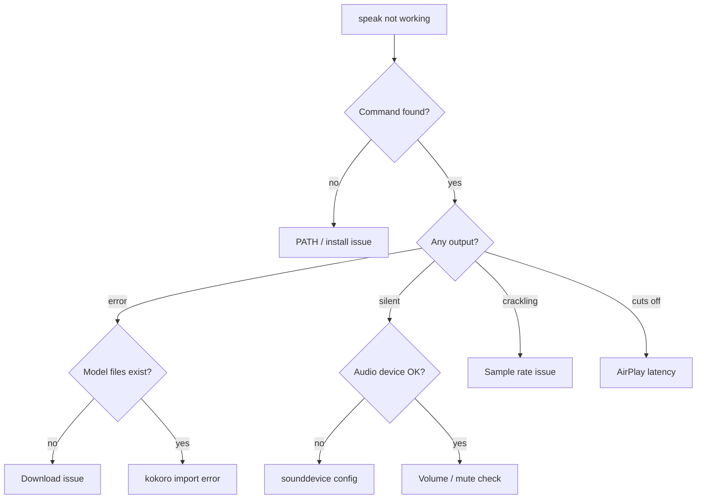

# Troubleshooting

## Diagnostic Decision Tree



## `speak` Command Not Found

**Symptom:** `zsh: command not found: speak`

**Cause:** `uv tool install` puts the binary at `~/.local/bin/speak`, which may not be in your PATH.

**Fix:**
```bash
# Check if it's installed
ls ~/.local/bin/speak
ls ~/.local/bin/speak-mcp

# Add to PATH (add to ~/.zshrc)
export PATH="$HOME/.local/bin:$PATH"

# Or reinstall
cd ~/code/personal/tools/speaker
uv tool install .[mcp] --force
```

## No Sound Output

**Symptom:** Command runs without error but no audio plays.

**Check 1 — Model files:**
```bash
ls -la ~/.cache/kokoro-onnx/
# Should contain: kokoro-v1.0.onnx (~337MB), voices-v1.0.bin
```

If missing, the download may have failed silently. Re-trigger:
```bash
rm -rf ~/.cache/kokoro-onnx
speak "test"  # triggers fresh download
```

**Check 2 — Audio device:**
```bash
python3 -c "import sounddevice; print(sounddevice.query_devices())"
```

If no output device is listed, sounddevice can't find your audio hardware. Check system audio settings.

**Check 3 — Volume:**
Obvious but easy to miss — check system volume isn't muted.

**Check 4 — Try macOS fallback:**
```bash
speak "test" -b macos
```

If this works, the issue is kokoro-specific.

## Crackling Audio

**Symptom:** Audio plays but sounds distorted or crackly.

**Cause:** kokoro-onnx outputs 24kHz audio. Some audio devices (especially Bluetooth/AirPlay) expect 48kHz. The engine resamples to 48kHz to fix this.

If you still hear crackling:
```bash
# Check what sample rate your device expects
python3 -c "import sounddevice; print(sounddevice.query_devices(kind='output'))"
```

The resampling in `engine.py` uses linear interpolation (`np.interp`). This handles the 24->48kHz case well. If your device uses a different rate, the code targets 48kHz hardcoded.

## AirPlay Latency

**Symptom:** Short clips get cut off. First ~2 seconds of audio are silent or missing.

**Cause:** AirPlay has a ~2 second buffer. `sd.play()` + `sd.wait()` finishes before AirPlay has flushed its buffer.

**Workarounds:**
- Use wired headphones or built-in speakers for short clips
- Prefix text with a pause: `speak "... Your actual text here"` (the ellipsis generates a brief pause)
- For longer text, this isn't noticeable

## MCP Server Not Working

**Symptom:** Agent doesn't have the speak tool available.

**Check 1 — speak-mcp is installed:**
```bash
which speak-mcp
# Should show ~/.local/bin/speak-mcp
```

If missing, reinstall:
```bash
cd ~/code/personal/tools/speaker
uv tool install .[mcp] --force
```

**Check 2 — MCP config exists:**

For Claude Code:
```bash
cat ~/.claude/mcp.json
# Should contain: "speaker": { "command": "speak-mcp" }
```

For Kiro CLI:
```bash
cat ~/.kiro/agents/speaker.json
# Should contain mcpServers.speaker
```

**Check 3 — Test the server manually:**
```bash
speak-mcp
# Should start on stdio waiting for MCP messages
# Ctrl+C to exit
```

**Check 4 — Kiro allowedTools:**

Kiro agents need `"mcp_speaker_speak"` in `allowedTools`. Without it, the tool exists but the agent can't call it.

## Slow Generation

**Symptom:** Long pause before audio plays.

**Cause:** kokoro-onnx runs on CPU. Long text takes proportionally longer to generate.

**Mitigations:**
- Keep spoken text short — agents should exclude code blocks
- First call loads the model (~2s), subsequent calls are faster (~200ms overhead)
- The MCP server keeps the model warm in memory between calls
- Very long text (paragraphs) will take several seconds

## Model Download Fails

**Symptom:** `Downloading kokoro-v1.0.onnx...` then error or hang.

**Cause:** Network issue, or `wget` not installed.

**Check wget:**
```bash
which wget
# If missing on macOS:
brew install wget
```

**Manual download:**
```bash
mkdir -p ~/.cache/kokoro-onnx
cd ~/.cache/kokoro-onnx
wget https://github.com/thewh1teagle/kokoro-onnx/releases/download/model-files-v1.0/kokoro-v1.0.onnx
wget https://github.com/thewh1teagle/kokoro-onnx/releases/download/model-files-v1.0/voices-v1.0.bin
```

**Verify:**
```bash
ls -lh ~/.cache/kokoro-onnx/
# kokoro-v1.0.onnx should be ~337MB
# voices-v1.0.bin should be ~37MB
```
