# Use Cases & How-To

## Table of Contents

1. [Quick Reference](#quick-reference)
2. [Use Case 1: Enable/Disable Voice in Claude Code](#use-case-1-enabledisable-voice-in-claude-code)
3. [Use Case 2: Enable/Disable Voice in Kiro CLI](#use-case-2-enabledisable-voice-in-kiro-cli)
4. [Use Case 3: Enable/Disable Voice in Gemini CLI](#use-case-3-enabledisable-voice-in-gemini-cli)
5. [Use Case 4: First-Time Installation](#use-case-4-first-time-installation)
6. [Use Case 5: Adding Speaker to a New Agent](#use-case-5-adding-speaker-to-a-new-agent)
7. [Use Case 6: Changing Voice or Speed](#use-case-6-changing-voice-or-speed)
8. [Use Case 7: Code Review Narration](#use-case-7-code-review-narration)
9. [Use Case 8: Learning and Tutoring](#use-case-8-learning-and-tutoring)
10. [Use Case 9: Accessibility — Neurodivergent Users](#use-case-9-accessibility--neurodivergent-users)
11. [Application Flow Diagrams](#application-flow-diagrams)
12. [Component Interaction Diagram](#component-interaction-diagram)
13. [Error Scenarios](#error-scenarios)
14. [Cross-References](#cross-references)

---

## Quick Reference

| # | Use Case | Agents | Command |
|---|----------|--------|---------|
| 1 | Enable/disable voice in Claude Code | Claude Code | `/speak-start`, `/speak-stop` |
| 2 | Enable/disable voice in Kiro CLI | Kiro CLI | `@speak-start`, `@speak-stop` |
| 3 | Enable/disable voice in Gemini CLI | Gemini CLI | `@speak-start`, `@speak-stop` |
| 4 | First-time installation | All | `./scripts/install.sh` |
| 5 | Add Speaker to a new agent | Any MCP-compatible agent | Manual MCP config |
| 6 | Change voice or speed | All | Prompt instruction or persona edit |
| 7 | Code review narration | All | Enable voice, open diff, ask for review |
| 8 | Learning and tutoring | All | Enable voice, ask questions |
| 9 | Accessibility — neurodivergent users | All | Enable voice, use recommended settings |

Voice is **off by default** in all agents. You must explicitly enable it each session (unless you modify the persona to start with it on).

---

## Use Case 1: Enable/Disable Voice in Claude Code

### User Story

A developer is using Claude Code and wants spoken feedback while reading code in a separate pane. They toggle voice on to hear responses without switching focus from the editor.

### Prerequisites

- Speaker installed (`which speak-mcp` returns a path)
- Claude Code running with `~/.claude/mcp.json` containing the speaker MCP config
- See [Use Case 4](#use-case-4-first-time-installation) if not yet installed

### Steps

1. Start Claude Code in your project directory:
   ```bash
   claude
   ```

2. Enable voice with the slash command:
   ```
   /speak-start
   ```
   Claude confirms: `Voice enabled. I'll speak my responses aloud from now on.`

3. Work normally. Claude calls `speak()` after each response:
   ```
   You: What does this function do?
   Claude: [text response displayed] [audio plays simultaneously]
   ```

4. Disable voice when done:
   ```
   /speak-stop
   ```
   Claude confirms: `Voice disabled.`

### What the `/speak-start` Command Does

The slash command loads `~/.claude/commands/speak-start.md`, which instructs Claude to:
- Call the `speak` MCP tool after every response
- Exclude code blocks from spoken text
- Fall back to `~/.local/bin/speak` if the MCP tool is unavailable
- Remember this state until `/speak-stop` is issued

This is soft-state — stored in the agent's context window, not persisted to disk. Voice resets to off when the session ends.

### Sequence Diagram

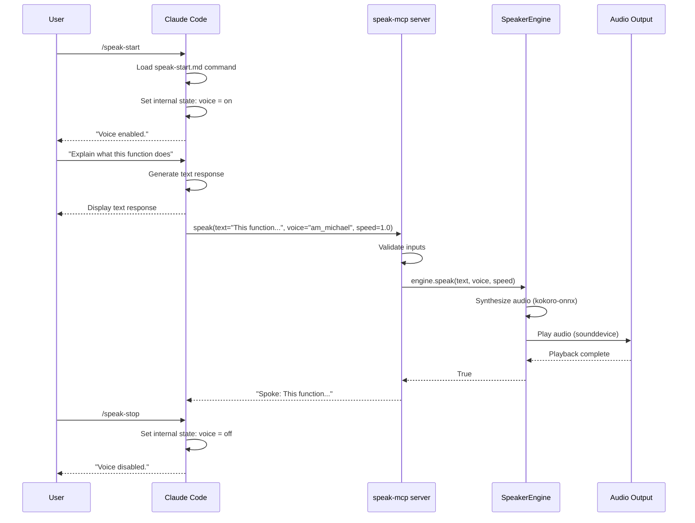

### Expected Output

```
You: /speak-start
Claude: Voice enabled. I'll speak my responses aloud from now on.

You: Explain Python list comprehensions
Claude: List comprehensions give you a concise way to create lists from
        iterables. The syntax is [expression for item in iterable if condition].
        [audio of above text plays]

You: /speak-stop
Claude: Voice disabled.
```

### What Can Go Wrong

| Symptom | Likely Cause | Fix |
|---------|-------------|-----|
| `/speak-start` not recognized | Command file not installed | Run `./scripts/install.sh` or manually install `~/.claude/commands/speak-start.md` |
| No audio after enabling | MCP tool not connected | Restart Claude Code, check `~/.claude/mcp.json` |
| Audio plays for first response only | Claude lost voice state | Re-issue `/speak-start` — this is a known context window behavior |
| `speak-mcp` not found | `~/.local/bin` not in PATH | Add `export PATH="$HOME/.local/bin:$PATH"` to `~/.zshrc` |

See [troubleshooting.md](troubleshooting.md) for detailed diagnosis steps.

---

## Use Case 2: Enable/Disable Voice in Kiro CLI

### User Story

A developer uses Kiro CLI as their primary coding agent and wants voice responses while navigating a large codebase. They start the dedicated speaker agent to get voice-first interactions.

### Prerequisites

- Speaker installed (`which speak-mcp` returns a path)
- Kiro CLI installed and `~/.kiro/agents/speaker.json` present
- See [Use Case 4](#use-case-4-first-time-installation) if not yet installed

### Steps

1. Start a Kiro session with the speaker agent:
   ```bash
   kiro-cli chat --agent speaker
   ```

2. Enable voice:
   ```
   @speak-start
   ```
   Kiro confirms: `Voice enabled.`

3. Work normally. Kiro calls `speak()` after each response.

4. Disable voice:
   ```
   @speak-stop
   ```

### How Kiro's Agent Config Differs from Claude Code

Kiro uses a dedicated agent definition (`speaker.json`) rather than a global MCP config. This means:

- Voice toggle is scoped to the `speaker` agent — other Kiro agents are unaffected
- The `allowedTools` list must include `"mcp_speaker_speak"` for the tool to be callable
- The persona (`persona.md`) defines the voice toggle behavior

### Sequence Diagram

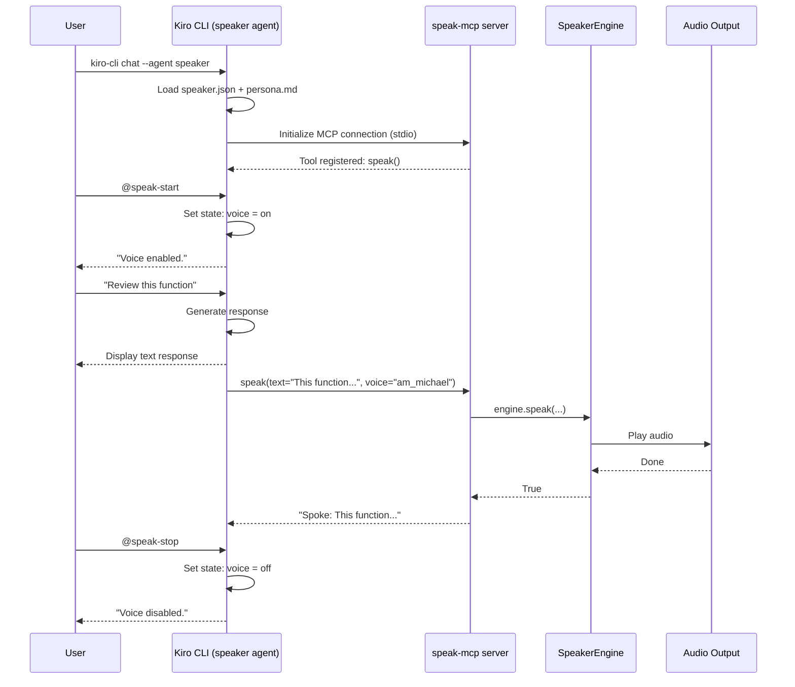

### What Can Go Wrong

| Symptom | Likely Cause | Fix |
|---------|-------------|-----|
| `@speak-start` has no effect | `allowedTools` missing `mcp_speaker_speak` | Add `"mcp_speaker_speak"` to `allowedTools` in `speaker.json` |
| Agent not found | `speaker.json` not in `~/.kiro/agents/` | Run `./scripts/install.sh` or manually copy from `agents/kiro/` |
| Tool not available | MCP server failed to start | Verify `speak-mcp` is on PATH |

See [troubleshooting.md](troubleshooting.md) and [agent-install.md](agent-install.md#kiro-cli).

---

## Use Case 3: Enable/Disable Voice in Gemini CLI

### User Story

A developer prefers Gemini CLI for its large context window and wants voice output when reviewing long documents or summarizing complex topics.

### Prerequisites

- Speaker installed (`which speak-mcp` returns a path)
- Gemini CLI installed and `~/.gemini/mcp.json` configured with the speaker entry
- See [Use Case 4](#use-case-4-first-time-installation) if not yet installed

### Steps

1. Start Gemini CLI:
   ```bash
   gemini
   ```

2. Enable voice:
   ```
   @speak-start
   ```

3. Work normally. Gemini calls `speak()` after each response.

4. Disable voice:
   ```
   @speak-stop
   ```

### Gemini Config Location

Gemini reads MCP config from `~/.gemini/mcp.json`:

```json
{
  "mcpServers": {
    "speaker": {
      "command": "speak-mcp",
      "args": []
    }
  }
}
```

Unlike Kiro, Gemini does not require `allowedTools` — the `speak` tool is available globally once the MCP server is configured.

### Sequence Diagram

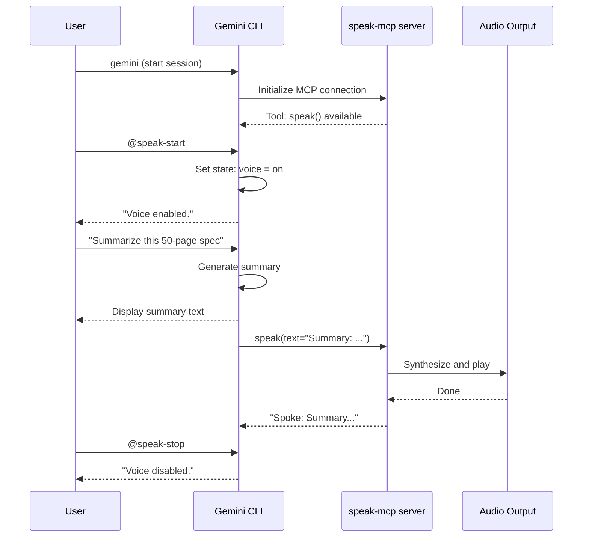

### What Can Go Wrong

| Symptom | Likely Cause | Fix |
|---------|-------------|-----|
| `@speak-start` unrecognized | No speaker persona loaded | Add speaker instructions to your Gemini system prompt or `~/.gemini/speaker.md` |
| Tool not called after enabling | Gemini lost voice state | Re-issue `@speak-start` |
| No audio | `~/.gemini/mcp.json` missing or malformed | Run `./scripts/install.sh` |

See [troubleshooting.md](troubleshooting.md) and [agent-install.md](agent-install.md#gemini-cli).

---

## Use Case 4: First-Time Installation

### User Story

A developer has just cloned the speaker repository. They want to add voice output to their existing AI agent setup with minimal configuration.

### Prerequisites

- Python 3.10 or later
- `uv` installed (`curl -LsSf https://astral.sh/uv/install.sh | sh`)
- macOS or Linux (Windows not currently supported)
- At least one of: Claude Code, Kiro CLI, Gemini CLI installed
- ~400MB disk space for model files (downloaded on first use)

### Steps

1. Clone or navigate to the speaker project:
   ```bash
   cd ~/code/personal/tools/speaker
   ```

2. Run the installer:
   ```bash
   ./scripts/install.sh
   ```

   The installer will:
   - Install `speak-mcp` via `uv tool install .`
   - Detect which AI tools you have installed
   - Merge the speaker MCP config into each tool's config file
   - Install Claude Code slash commands if Claude is detected

3. Verify the installation:
   ```bash
   which speak-mcp
   # Expected: /Users/yourname/.local/bin/speak-mcp
   ```

4. Restart your AI agent to pick up the new MCP config.

5. Enable voice in your agent and verify audio plays:
   ```
   /speak-start       # Claude Code
   @speak-start       # all other agents

   "Say hello"
   # Expected: text response + audio plays
   ```

### Install Process Flowchart

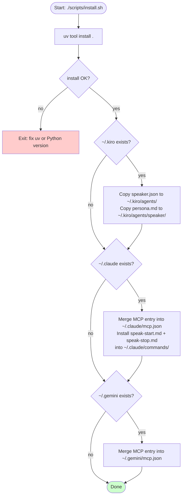

### What Happens on First Speak

The model files are not bundled — they are downloaded on first use (~374MB total).

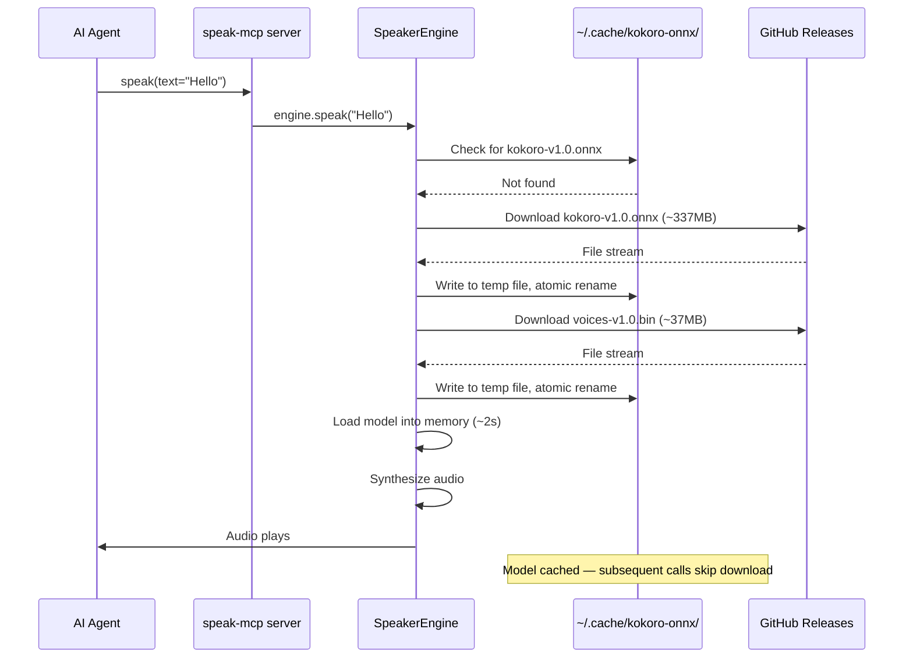

The first `speak` call takes 30–120 seconds depending on your connection. Every subsequent call in the same session takes ~200ms overhead for model inference.

### What Can Go Wrong

| Symptom | Likely Cause | Fix |
|---------|-------------|-----|
| `uv: command not found` | uv not installed | `curl -LsSf https://astral.sh/uv/install.sh \| sh` |
| `speak-mcp: command not found` | `~/.local/bin` not in PATH | Add `export PATH="$HOME/.local/bin:$PATH"` to `~/.zshrc`, then restart shell |
| No agents detected | AI tools in non-standard locations | Use manual install — see [agent-install.md](agent-install.md) |
| First speak times out | Slow network | Wait, or manually download models — see [troubleshooting.md](troubleshooting.md#model-download-fails) |

---

## Use Case 5: Adding Speaker to a New Agent

### User Story

A developer uses an MCP-compatible agent not on the supported list (for example, Continue.dev, Cursor, or a custom agent). They want to add Speaker voice support to it.

### Prerequisites

- Speaker installed (`which speak-mcp` returns a path)
- The target agent supports MCP over stdio
- You can edit the agent's config file or system prompt

### Steps

**Step 1: Add the MCP server to the agent's config**

All agents use the same MCP config pattern. Find the location where your agent reads MCP server definitions and add:

```json
{
  "mcpServers": {
    "speaker": {
      "command": "speak-mcp",
      "args": []
    }
  }
}
```

For agents that use environment variable overrides:
```json
{
  "mcpServers": {
    "speaker": {
      "command": "speak-mcp",
      "args": [],
      "env": {
        "FASTMCP_LOG_LEVEL": "ERROR"
      }
    }
  }
}
```

**Step 2: Teach the agent the voice toggle protocol**

Add these instructions to the agent's system prompt, persona file, or equivalent:

```markdown
## Voice Output

You have a voice output tool called `speak` available via MCP.

The user controls it with:
- `@speak-start` — enable voice (remember this state for the session)
- `@speak-stop` — disable voice

Voice is off by default.

When voice is enabled, call the `speak` tool after every response with your
full response text. Exclude code blocks — those should not be spoken aloud.

If the tool fails or is unavailable, continue without voice and do not
report the failure unless the user asks.
```

**Step 3: Verify the tool is available**

Ask the agent to list its available tools, or use a probe:
```
What MCP tools do you have available?
```

The agent should mention `speak` in its tool list.

**Step 4: Test the integration**

```
@speak-start
Say hello in one sentence.
```

You should hear audio.

### Integration Pattern Diagram

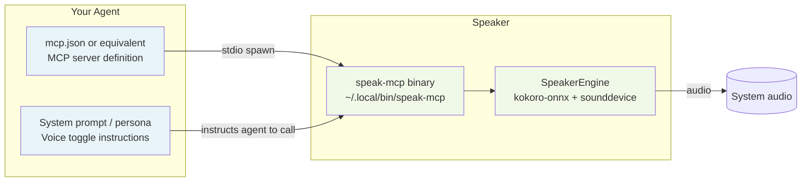

### Agent-Specific Notes

For agents that require explicit tool allowlists (similar to Kiro's `allowedTools`), add the tool identifier for `speak`. The exact identifier depends on your agent's MCP implementation — it is commonly `mcp_speaker_speak` or `speaker.speak`.

For agents that use `AGENTS.md` as their instruction file (like Amp), add the voice toggle instructions there:

```markdown
## Voice Output

The user can toggle voice with @speak-start and @speak-stop.
When enabled, call the speak tool with your full response text.
Exclude code blocks from spoken text.
```

### What Can Go Wrong

| Symptom | Likely Cause | Fix |
|---------|-------------|-----|
| Agent doesn't list `speak` tool | MCP config wrong or agent not restarted | Verify config path, restart agent |
| Tool listed but not called | Persona instructions missing | Add voice toggle instructions to system prompt |
| Tool called but no audio | `speak-mcp` not on PATH in agent's environment | Use absolute path in config: `"command": "/Users/yourname/.local/bin/speak-mcp"` |

---

## Use Case 6: Changing Voice or Speed

### User Story

A developer prefers a different voice and wants responses at a slightly faster pace to match their reading speed.

### Available Voices

| Voice ID | Accent | Gender | Character |
|----------|--------|--------|-----------|
| `am_michael` | American | Male | Clear and natural (default) |
| `af_heart` | American | Female | Warm tone, good for longer passages |
| `af_bella` | American | Female | Brighter delivery |
| `am_adam` | American | Male | Deeper, more deliberate |
| `bf_emma` | British | Female | British English pronunciation |

Voice ID pattern: `{accent}{gender}_{name}` — `a` = American, `b` = British, `m` = male, `f` = female.

### Speed Reference

| Speed | Relative Rate | Best For |
|-------|--------------|----------|
| `0.5` | Half speed | Dense technical content, learning new material |
| `0.8` | Slightly slow | First-time topics, high-complexity explanations |
| `1.0` | Normal (default) | General use |
| `1.2` | Slightly fast | Familiar topics |
| `1.5` | Fast | Quick confirmations, brief answers |
| `2.0` | Double speed | Skimming, returning to known content |

Speed values outside the 0.5–2.0 range are clamped automatically.

### Set Voice/Speed for a Single Session

Tell your agent to use specific settings when enabling voice:

```
@speak-start — please use voice af_heart at speed 1.2 for this session
```

Or ask it mid-session:
```
Switch to voice am_adam at speed 0.9 for the rest of this session.
```

The agent will use those values when calling `speak(text="...", voice="am_adam", speed=0.9)`.

### Set Voice/Speed Permanently in a Persona File

Edit the agent's persona file to specify defaults. For Kiro (`~/.kiro/agents/speaker/persona.md`), add:

```markdown
When voice is enabled, call the speak tool with voice="af_heart" and speed=1.1
unless the user specifies otherwise.
```

For Claude Code (`~/.claude/commands/speak-start.md`), modify the instruction:

```markdown
Enable voice output. After every response, call the `speak` MCP tool with
your full response text (excluding code blocks), using voice="af_heart"
and speed=1.1.
```

### What Can Go Wrong

| Symptom | Likely Cause | Fix |
|---------|-------------|-----|
| Voice not changing | Agent ignoring instruction | Restate explicitly: "for every speak() call use voice='af_bella'" |
| Invalid voice error | Typo in voice ID | Check pattern: two lowercase letters, underscore, two to twenty lowercase letters |
| Speed ignored | Agent passing wrong type | Ensure speed is a float: `speed=1.2` not `speed="1.2"` |

---

## Use Case 7: Code Review Narration

### User Story

A developer is reviewing a pull request. They want to display the diff in one pane and hear the AI's analysis spoken while they read the code, so they can absorb the feedback without switching focus.

### Setup

1. Open the diff in your editor or terminal.
2. In your AI agent session, enable voice:
   ```
   @speak-start
   ```
3. Paste the diff or describe the change:
   ```
   Here's the diff for the authentication module. Review it for security issues.
   [paste diff]
   ```
4. The agent speaks its analysis while you read the code.

### Recommended Settings for Code Review

```
@speak-start — use voice am_adam at speed 0.9

Review this diff for correctness, security, and readability. When you speak
your review, describe what each change does and flag any concerns. Do not
speak the diff itself — only your analysis.
```

Slower speed (0.9) works well here because you are reading simultaneously and need time to absorb each point.

### Flow Diagram

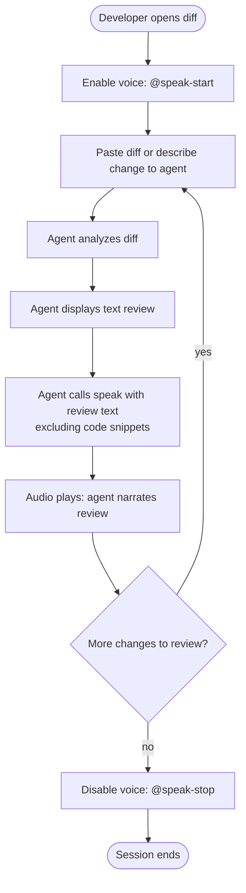

### Tips

- Tell the agent explicitly: "speak only your analysis, not the code itself." Code blocks are excluded from speech by default, but large inline code fragments may still be included unless you give this instruction.
- For long diffs, break them into logical sections to keep each spoken segment to a manageable length.
- The 10,000 character text limit means very long review outputs will be truncated at the audio boundary but full text still appears on screen.

### What Can Go Wrong

| Symptom | Likely Cause | Fix |
|---------|-------------|-----|
| Agent speaks the raw diff | No instruction to exclude code | Add: "speak only your narrative analysis" |
| Audio cuts out mid-review | Text exceeded 10,000 char limit | Ask for a shorter summary, or break into sections |
| Long pause before audio | Large synthesis workload | Normal for long responses — keep individual review chunks under 2,000 chars for best latency |

---

## Use Case 8: Learning and Tutoring

### User Story

A developer learning a new concept — concurrency, type theory, cloud architecture — wants auditory reinforcement alongside the text. Hearing explanations read aloud improves retention and allows note-taking without losing their place in the screen.

### Setup

1. Enable voice with appropriate settings for learning:
   ```
   @speak-start — please use voice af_heart at speed 0.85
   ```

2. Ask for explanations. The agent will display text and speak simultaneously:
   ```
   Explain Python's GIL and when it matters for concurrency.
   ```

3. For code examples, the agent will speak the explanation but skip the code block:
   ```
   Here's how a threading example looks:

   [code block — not spoken]

   What this does is... [spoken]
   ```

### How Code Blocks Are Excluded

The persona instruction tells agents to exclude code blocks from spoken text. In practice, an agent transforms its response roughly like this:

```
Full response:
  "Here is an example:
   ```python
   def hello(): pass
   ```
   The function above does nothing."

Spoken text:
  "Here is an example. The function above does nothing."
```

Code fences and their contents are omitted. Inline code like `variable_name` is typically retained since it reads naturally in context.

### Flow Diagram

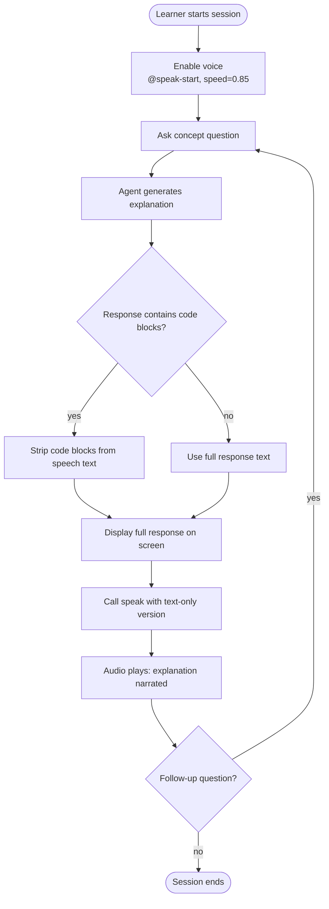

### Tips for Effective Learning Sessions

- Use speed 0.8–0.9 for new material — this gives time to absorb each point.
- Ask the agent to structure explanations with numbered points. Spoken numbered lists are easier to follow than prose.
- Request a spoken summary at the end of each topic: "Give me a three-sentence spoken summary of what we just covered."
- If you're taking notes, say so: "I'm taking notes as you explain this — pause between each key point."

### What Can Go Wrong

| Symptom | Likely Cause | Fix |
|---------|-------------|-----|
| Code blocks spoken as text | Agent not following persona | Add explicit instruction: "never speak the contents of code fences" |
| Too fast to absorb | Default speed 1.0 | Set `speed=0.8` when enabling |
| Long technical terms mispronounced | TTS limitation | This is a known limitation of kokoro-onnx; the text on screen is always accurate |

---

## Use Case 9: Accessibility — Neurodivergent Users

### Why Voice Output Helps

For users with ADHD, dyslexia, or other neurodivergent profiles, simultaneous audio and text can significantly improve information absorption. Speaker is designed to work as a local, private, always-available tool — no cloud service, no internet dependency after first model download, no subscription.

Key benefits:

- **Dual-channel input**: Reading and hearing simultaneously improves retention for many neurodivergent users.
- **Reduced screen dependency**: Complex explanations can be absorbed with eyes closed or focused on a task rather than the screen.
- **Focus anchoring**: Spoken output provides an external pacing mechanism, reducing the tendency to skim or re-read in anxiety loops.
- **Text overwhelm reduction**: Long LLM responses can feel visually dense. Hearing the response at a controlled pace breaks it into a manageable stream.

### Recommended Configuration

**Voice choice:**
- `af_heart` — warm, natural delivery; good for extended listening sessions
- `am_michael` — clear, neutral; good for technical content

**Speed:**
- Start at `0.8`–`0.9` for dense technical content
- Increase to `1.0`–`1.1` as topics become familiar
- Reduce to `0.75` for new or difficult material

**Setup:**

```
@speak-start — use voice af_heart at speed 0.85

When explaining concepts, use clear numbered steps and speak each step
as a complete sentence. Pause between major points by ending with a
brief phrase like "that's the first part."
```

### Usage Patterns

**Pattern 1: Eyes-free absorption**

Enable voice, ask a question, close your eyes while the explanation plays. Use the text on screen as a reference when you need to re-examine a specific point.

**Pattern 2: Parallel processing**

Keep the agent session in one pane. Have your editor, diagram, or notes in the main pane. The agent's spoken output reaches you while your eyes stay on your work.

**Pattern 3: Paced review**

After a long working session, ask the agent to summarize what was accomplished. The spoken summary at a controlled pace provides a lower-cognitive-load review than re-reading a transcript.

**Pattern 4: Focus re-entry**

After an interruption, ask "briefly tell me where we were" and let the spoken summary help you re-orient without having to re-read the full conversation history.

### Session Setup Example

```
@speak-start — voice af_heart, speed 0.85

I'm working on understanding async/await in Python. I have ADHD so please:
- Use short, numbered explanations
- Speak one concept at a time, check in before moving to the next
- Don't read out code blocks
```

---

## Application Flow Diagrams

### Complete Application Lifecycle

From installation through daily use across multiple sessions:

```mermaid
flowchart TD
    INSTALL([Install Speaker\n./scripts/install.sh]) --> MODELS{Model files\ncached?}
    MODELS -->|no, first use| DOWNLOAD[Download kokoro-onnx models\n~374MB, one-time]
    MODELS -->|yes| START
    DOWNLOAD --> START

    START([Start agent session]) --> OPTIONAL_VOICE{Want voice\nthis session?}
    OPTIONAL_VOICE -->|no| WORK_SILENT[Work silently\ntext only]
    OPTIONAL_VOICE -->|yes| ENABLE[Enable voice\n/speak-start or @speak-start]

    ENABLE --> INTERACT
    WORK_SILENT --> INTERACT

    INTERACT([Ask question or give task]) --> AGENT[Agent generates response]
    AGENT --> DISPLAY[Display text response]
    DISPLAY --> VOICE_ON{Voice\nenabled?}
    VOICE_ON -->|yes| SPEAK[Call speak MCP tool\naudio plays]
    VOICE_ON -->|no| NEXT
    SPEAK --> NEXT

    NEXT{Continue\nsession?} -->|yes| INTERACT
    NEXT -->|no| DISABLE{Voice was\nenabled?}
    DISABLE -->|yes| STOP[/speak-stop or @speak-stop]
    DISABLE -->|no| END
    STOP --> END([Session ends\nVoice state reset])

    style INSTALL fill:#e8f4f8
    style END fill:#ccffcc
    style DOWNLOAD fill:#fff8e8
```

### MCP Request/Response Flow

Full detail from agent tool call through audio playback:

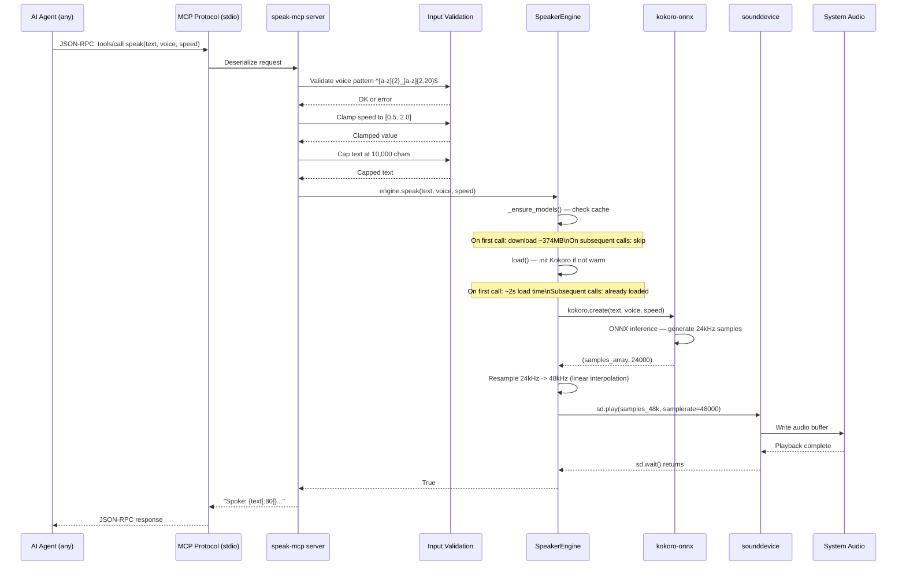

### User Interaction Flow

The developer's experience from install through a typical working session:

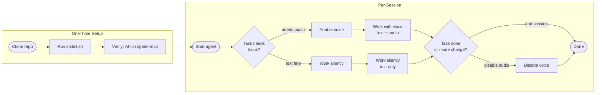

---

## Component Interaction Diagram

This diagram shows how the major components relate to each other — from agent configs through to audio hardware.

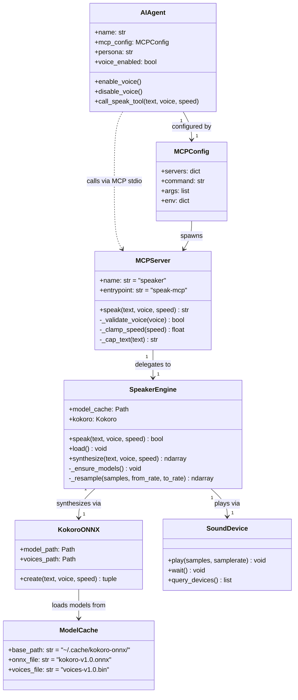

### Key Relationships

- **AIAgent to MCPServer**: Communication is over stdio using the Model Context Protocol. The agent spawns `speak-mcp` as a subprocess; all calls are JSON-RPC messages.
- **MCPServer to SpeakerEngine**: In-process call — no IPC overhead. The engine instance is created once at server startup and kept warm.
- **SpeakerEngine to KokoroONNX**: The ONNX model is loaded into memory on first call and reused. This is why the first call is slow (~2s model load) and subsequent calls are fast (~200ms).
- **SpeakerEngine to SoundDevice**: Blocking playback — `sd.play()` followed by `sd.wait()`. The MCP tool call does not return until audio has finished playing.

---

## Error Scenarios

### Common Errors Across All Use Cases

| Error | Context | Cause | Resolution |
|-------|---------|-------|------------|
| `speak-mcp: command not found` | Any | Binary not installed or not on PATH | `uv tool install . --force`, add `~/.local/bin` to PATH |
| `TTS failed.` returned to agent | Any | Model download failed or audio device error | Check `~/.cache/kokoro-onnx/`, verify audio device |
| Voice toggles but no audio | Any | MCP tool unreachable | Restart agent, verify MCP config |
| Audio cuts off abruptly | Bluetooth/AirPlay output | AirPlay latency (~2s buffer) | Use wired output for short clips |
| Crackling or distorted audio | Any | Sample rate mismatch | Engine resamples to 48kHz — check device sample rate with `python3 -c "import sounddevice; print(sounddevice.query_devices())"` |
| Slow first response | Any (first use) | Model loading or download | Expected — subsequent calls are faster |
| Text truncated in audio | Long responses | 10,000 char limit | Full text still on screen; ask agent to keep spoken summaries shorter |

### Kiro-Specific Errors

| Error | Cause | Resolution |
|-------|-------|------------|
| `speak` tool not callable | `mcp_speaker_speak` not in `allowedTools` | Add `"mcp_speaker_speak"` to `allowedTools` in `speaker.json` |
| Agent not found | `speaker.json` missing from `~/.kiro/agents/` | Re-run `./scripts/install.sh` |

### Claude Code-Specific Errors

| Error | Cause | Resolution |
|-------|-------|------------|
| `/speak-start` not recognized | Command file not at `~/.claude/commands/speak-start.md` | Re-run `./scripts/install.sh` or manually create the file |
| Voice works once then stops | Claude context window issue | Re-issue `/speak-start` to re-establish state |

For full diagnostic guidance, see [troubleshooting.md](troubleshooting.md).

---

## Cross-References

| Document | What It Covers |
|----------|----------------|
| [agent-install.md](agent-install.md) | Platform-specific MCP config locations, exact file contents for each agent |
| [mcp.md](mcp.md) | MCP protocol overview, tool schema, voice table, speed reference |
| [troubleshooting.md](troubleshooting.md) | Diagnostic decision tree, fixes for audio issues, model download problems |
| [codemap.md](codemap.md) | Source code structure, module breakdown, dependency list |
