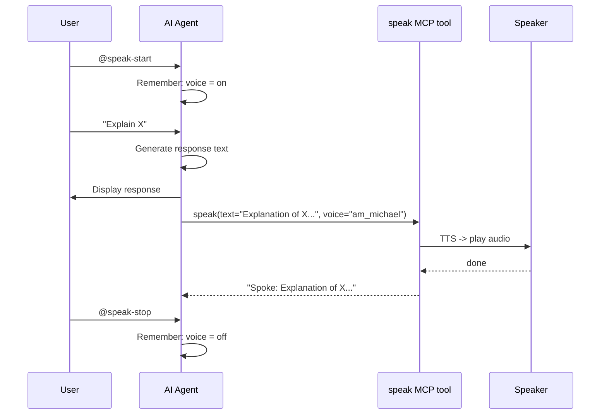

# Use Cases & How-To

## 1. Enable Voice in Claude Code

Toggle voice output during any Claude Code session.

**Steps:**

1. Ensure MCP config is installed (install.sh does this):
   ```bash
   cat ~/.claude/mcp.json  # should contain speaker MCP config
   ```
2. Start Claude Code
3. Type `/speak-start` to enable voice
4. The agent calls the `speak` MCP tool after each response
5. Type `/speak-stop` to disable

**Example:**
```
You: /speak-start
Claude: Voice enabled. I'll speak my responses aloud from now on.

You: Explain Python generators
Claude: [explains generators — text spoken aloud via MCP tool]

You: /speak-stop
Claude: Voice disabled.
```

## 2. Enable Voice in Kiro CLI

Toggle voice output during any Kiro CLI agent session.

**Steps:**

1. Start a session with the speaker agent (or any agent with speaker MCP configured):
   ```bash
   kiro-cli chat --agent speaker
   ```
2. Type `@speak-start` to enable voice
3. The agent calls the `speak` MCP tool after each response
4. Type `@speak-stop` to disable

**Example:**
```
You: @speak-start
Agent: Voice enabled. I'll speak my responses aloud from now on.

You: Explain Python generators
Agent: [explains generators — text spoken aloud automatically]

You: @speak-stop
Agent: Voice disabled.
```

## 3. Standalone CLI Usage

Use `speak` directly from the terminal or in scripts.

**Basic usage:**
```bash
speak "Hello, can you hear me?"
```

**Pipe from stdin:**
```bash
echo "Pipeline text" | speak -
cat notes.txt | speak -
```

**Custom voice and speed:**
```bash
speak "Fast and feminine" -v af_heart -s 1.3
speak "Slow and clear" -v am_michael -s 0.8
```

**macOS fallback:**
```bash
speak "Using Apple TTS" -b macos
```

**In scripts:**
```bash
#!/usr/bin/env bash
# Announce deployment status
speak "Deployment to staging complete. Running smoke tests."
if ./run-tests.sh; then
    speak "All tests passed."
else
    speak "Tests failed. Check the logs."
fi
```

## 4. Adding Speaker to an Existing Custom Agent

You have an AI agent and want to add voice support.

**Steps:**

1. Add the MCP server to your agent's config:
   ```json
   {
     "mcpServers": {
       "speaker": {
         "command": "speak-mcp",
         "args": []
       }
     }
   }
   ```

2. Add to your agent's persona/prompt:
   ```markdown
   The user can toggle voice with @speak-start and @speak-stop.
   When enabled, call the speak tool with your full response text.
   Exclude code blocks from spoken text.
   ```

3. For Kiro agents, add `"mcp_speaker_speak"` to `allowedTools`.

## 5. Changing Voice/Speed Mid-Workflow

**Via MCP tool parameters:** Agents can pass `voice` and `speed` to the speak tool directly. Update your agent's prompt to specify preferred voice/speed.

**Via config file (CLI only):** Edit `~/.config/speaker/config.yaml` — changes take effect on the next `speak` CLI call (no restart needed).

```yaml
tts:
  voice: af_heart    # was am_michael
  speed: 1.2         # was 1.0
```

Or override per-call with CLI flags:
```bash
speak "Quick test" -v bf_emma -s 1.5
```

## Agent -> Speak Flow


