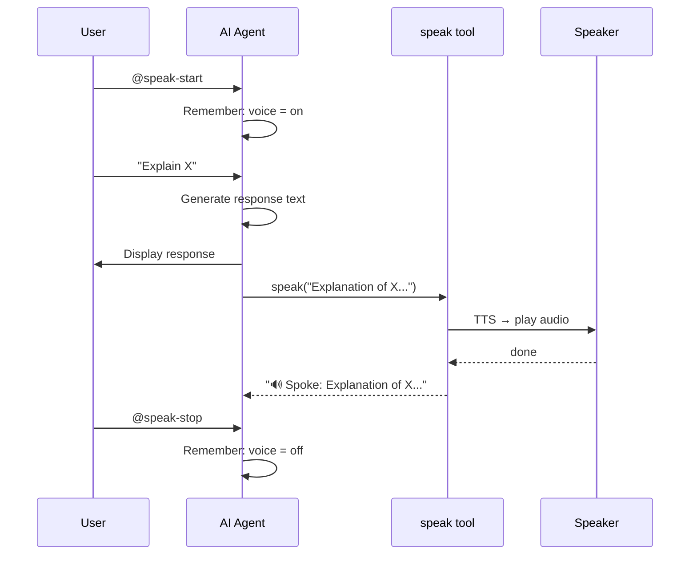

# Use Cases & How-To

## 1. Enable Voice in a Kiro CLI Session

Toggle voice output during any Kiro CLI agent session.

**Steps:**

1. Start a session with the speaker agent (or any agent with speaker MCP configured):
   ```bash
   kiro-cli chat --agent speaker
   ```
2. Type `@speak-start` to enable voice
3. The agent calls the `speak` MCP tool after each response
4. Type `@speak-stop` to disable

**Example:**
```
You: @speak-start
Agent: Voice enabled. I'll speak my responses aloud from now on.
🔊 Spoke: Voice enabled. I'll speak my responses aloud from now on.

You: Explain Python generators
Agent: [explains generators — text spoken aloud automatically]

You: @speak-stop
Agent: Voice disabled.
```

## 2. Enable Voice in Claude Code

Toggle voice in a Claude Code session.

**Steps:**

1. Ensure `~/.claude/speaker.md` exists (install.sh creates it)
2. Start Claude Code and load the prompt:
   ```
   /read ~/.claude/speaker.md
   ```
3. Type `/speak-start` to enable voice
4. Claude runs `~/.local/bin/speak "response text"` after each reply
5. Type `/speak-stop` to disable

**Example:**
```
You: /speak-start
Claude: Voice enabled.
> Running: ~/.local/bin/speak "Voice enabled."

You: /speak-stop
Claude: Voice disabled.
```

## 3. Standalone CLI Usage

Use `speak` directly from the terminal or in scripts.

**Basic usage:**
```bash
speak "Hello, can you hear me?"
```

**Pipe from stdin:**
```bash
echo "Pipeline text" | speak -
cat notes.txt | speak -
```

**Custom voice and speed:**
```bash
speak "Fast and feminine" -v af_heart -s 1.3
speak "Slow and clear" -v am_michael -s 0.8
```

**macOS fallback:**
```bash
speak "Using Apple TTS" -b macos
```

**In scripts:**
```bash
#!/usr/bin/env bash
# Announce deployment status
speak "Deployment to staging complete. Running smoke tests."
if ./run-tests.sh; then
    speak "All tests passed."
else
    speak "Tests failed. Check the logs."
fi
```

## 4. Adding Speaker to an Existing Custom Agent

You have a Kiro agent and want to add voice support.

**Steps:**

1. Add the MCP server to your agent's JSON config:
   ```json
   {
     "mcpServers": {
       "speaker": {
         "command": "uvx",
         "args": ["--from", "mcp[cli]", "mcp", "run", "~/.kiro/agents/mcp/speaker-server.py"],
         "env": {"FASTMCP_LOG_LEVEL": "ERROR"}
       }
     },
     "allowedTools": ["mcp_speaker_speak"]
   }
   ```

2. Add to your agent's persona/prompt:
   ```markdown
   The user can toggle voice with @speak-start and @speak-stop.
   When enabled, call the speak tool with your full response text.
   Exclude code blocks from spoken text.
   ```

3. Merge `"@speaker"` into your `tools` array if using tool groups.

For Claude Code / Gemini / shell-based agents, add to the system prompt:
```markdown
When voice is enabled, run: ~/.local/bin/speak "your response text"
```

## 5. Changing Voice/Speed Mid-Workflow

Edit `~/.config/speaker/config.yaml` — changes take effect on the next `speak` call (no restart needed).

**Steps:**

1. Edit the config:
   ```bash
   vim ~/.config/speaker/config.yaml
   ```

2. Change voice or speed:
   ```yaml
   tts:
     voice: af_heart    # was am_michael
     speed: 1.2         # was 1.0
   ```

3. Next `speak` call uses the new settings.

Or override per-call with CLI flags (no config edit needed):
```bash
speak "Quick test" -v bf_emma -s 1.5
```

## Agent → Speak Flow


