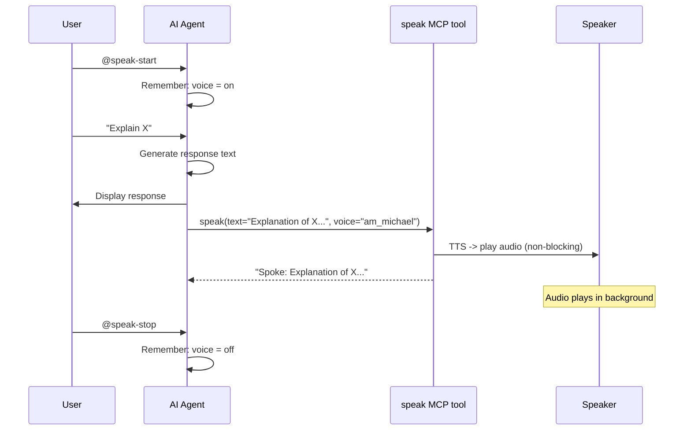

# Use Cases & How-To

## 1. Enable Voice in Claude Code

Toggle voice output during any Claude Code session.

**Steps:**

1. Ensure MCP config is installed (install.sh does this):
   ```bash
   cat ~/.claude/mcp.json  # should contain speaker MCP config
   ```
2. Start Claude Code
3. Type `/speak-start` to enable voice
4. The agent calls the `speak` MCP tool after each response
5. Type `/speak-stop` to disable

**Example:**
```
You: /speak-start
Claude: Voice enabled. I'll speak my responses aloud from now on.

You: Explain Python generators
Claude: [explains generators — text spoken aloud via MCP tool]

You: /speak-stop
Claude: Voice disabled.
```

## 2. Enable Voice in Kiro CLI

Toggle voice output during any Kiro CLI agent session.

**Steps:**

1. Start a session with the speaker agent (or any agent with speaker MCP configured):
   ```bash
   kiro-cli chat --agent speaker
   ```
2. Type `@speak-start` to enable voice
3. The agent calls the `speak` MCP tool after each response
4. Type `@speak-stop` to disable

## 3. Adding Speaker to an Existing Agent

You have an AI agent and want to add voice support.

**Steps:**

1. Add the MCP server to your agent's config:
   ```json
   {
     "mcpServers": {
       "speaker": {
         "command": "speak-mcp",
         "args": []
       }
     }
   }
   ```

2. Add to your agent's persona/prompt:
   ```markdown
   The user can toggle voice with @speak-start and @speak-stop.
   When enabled, call the speak tool with your full response text.
   Exclude code blocks from spoken text.
   ```

3. For Kiro agents, add `"mcp_speaker_speak"` to `allowedTools`.

## 4. Changing Voice or Speed

Agents pass `voice` and `speed` as parameters to the speak tool. Update your agent's prompt to specify preferences:

```
When voice is enabled, call the speak tool with voice="af_heart" and speed=1.2.
```

Available voices: `am_michael` (default), `af_heart`, `af_bella`, `am_adam`, `bf_emma`.

Speed range: 0.5 (slow) to 2.0 (fast), default 1.0.

## Agent -> Speak Flow


